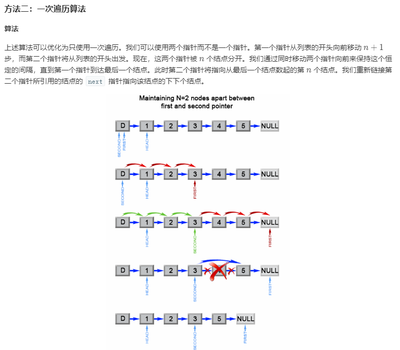

## Remove Nth Node From End of List

### Information
* TIME: 20190904
* LINK: [Click Here](https://leetcode-cn.com/problems/remove-nth-node-from-end-of-list/)
* TAG: `TWO POINT` `LIST`

### Description
> 删除链表的倒数第N个节点

### Example
```text
给定一个链表: 1->2->3->4->5, 和 n = 2.

当删除了倒数第二个节点后，链表变为 1->2->3->5.
```

### My Answer
> 低效的思路，利用java传引用的特点，把所有节点入队计算长度，然后反推删除节点位置
```java
/**
 * Definition for singly-linked list.
 * public class ListNode {
 *     int val;
 *     ListNode next;
 *     ListNode(int x) { val = x; }
 * }
 */
class Solution {
    public ListNode removeNthFromEnd(ListNode head, int n) {
        List<ListNode> nodeList = new ArrayList<>();
        while(head!=null){
            nodeList.add(head);
            head = head.next;
        }
        int len = nodeList.size();
        System.out.println(len);
        if(n==len)
            return nodeList.get(0).next;
        if(n==1){
            nodeList.get(len-n-1).next = null;
            return nodeList.get(0);
        }
        nodeList.get(len-n-1).next = nodeList.get(len-n+1);
        return nodeList.get(0);
    }
}
```

> 双指针思路：首先建立虚拟头节点，可以防止链表长度为0这种特殊情况
>
> 头指针指向虚拟头，尾指针移动n+1位，因为链表的结构为virtual->1->2->3->null,当要删除倒数第二位的指针时，将bottom移动到3的位置
> ，当bottom触碰尾部的null时，top指针刚好位于1的位置（删除节点的前一位），将1->3就可删倒数第二个节点
>
>
```java
/**
 * Definition for singly-linked list.
 * public class ListNode {
 *     int val;
 *     ListNode next;
 *     ListNode(int x) { val = x; }
 * }
 */
class Solution {
    public ListNode removeNthFromEnd(ListNode head, int n) {
        //建立头指针
        ListNode topHead = new ListNode(0);
        topHead.next = head;
        ListNode bottomHead = new ListNode(0);
        bottomHead.next = head;
        
        //赋值给原头节点
        head = topHead;
        //尾部指针从top向后移动n+1
        for(int i=0;i<=n;i++)
            bottomHead = bottomHead.next;
        while(bottomHead!=null){
            topHead = topHead.next;
            bottomHead = bottomHead.next;
        }
        //删除节点
        topHead.next = topHead.next.next;
        return head.next;
    }
}
```
