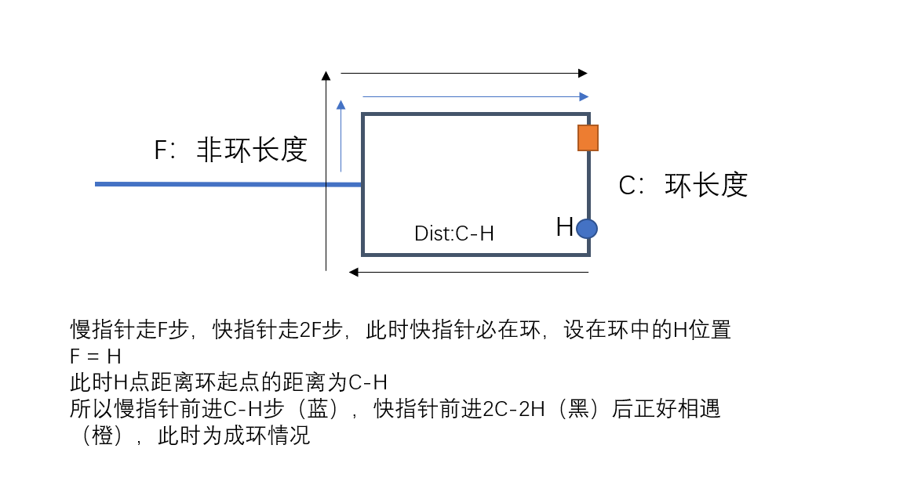

## 142. Linked List Cycle II

### Information
* TIME: 2019/09/11
* LINK: [Click Here](https://leetcode-cn.com/problems/linked-list-cycle-ii/)
* TAG: `DS` `Link`

### Description
> 给定一个链表，返回链表开始入环的第一个节点。 如果链表无环，则返回 null

### My Answer
> 用映射关系记录节点，查重节点就是所得答案
```java
/**
 * Definition for singly-linked list.
 * class ListNode {
 *     int val;
 *     ListNode next;
 *     ListNode(int x) {
 *         val = x;
 *         next = null;
 *     }
 * }
 */
public class Solution {
    public ListNode detectCycle(ListNode head) {
        Map<ListNode,Integer> record = new HashMap<>();
        int index = 0;
        while(head!=null){
            if(record.containsKey(head)){
                System.out.println("tail connects to node index "+record.get(head));
                return head;
            }else{
                record.put(head,index);
                head = head.next;
                index++;
            }
        }
        System.out.println("no cycle");
        return null;
    }
}
```

### Best Answer
> 
> 
> 在找到相遇点后，头节点和相遇点一同前进寻找环起点
```java
/**
 * Definition for singly-linked list.
 * class ListNode {
 *     int val;
 *     ListNode next;
 *     ListNode(int x) {
 *         val = x;
 *         next = null;
 *     }
 * }
 */
public class Solution {
    public ListNode detectCycle(ListNode head) {
        ListNode commonNode = getCommon(head);
        if(commonNode==null){
            return null;
        }
        ListNode tmpHead = head;
        while(commonNode!=tmpHead){
            commonNode = commonNode.next;
            tmpHead = tmpHead.next;
        }
        return commonNode;
    }
    
    public ListNode getCommon(ListNode head){
        ListNode fastPoint = head;
        ListNode slowPoint = head;
        while(fastPoint!=null&&fastPoint.next!=null){
            fastPoint = fastPoint.next.next;
            slowPoint = slowPoint.next;
            if(fastPoint==slowPoint)
                return fastPoint;
        }
        return null;
    }
}
```
