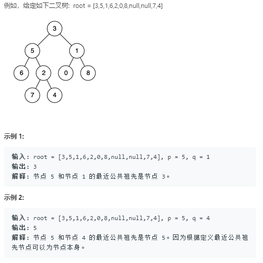

## 236. Lowest Common Ancestor of a Binary Tree

### Information
* TIME: 2019/09/13(bu)
* LINK: [Click Here](https://leetcode-cn.com/problems/lowest-common-ancestor-of-a-binary-tree/)
* TAG: `Tree`

### Description
> 给定一个二叉树, 找到该树中两个指定节点的最近公共祖先。

### Example
> 

### My Answer
> 一遍dfs用映射表保存节点和前驱的映射关系
>
> lca算法求解最近祖先，但是效率很低
```java
/**
 * Definition for a binary tree node.
 * public class TreeNode {
 *     int val;
 *     TreeNode left;
 *     TreeNode right;
 *     TreeNode(int x) { val = x; }
 * }
 */
class Solution {
    private Map<TreeNode,TreeNode> reverseTree;
    private HashMap<TreeNode,Integer> depthTree;
    public TreeNode lowestCommonAncestor(TreeNode root, TreeNode p, TreeNode q) {
        reverseTree = new HashMap<>();
        depthTree = new HashMap<>();
        
        dfs(root,null,1);
        
        System.out.println(depthTree.get(p));
        System.out.println(depthTree.get(q));
        
        return lca(p,q);
    }
    public void dfs(TreeNode root,TreeNode pre,int depth){
        if(root==null)return;
        
        reverseTree.put(root,pre);
        depthTree.put(root,depth);
        
        dfs(root.left,root,depth+1);
        dfs(root.right,root,depth+1);
    }
    public TreeNode lca(TreeNode p,TreeNode q){
        while(p!=q){
            if(depthTree.get(p)>depthTree.get(q)){
                p = reverseTree.get(p);
            }else if(depthTree.get(p)<depthTree.get(q)){
                q = reverseTree.get(q);
            }else{
                p = reverseTree.get(p);
                q = reverseTree.get(q);
            }
        }
        return p;
    }
}
```

### Best Answer
> [官方做法](https://leetcode-cn.com/problems/lowest-common-ancestor-of-a-binary-tree/solution/er-cha-shu-de-zui-jin-gong-gong-zu-xian-by-leetcod/)
>
> 从根节点开始遍历树。
> 
> 如果当前节点本身是 p 或 q 中的一个，我们会将变量 mid 标记为 true，并继续搜索左右分支中的另一个节点。
> 
> 如果左分支或右分支中的任何一个返回 true，则表示在下面找到了两个节点中的一个。
> 
>如果在遍历的任何点上，左、右或中三个标志中的任意两个变为 true，这意味着我们找到了节点 p 和 q 的最近公共祖先。

```java
/**
 * Definition for a binary tree node.
 * public class TreeNode {
 *     int val;
 *     TreeNode left;
 *     TreeNode right;
 *     TreeNode(int x) { val = x; }
 * }
 */
class Solution {
    private TreeNode res;
    public TreeNode lowestCommonAncestor(TreeNode root, TreeNode p, TreeNode q) {
        res = null;
        findAncestor(root,p,q);
        return res;
    }
    public boolean findAncestor(TreeNode root,TreeNode p,TreeNode q){
        if(root==null)return false;
        
        int left = findAncestor(root.left,p,q)? 1:0;
        int right = findAncestor(root.right,p,q)?1:0;
        
        int mid = root==p||root==q?1:0;
        
        if(left+right+mid>=2)
            this.res = root;
        return left+right+mid>0?true:false;
    }
}
```