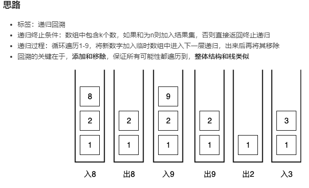

## 216. Combination Sum III

### Information
* TIME: 20190915
* LINK: [Click Here](https://leetcode-cn.com/problems/combination-sum-iii/)
* TAG: `回溯算法`

### Description
> 找出所有相加之和为 n 的 k 个数的组合。组合中只允许含有 1 - 9 的正整数，并且每种组合中不存在重复的数字。

### Example
```text
输入: k = 3, n = 9
输出: [[1,2,6], [1,3,5], [2,3,4]]
```

### My Answer
> 
```java
class Solution {
    private List<List<Integer>> ans = new ArrayList<>();
    public List<List<Integer>> combinationSum3(int k, int n) {
        getSum(k,n,0,1,new LinkedList<>());
        return ans;
    }
    public void getSum(int k,int n,int sum,int begin,LinkedList<Integer> list){
        if(k==0){
            if(n==sum){
                ans.add(new ArrayList<>(list));
            }
            return;
        }
        
        for(int i=begin;i<10;i++){
            list.add(i);
            getSum(k-1,n,sum+i,i+1,list);
            list.removeLast();
        }
    }
}
```