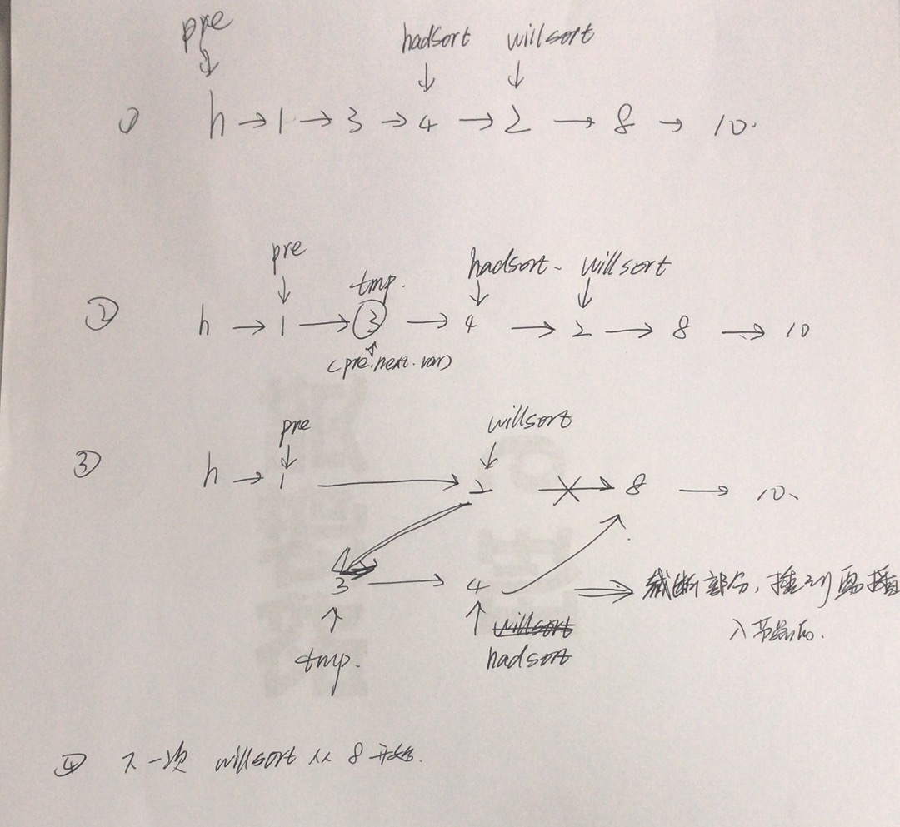

## KATA-NAME

### Information
* TIME: `2019/09/17`
* LINK: [Click Here](https://leetcode-cn.com/problems/insertion-sort-list/)
* TAG: `LINK`

### Description
> 对链表进行插入排序

### Example
```text
输入: 4->2->1->3
输出: 1->2->3->4
```

### My Answer
> 
```java
/**
 * Definition for singly-linked list.
 * public class ListNode {
 *     int val;
 *     ListNode next;
 *     ListNode(int x) { val = x; }
 * }
 */
class Solution {
    public ListNode insertionSortList(ListNode head) {
        if(head == null||head.next == null){
            return head;
        }
        ListNode h = new ListNode(0);
        h.next = head;
        ListNode pre = h;
        ListNode hadSort = head;    //已排序部分的尾巴
        ListNode willInsert = head;     //需要执行插入的节点
        
        while(hadSort!=null){
            willInsert = hadSort.next;  //更新需要插入的节点

            //不空并且当插入节点小于已排序完尾巴时才需进行插入
            if(willInsert!=null&&willInsert.val<hadSort.val){
                while(pre.next!=null&&pre.next.val<willInsert.val){
                    pre = pre.next;
                }
                
                ListNode tmp = pre.next;
                //断点与插入节点端进行连接
                pre.next = willInsert;
                //截断部分连接到插入点后
                hadSort.next = willInsert.next;
                willInsert.next = tmp;
                
                pre = h;
            }else{
                hadSort = willInsert;
            }
            //System.out.println(hadSort.val);
        }
        return h.next;
    }
}
```
