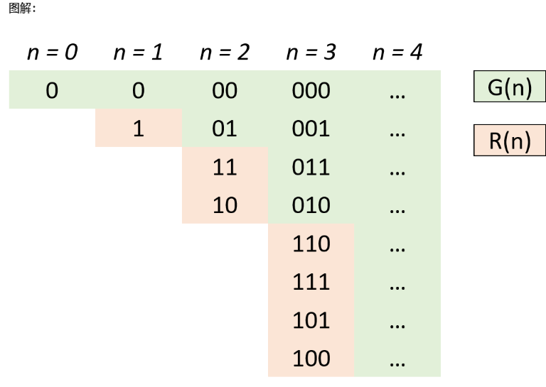

## 89. Gray Code

### Information
* TIME: 2019/09/22
* LINK: [Click Here](https://leetcode-cn.com/problems/gray-code/)
* TAG: 

### Description
> 格雷编码是一个二进制数字系统，在该系统中，两个连续的数值仅有一个位数的差异。给定一个代表编码总位数的非负整数 n，打印其格雷编码序列。格雷编码序列必须以 0 开头。

### Example
```text
输入: 2
输出: [0,1,3,2]
解释:
00 - 0
01 - 1
11 - 3
10 - 2

对于给定的 n，其格雷编码序列并不唯一。
例如，[0,2,3,1] 也是一个有效的格雷编码序列。

00 - 0
10 - 2
11 - 3
01 - 1

```

### My Answer
> 通过位移修改的方法确定，需要查重所以效率很低，幂次的效率,无法通关
```java
class Solution {
    public List<Integer> grayCode(int n) {
        List<Integer> ans = new ArrayList<>();
        if(n==0){
            ans.add(0);
            return ans;
        }else{
            int cnt = (int)Math.pow(2,n);
            int point = n-1;
            StringBuilder num = new StringBuilder();
            for(int i=0;i<n;i++){
                num.append("0");
            }
            ans.add(0);
            while(ans.size()!=cnt){
                char c = num.charAt(point);
                if(c=='0')
                    num.setCharAt(point,'1');
                else
                    num.setCharAt(point,'0');
                int proNum = Integer.parseInt(num.toString(),2);
                if(ans.indexOf(proNum)==-1){
                    ans.add(proNum);
                    /*for(int e:ans){
                        System.out.print(e+" ");
                    }
                    System.out.println();*/
                }
                point--;
                if(point<0)
                    point=n-1;
            }
            return ans;
        }
        
    }
}
```

### Best Answer
> 
>
> 在得到2后，实际上需要做的只是逆序加最高位（比如n=3时得到2后逆序+4）放到n=2的结果中
> 
> 这是一个镜像对称
> [具体题解](https://leetcode-cn.com/problems/gray-code/solution/gray-code-jing-xiang-fan-she-fa-by-jyd/)
```java
class Solution {
    public List<Integer> grayCode(int n) {
        List<Integer> res = new ArrayList<Integer>() {{ add(0); }};
        int head = 1;
        for (int i = 0; i < n; i++) {
            for (int j = res.size() - 1; j >= 0; j--)
                res.add(head + res.get(j));
            head <<= 1;
        }
        return res;
    }
}
```

### Extend & Reference
> [https://www.cnblogs.com/116970u/p/11495096.html](https://www.cnblogs.com/116970u/p/11495096.html)