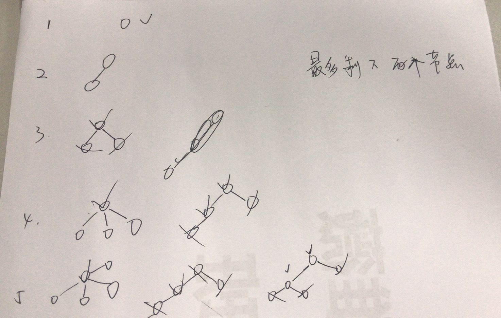

## 310. Minimum Height Trees

### Information
* TIME: `20191009`
* LINK: [Click Here](https://leetcode-cn.com/problems/minimum-height-trees/)
* TAG: `BFS` `拓扑排序`

### Description
> 对于一个具有树特征的无向图，我们可选择任何一个节点作为根。图因此可以成为树，在所有可能的树中，具有最小高度的树被称为最小高度树。给出这样的一个图，写出一个函数找到所有的最小高度树并返回他们的根节点。

### Example
```text
输入: n = 6, edges = [[0, 3], [1, 3], [2, 3], [4, 3], [5, 4]]

     0  1  2
      \ | /
        3
        |
        4
        |
        5 

输出: [3, 4]

```

### My Answer
> 根据归纳法，最后的结果只存在1-2个节点
> >
> 
> 拓扑排序思想
> * 逐层删除入度为1的点
> 
```java
class Solution {
    public List<Integer> findMinHeightTrees(int n, int[][] edges) {
        List<List<Integer>> map = new ArrayList<>();
        int[] inDegree = new int[n];
        boolean[] visited = new boolean[n];
        List<Integer> ans = new ArrayList<>();
        
        if(n<=2){
            for(int i=0;i<n;i++){
                ans.add(i);
            }
            return ans;
        }
        for(int i=0;i<n;i++){
            map.add(new ArrayList<>());
            visited[i] = false;
        }
        for(int[] edge:edges){
            map.get(edge[0]).add(edge[1]);
            map.get(edge[1]).add(edge[0]);
            inDegree[edge[0]]++;
            inDegree[edge[1]]++;
        }
        
        Queue<Integer> queue = new LinkedList<>();
        for(int i=0;i<n;i++){
            if(inDegree[i]==1)
                queue.offer(i);
        }
        while(n>2){
            int size = queue.size();
            n-=size;
            for(int i=0;i<size;i++){
                int front = queue.poll();
                visited[front] = true;
                for(int next:map.get(front)){
                    inDegree[next]--;
                    if(inDegree[next]==1&&!visited[next]){
                        queue.offer(next);
                    }
                }
            }
        }
        
        for(int i=0;i<visited.length;i++){
            if(!visited[i])
                ans.add(i);
        }
        return ans;
    }
}
```
