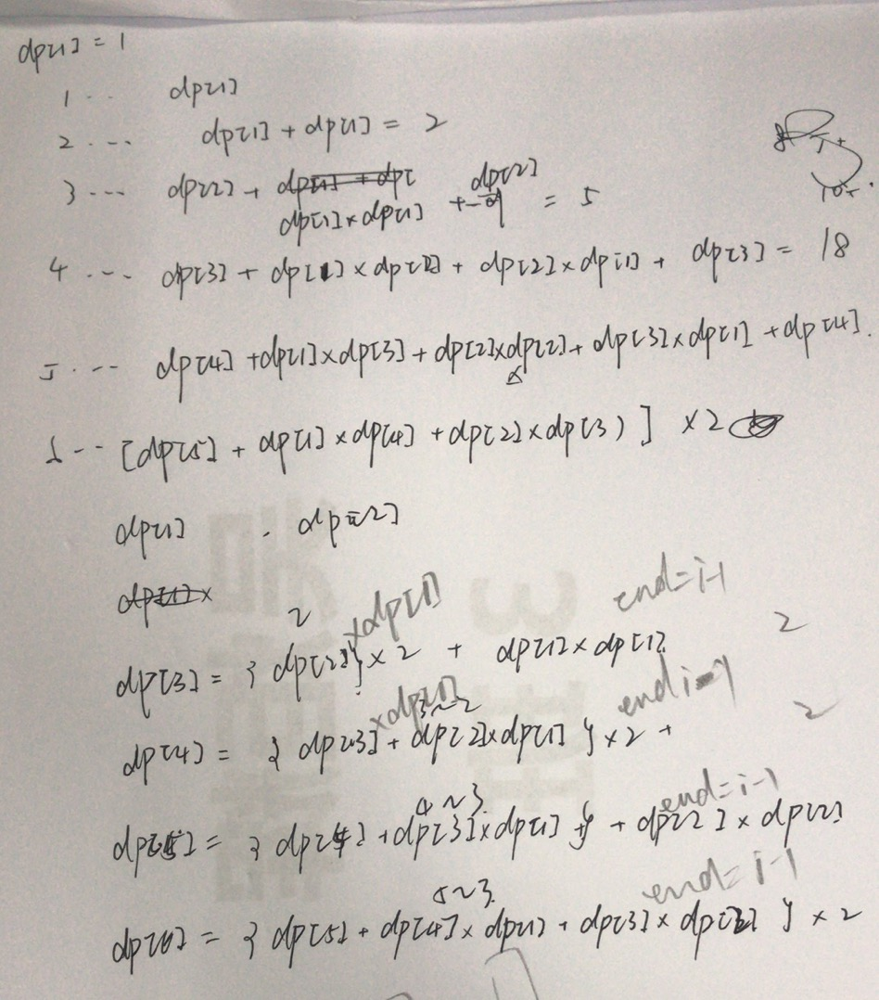
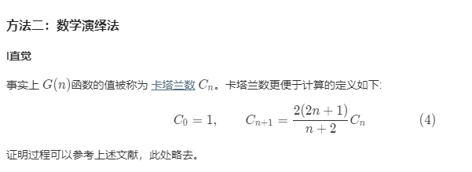

## 96. Unique Binary Search Trees

### Information
* TIME: 2019/10/25
* LINK: [Click Here](https://leetcode-cn.com/problems/unique-binary-search-trees/)
* TAG: `DP`

### Description
> 给定一个整数 n，求以 1 ... n 为节点组成的二叉搜索树有多少种？

### Example
```text
输入: 3
输出: 5
解释:
给定 n = 3, 一共有 5 种不同结构的二叉搜索树:

   1         3     3      2      1
    \       /     /      / \      \
     3     2     1      1   3      2
    /     /       \                 \
   2     1         2                 3

```

### My Answer
> 递推规律
> 
> 设1..i为节点可以组成G(i)种二叉搜索树，选定二叉搜索树序列的索引t
> * 可以构成的二叉搜索树种类：`f(t) = G(t-1) * G(n-t)`
> * 所以有  `G(n) = sum(f(t))` `t=1..n`
>
> 
```java
class Solution {
    public int numTrees(int n) {
        if(n==0)
            return 0;
        if(n==1)
            return 1;
        int[] dp = new int[n+1];
        dp[0]=1;
        dp[1]=1;
        
        for(int i=2;i<=n;i++){
            int start = (i+1)/2;
            int end = i-1;
            for(int j=start;j<=end;j++){
                dp[i]+=dp[j]*dp[end-j]*2;
            }
            if(i%2==1){
                dp[i]+=dp[i/2]*dp[i/2];
            }
        }
        
        return dp[n];
    }
}
```

### Best Answer
> 卡特兰数求解
>
> 
```java
class Solution {
  public int numTrees(int n) {
    // Note: we should use long here instead of int, otherwise overflow
    long C = 1;
    for (int i = 0; i < n; ++i) {
      C = C * 2 * (2 * i + 1) / (i + 2);
    }
    return (int) C;
  }
}
```


