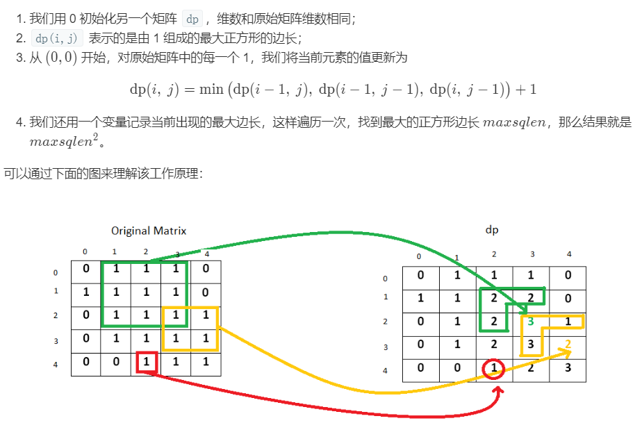

## 221. Maximal Square

### Information
* TIME: 2019/11/01
* LINK: [Click Here](https://leetcode-cn.com/problems/maximal-square/submissions/)
* TAG: `DP`

### Description
> 在一个由 0 和 1 组成的二维矩阵内，找到只包含 1 的最大正方形，并返回其面积

### Example
```text
输入: 

1 0 1 0 0
1 0 1 1 1
1 1 1 1 1
1 0 0 1 0

输出: 4
```

### My Answer
> 
```java
class Solution {
    public int maximalSquare(char[][] matrix) {
        int rows,cols,maxLength;
        rows = matrix.length;
        cols = rows==0?0:matrix[0].length;
        maxLength = 0;
        int[][] dp = new int[rows+1][cols+1];
        for(int i=1;i<=rows;i++){
            for(int j=1;j<=cols;j++){
                if(matrix[i-1][j-1]=='1'){
                    dp[i][j] = Math.min(dp[i-1][j-1],Math.min(dp[i-1][j],dp[i][j-1]))+1;
                    maxLength = Math.max(maxLength,dp[i][j]);
                }
            }
        }
        
        return maxLength*maxLength;
    }
}
```

### Best Answer
> 空间压缩
> 
> 下一状态指用到`(i-1,j-1)` `(i-1,j)` `(i,j-1)`三个状态
>   * `(i-1,j)` -- `dp[j]`
>   * `(i,j-1)` -- `dp[j-1]`
> 
> 所以只需在`dp[j]`改变前保存该值
```java
class Solution {
    public int maximalSquare(char[][] matrix) {
        int rows,cols,maxLength,pre;
        rows = matrix.length;
        cols = rows==0?0:matrix[0].length;
        pre = maxLength = 0;
        int[] dp = new int[cols+1];
        for(int i=1;i<=rows;i++){
            for(int j=1;j<=cols;j++){
                int tmp = dp[j];
                if(matrix[i-1][j-1]=='1'){
                    dp[j] = Math.min(dp[j-1],Math.min(dp[j],pre))+1;
                    maxLength = Math.max(dp[j],maxLength);
                }else{
                    dp[j] = 0;
                }
                pre = tmp;
            }
        }
        return maxLength*maxLength;
    }
}
```

