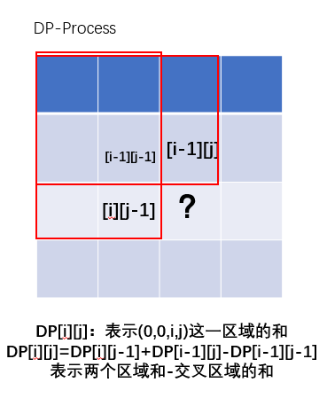
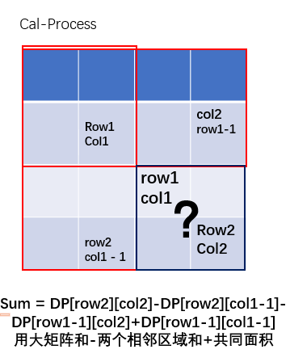

## 304. Range Sum Query 2D - Immutable

### Information
* TIME: 2019/11/05(bu)
* LINK: [Click Here](https://leetcode-cn.com/problems/range-sum-query-2d-immutable/)
* TAG: `DP`

### Description
> 给定一个二维矩阵，计算其子矩形范围内元素的总和，该子矩阵的左上角为 (row1, col1) ，右下角为 (row2, col2)。

### Example
```text
给定 matrix = [
  [3, 0, 1, 4, 2],
  [5, 6, 3, 2, 1],
  [1, 2, 0, 1, 5],
  [4, 1, 0, 1, 7],
  [1, 0, 3, 0, 5]
]

sumRegion(2, 1, 4, 3) -> 8
sumRegion(1, 1, 2, 2) -> 11
sumRegion(1, 2, 2, 4) -> 12

```

### My Answer
> 
>
> 
```java
class NumMatrix {
    int[][] dp;
    public NumMatrix(int[][] matrix) {
        if(matrix.length==0||matrix[0].length==0)
            return;
        dp = new int[matrix.length+1][matrix[0].length+1];
        
        for(int i=0;i<matrix.length;i++){
            for(int j=0;j<matrix[0].length;j++){
                dp[i+1][j+1] = dp[i][j+1] + dp[i+1][j] + matrix[i][j] - dp[i][j];
            }
        }
    }
    
    public int sumRegion(int row1, int col1, int row2, int col2) {
        return dp[row2+1][col2+1] - dp[row2+1][col1] - dp[row1][col2+1] + dp[row1][col1];
    }
}

/**
 * Your NumMatrix object will be instantiated and called as such:
 * NumMatrix obj = new NumMatrix(matrix);
 * int param_1 = obj.sumRegion(row1,col1,row2,col2);
 */
```


