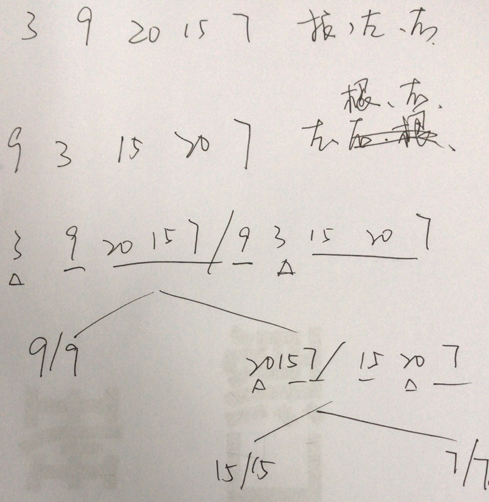

## 105. Construct Binary Tree from Preorder and Inorder Traversal

### Information
* TIME: 2019/11/06
* LINK: [Click Here](https://leetcode-cn.com/problems/construct-binary-tree-from-preorder-and-inorder-traversal/)
* TAG: `2019/11/06`

### Description
> 根据一棵树的前序遍历与中序遍历构造二叉树。

### Example
```text
前序遍历 preorder = [3,9,20,15,7]
中序遍历 inorder = [9,3,15,20,7]

    3
   / \
  9  20
    /  \
   15   7
```

### My Answer
> 根据先序：根左右/中序：左根右的特征
>
> 先序序列首元素确定根，再去中序中查找根，用根划分左右子树的中序序列
>
> 根据中序序列的划分情况，反推先序的划分
>
> 
```java
/**
 * Definition for a binary tree node.
 * public class TreeNode {
 *     int val;
 *     TreeNode left;
 *     TreeNode right;
 *     TreeNode(int x) { val = x; }
 * }
 */
class Solution {
    public TreeNode buildTree(int[] preorder, int[] inorder) {
        if(preorder.length==0)
            return null;
        TreeNode root = new TreeNode(preorder[0]);
        
        int split = 0;
        while(preorder[0]!=inorder[split]){
            split++;
        }
        root.left = buildTree(Arrays.copyOfRange(preorder,1,split+1),
                             Arrays.copyOfRange(inorder,0,split));
        
        root.right = buildTree(Arrays.copyOfRange(preorder,split+1,preorder.length),
                             Arrays.copyOfRange(inorder,split+1,inorder.length));
        return root;
    }
}
```

### Best Answer
> [待解决：解法二 迭代 栈](https://leetcode-cn.com/problems/construct-binary-tree-from-preorder-and-inorder-traversal/solution/xiang-xi-tong-su-de-si-lu-fen-xi-duo-jie-fa-by--22/)
```c
/*code*/
```

