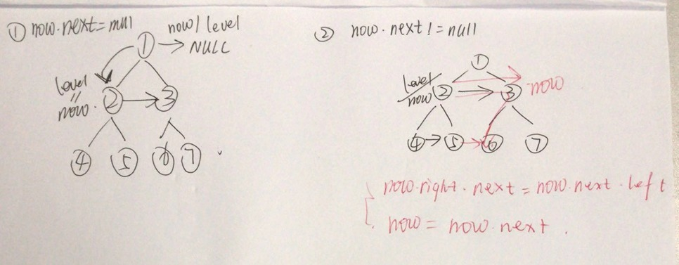

## 116. Populating Next Right Pointers in Each Node

### Information

* TIME: 2019/11/12
* LINK: [Click Here]( https://leetcode-cn.com/problems/populating-next-right-pointers-in-each-node/ )
* TAG: `Tree`

### Description

>  给定一个**完美二叉树**，其所有叶子节点都在同一层，每个父节点都有两个子节点。 
>
> 填充它的每个 next 指针，让这个指针指向其下一个右侧节点。如果找不到下一个右侧节点，则将 next 指针设置为 NULL。
>
> 初始状态下，所有 next 指针都被设置为 NULL。
>

### Example

```text
输入：{"$id":"1","left":{"$id":"2","left":{"$id":"3","left":null,"next":null,"right":null,"val":4},"next":null,"right":{"$id":"4","left":null,"next":null,"right":null,"val":5},"val":2},"next":null,"right":{"$id":"5","left":{"$id":"6","left":null,"next":null,"right":null,"val":6},"next":null,"right":{"$id":"7","left":null,"next":null,"right":null,"val":7},"val":3},"val":1}

输出：{"$id":"1","left":{"$id":"2","left":{"$id":"3","left":null,"next":{"$id":"4","left":null,"next":{"$id":"5","left":null,"next":{"$id":"6","left":null,"next":null,"right":null,"val":7},"right":null,"val":6},"right":null,"val":5},"right":null,"val":4},"next":{"$id":"7","left":{"$ref":"5"},"next":null,"right":{"$ref":"6"},"val":3},"right":{"$ref":"4"},"val":2},"next":null,"right":{"$ref":"7"},"val":1}

解释：给定二叉树如图 A 所示，你的函数应该填充它的每个 next 指针，以指向其下一个右侧节点，如图 B 所示。
```

> 

### My Answer

> 
>
> 思路：通过层次遍历的方式，将同一层次的节点进行连接
>
> IF：`now.next=null`
>
> * 表示当前`now`节点已经走到本层的最后，此时`level`指向下一层，表示开始连接下一层的节点
> * 而`now`初始化为`level`
> * `now`总是在**已连接层**，通过访问左右孩子连接下一层的节点
>
> ELSE：`now.next!=null`
>
> * 表示当前层还没有走完，此时需要将当前层的两个相邻节点的右孩子和左孩子进行连接
> * 借助`now.next.left`可以从`2`访问到`6`，将`5`与`6`进行连接
> * `now`通过`next`走向本层的下一个节点，继续对孩子节点进行连接

```java
/*
// Definition for a Node.
class Node {
    public int val;
    public Node left;
    public Node right;
    public Node next;

    public Node() {}

    public Node(int _val,Node _left,Node _right,Node _next) {
        val = _val;
        left = _left;
        right = _right;
        next = _next;
    }
};
*/
class Solution {
    public Node connect(Node root) {
        if(root==null)
            return root;
        Node level = root;
        Node now = level;
        while(level.left!=null){
            now.left.next = now.right;
            if(now.next==null){
                //next level
                level = level.left;
                now = level;
            }else{
                now.right.next = now.next.left;
                now = now.next;
            }
        }
        return root;
    }
}
```

### Extend & Reference

> 该题解代码有误，但思路很好
>
> [通过next进行层次遍历的java解法]( https://leetcode-cn.com/problems/populating-next-right-pointers-in-each-node/solution/mei-guan-yi-dong-de-java-xie-fa-by-zoharyips/ )

