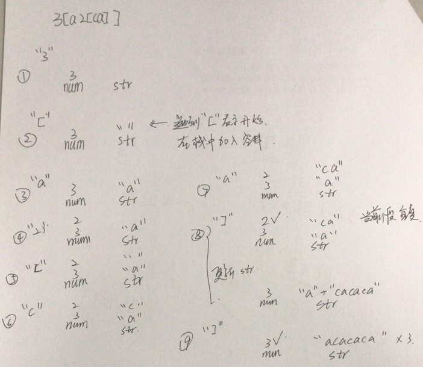

## 394. Decode String

### Information

* TIME: 2019/11/25
* LINK: [Click Here]( https://leetcode-cn.com/problems/decode-string/ )
* TAG: `DFS`

### Description

> 给定一个经过编码的字符串，返回它解码后的字符串。
>
> 编码规则为: k[encoded_string]，表示其中方括号内部的 encoded_string 正好重复 k 次。注意 k 保证为正整数。
>
> 你可以认为输入字符串总是有效的；输入字符串中没有额外的空格，且输入的方括号总是符合格式要求的。
>
> 此外，你可以认为原始数据不包含数字，所有的数字只表示重复的次数 k ，例如不会出现像 3a 或 2[4] 的输入。
>

### Example

```text
s = "3[a]2[bc]", 返回 "aaabcbc".
s = "3[a2[c]]", 返回 "accaccacc".
s = "2[abc]3[cd]ef", 返回 "abcabccdcdcdef".
```

### My Answer

> 
>
> 思路如上：
>
> * 遇到`[`表示需重复段的开始，此时需要在栈中单独开一行
> * 遇到`]`表示重复段结束，出栈需重复的段进行叠加
>   * 叠加后的重复字符串与此时的栈顶字符串相加，成为新的栈顶

```java
class Solution {
    public String decodeString(String s) {
        String res = "";
        Stack<String> str_stack  = new Stack<>();
        Stack<Integer> num_stack = new Stack<>();
        str_stack.push("");
        int number = 0;
        for(int i=0;i<s.length();i++){
            char c = s.charAt(i);
            if(c>='0'&&c<='9'){
                number = number*10 + (c-'0');
                if(s.charAt(i+1)>'9'||s.charAt(i+1)<'0'){
                    num_stack.push(number);
                    number = 0;
                }
            }else if(c=='['){
                str_stack.push("");
            }else if(c==']'){
                int num = num_stack.pop();
                String sub_str = str_stack.pop();
                String re_str = "";
                for(int j=0;j<num;j++){
                    re_str += sub_str;
                }
                //重复叠加所得的字符串与此时的栈顶字符串相加后成为新栈顶
                str_stack.push(str_stack.pop()+re_str);
            }else{
                //更新栈顶
                str_stack.push(str_stack.pop()+c);
            }
        }
        return str_stack.peek();
    }
}
```
