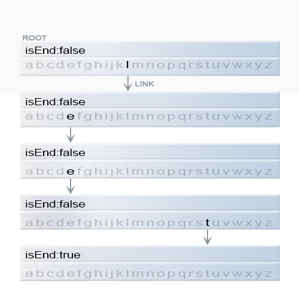
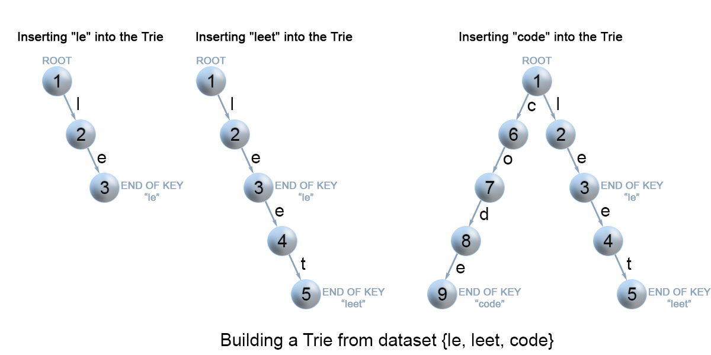

## 208. Implement Trie (Prefix Tree)

### Information

* TIME: 2019/12/03
* LINK: [Click Here](https://leetcode-cn.com/problems/implement-trie-prefix-tree/)
* TAG: `前缀树`

### Description

> 实现一个 Trie (前缀树)，包含 `insert`, `search`, 和 `startsWith` 这三个操作。

### Example

```text
Trie trie = new Trie();

trie.insert("apple");
trie.search("apple");   // 返回 true
trie.search("app");     // 返回 false
trie.startsWith("app"); // 返回 true
trie.insert("app");   
trie.search("app");     // 返回 true

```

### My Answer

> 前缀树结构
>
> * 最多有R个指向子节点的连接，每个链接对应字母表数据集中的一个字母
> * R取决于字符集大小
> * `isEnd` 指定节点是字符串结尾或是键前缀
>
> 
>
> 构建Tire
>
> * 链接存在。沿着链接移动到树的下一个子层。算法继续搜索下一个键字符。
> * 链接不存在。创建一个新的节点，并将它与父节点的链接相连，该链接与当前的键字符相匹配。
>
> 查找Trie
>
> * 链接不存在则说明查找单词不存在
>
> 判定前缀存在
>
> * 与查找的区别在于：查找时`isEnd=true`，判定前缀只需保证`prefix`到达终点
>
> 

```java
//树节点
class TrieNode{
    private TrieNode[] links;
    private final int CHARSET_NUM = 26;
    //标记单词尾
    private boolean isEnd;
    public TrieNode(){
        links = new TrieNode[CHARSET_NUM];
    }
    
    public boolean containsKey(char c){
        return links[c-'a']!=null;
    }
    public TrieNode get(char c){
        return links[c-'a'];
    }
    public void put(char c,TrieNode node){
        links[c-'a'] = node;
    }
    public void setEnd(){
        isEnd = true;
    }
    public boolean isEnd(){
        return isEnd;
    }
}

class Trie {
    private TrieNode root;
    /** Initialize your data structure here. */
    public Trie() {
        root = new TrieNode();
    }
    
    /** Inserts a word into the trie. */
    public void insert(String word) {
        TrieNode node = root;
        for(char c:word.toCharArray()){
            //不存在该节点，进行插入操作
            if(!node.containsKey(c)){
                node.put(c,new TrieNode());
            }
            //获取下一节点
            node = node.get(c);
        }
        //设置单词结尾标记
        node.setEnd();
    }
    
    /** Returns if the word is in the trie. */
    public boolean search(String word) {
        TrieNode node = root;
        for(char c:word.toCharArray()){
            if(!node.containsKey(c)){
                return false;
            }
            node = node.get(c);
        }
        return node.isEnd();
    }
    
    /** Returns if there is any word in the trie that starts with the given prefix. */
    public boolean startsWith(String prefix) {
        TrieNode node = root;
        for(char c:prefix.toCharArray()){
            if(!node.containsKey(c)){
                return false;
            }
            node = node.get(c);
        }
        return true;
    }
}

/**
 * Your Trie object will be instantiated and called as such:
 * Trie obj = new Trie();
 * obj.insert(word);
 * boolean param_2 = obj.search(word);
 * boolean param_3 = obj.startsWith(prefix);
 */
```

### Extend & Reference

> **Leetcode官方前缀树介绍：** [**实现 Trie (前缀树)**](https://leetcode-cn.com/problems/implement-trie-prefix-tree/solution/shi-xian-trie-qian-zhui-shu-by-leetcode/)

