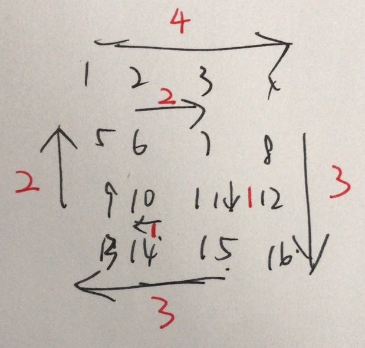

## 54. 螺旋矩阵

### Information

* TIME: 2019/12/13
* LINK: [Click Here](https://leetcode-cn.com/problems/spiral-matrix/)
* TAG: `matrix`

### Description

> 给定一个包含 *m* x *n* 个元素的矩阵（*m* 行, *n* 列），请按照顺时针螺旋顺序，返回矩阵中的所有元素。

### Example

```text
输入:
[
  [1, 2, 3, 4],
  [5, 6, 7, 8],
  [9,10,11,12]
]
输出: [1,2,3,4,8,12,11,10,9,5,6,7]
```

### My Answer

> 
>
> 螺旋矩阵只能`垂直` `平行`走，且每次走完，步长都会**-1**
>
> 初始化移动向量`dirct`，模拟螺旋过程

```java
class Solution {
    private int[][] dirct = {{0, 1}, {1, 0}, {0, -1}, {-1, 0}};
    public List<Integer> spiralOrder(int[][] matrix) {
        List<Integer> ans = new ArrayList<>();
        if(matrix==null || matrix.length==0)
            return ans;
        int verticalStep = matrix.length - 1;       //垂直方向应走步数
        int parallelStep = matrix[0].length;        //平行方向应走步数
        int step = parallelStep;                    //一开始应该是平行走
        int dirctIdx = 0;
        int i, j;       
        i = 0;
        j = -1;
        
        //初始走平行，下一次平行步数-1
        parallelStep--;
        while(step > 0){
            
            while(step-- > 0){
                i += dirct[dirctIdx][0];
                j += dirct[dirctIdx][1];
                ans.add(matrix[i][j]);
            }
            
            dirctIdx = (dirctIdx + 1) % 4;
            
            // 单数转垂直走
            if(dirctIdx % 2 == 1){
                step = verticalStep;
                //下一次垂直步数 -1
                verticalStep--;
            }else{
                step = parallelStep;
                //下一次平行步数 -1
                parallelStep--;
            }
        }
        
        return ans;
    }
}
```

