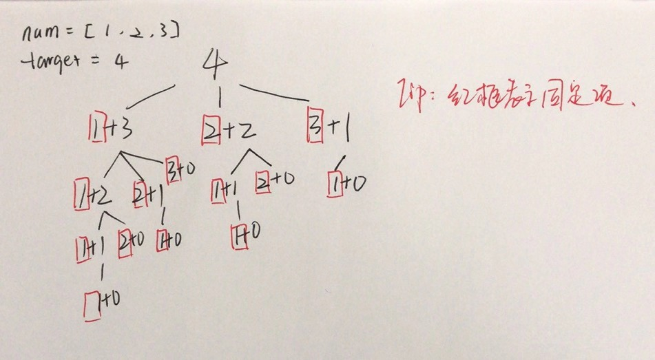

## 377. Combination Sum IV

### Information

* TIME: 2019/12/15
* LINK: [Click Here](https://leetcode-cn.com/problems/combination-sum-iv/)
* TAG: `DP`

### Description

> 给定一个由正整数组成且不存在重复数字的数组，找出和为给定目标正整数的组合的个数。

### Example

```text
nums = [1, 2, 3]
target = 4

所有可能的组合为：
(1, 1, 1, 1)
(1, 1, 2)
(1, 2, 1)
(1, 3)
(2, 1, 1)
(2, 2)
(3, 1)

请注意，顺序不同的序列被视作不同的组合。

因此输出为 7。
```

### My Answer - 超时

> 
>
> 记忆化递归解法
>
> * 自顶而下递归，固定红框部分
>
> 但该方法无法通过`[3,33,333] target = 10000` 
>
> * 原因是递归层过大，且无法记忆

```java
class Solution {
    
    private int[] memory;
    public int combinationSum4(int[] nums, int target) {
        memory = new int[target + 1];
        memory[0] = 1;
        Arrays.sort(nums);
        return combinationSum4Helper(nums, target);
    }
    
    public int combinationSum4Helper(int[] nums, int target){
        if(memory[target] != 0){
            return memory[target];
        }
        
        int cnt = 0;
        
        for(int i = 0; i < nums.length && nums[i] <= target; i++){
            memory[target - nums[i]] = combinationSum4Helper(nums, target - nums[i]);
            cnt += memory[target - nums[i]];
        }
        return cnt;
    }
}
```

### Best Answer

> 与递归不同，一样看上图，DP是自底而上的过程
>
> 先求得`target`之前的`1-target-1`的组合数，自然可得`target`的组合数

```c
class Solution {
    public int combinationSum4(int[] nums, int target) {
        if(nums == null || nums.length == 0)
            return 0;
        int len = nums.length;
        int[] dp = new int[target + 1];
        dp[0] = 1;
        for(int i = 1; i <= target; i++){
            for(int j = 0; j < nums.length; j++){
                if(nums[j] <= i){
                    dp[i] += dp[i - nums[j]];
                }
            }
        }
        
        return dp[target];
    }
}
```

