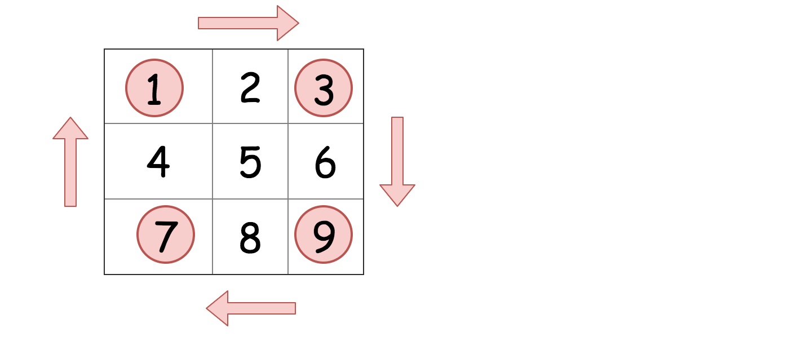

## 48. Rotate Image

### Information

* TIME: 2020/01/05
* LINK: [Click Here](https://leetcode-cn.com/problems/rotate-image/)
* TAG: `Matrix`

### Description

> 给定一个 n × n 的二维矩阵表示一个图像。
>
> 将图像顺时针旋转 90 度。
>
> 说明：
>
> 你必须在原地旋转图像，这意味着你需要直接修改输入的二维矩阵。请不要使用另一个矩阵来旋转图像。
>

### Example

```text
给定 matrix = 
[
  [1,2,3],
  [4,5,6],
  [7,8,9]
],

原地旋转输入矩阵，使其变为:
[
  [7,4,1],
  [8,5,2],
  [9,6,3]
]
```

### My Answer1

> 先求矩阵转置，再转换为y轴对称

```java
class Solution {
    public void rotate(int[][] matrix) {
        
        if(matrix == null)
            return;
        
        int n = matrix.length;
        
        //转置
        for(int i = 0; i < n; i++){
            for(int j = i; j < n; j++){
                int tmp = matrix[i][j];
                matrix[i][j] = matrix[j][i];
                matrix[j][i] = tmp;
            }
        }
        
        //求关于y轴对称
        for(int i = 0; i < n; i++){
            for(int j = 0; j < n / 2; j++){
                int tmp = matrix[i][j];
                matrix[i][j] = matrix[i][n - j - 1];
                matrix[i][n - j - 1] = tmp;
            }
        }
    }
}
```

### My Answer2

> 
>
> 对镜像的4个元素进行旋转

```java
class Solution {
    public void rotate(int[][] matrix) {
        
        if(matrix == null)
            return;
        
        int n = matrix.length;
        int[] tmps = new int[4];
        
        for(int i = 0; i < n / 2 + (n % 2); i++){
            for(int j = 0; j < n / 2; j++){
                int row = i;
                int col = j;
                
                for(int k = 0; k < 4; k++){
                    tmps[k] = matrix[row][col];
                    int tmp_row = row;
                    row = col;
                    col = n - tmp_row - 1;
                }
                
                for(int k = 0; k < 4; k++){
                    matrix[row][col] = tmps[(k + 3) % 4];
                    int tmp_row = row;
                    row = col;
                    col = n - tmp_row - 1;
                }
            }
        }
    }
}
```

### My Answer3

>根据`My Answer2`进行展开

```java
class Solution {
    public void rotate(int[][] matrix) {
        if(matrix == null)
            return;
        
        int n = matrix.length;
        
        for(int i = 0; i < n / 2 + (n % 2); i++){
            for(int j = 0; j < n / 2; j++){
                
                int tmp = matrix[n - j - 1][i];
                matrix[n - j - 1][i] = matrix[n - i - 1][n - j - 1];
                matrix[n - i - 1][n - j - 1] = matrix[j][n - 1 - i];
                matrix[j][n - 1 - i] = matrix[i][j];
                matrix[i][j] = tmp;
            }
        }
        
    }
}
```

### Extend & Reference

> [旋转图像官方题解](https://leetcode-cn.com/problems/rotate-image/solution/xuan-zhuan-tu-xiang-by-leetcode/)