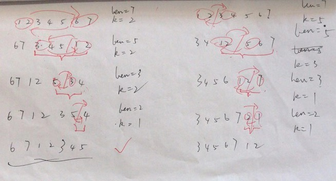

## 189. Rotate Array

### Information

* TIME: 2020/01/21
* LINK: [Click Here](https://leetcode-cn.com/problems/rotate-array/)
* TAG: `Array`

### Description

> 给定一个数组，将数组中的元素向右移动 *k* 个位置，其中 *k* 是非负数。

### Example

```text
输入: [1,2,3,4,5,6,7] 和 k = 3
输出: [5,6,7,1,2,3,4]
解释:
向右旋转 1 步: [7,1,2,3,4,5,6]
向右旋转 2 步: [6,7,1,2,3,4,5]
向右旋转 3 步: [5,6,7,1,2,3,4]
```

### My Answer -1

> 冒泡思想，分治算法，改进为算法复杂度O(n)，空间O(1)
>
> 这是一个无聊时想到的很难理解的方法，需要分两种情况
>
> 

```java
class Solution {
    public void rotate(int[] nums, int k) {
        k = k % nums.length;
        if(k == 0){
            return;
        }
        int start = 0;
        int end = nums.length - 1;
        
        while(k < end - start + 1){
            int len = end - start + 1;
            //后半部分大
            if(k > len / 2){
                int newStart = start + (len - k);
                for(int i = 0; i < len - k; i++){
                    int tmp = nums[i + start];
                    nums[i + start] = nums[i + newStart];
                    nums[i + newStart] = tmp;
                }
                start = newStart;
                k = len - ((len - k) * 2);
            }else{
                int newStart = start + k;
                for(int i = 0; i < k; i++){
                    int tmp = nums[i + start];
                    nums[i + start] = nums[end - k + 1 + i];
                    nums[end - k + 1 + i] = tmp;
                }
                start = newStart;
            }
            //System.out.println(k);
        }

    }
}
```

### My Answer -2

> 
>
> 座位轮换思想
>
> 向右移动k位，等价于每个元素都执行`num[(i + k) % length] = num[i]`
>
> 相等于环形换座位，每一个环，都缺1个tmp缓存位
>
> 比如 `1起立 -> 在3坐下 -> 3起立 -> 在5坐下 -> 5起立 -> 在1坐下`
>
> 于是只需要一个缓存位进行移动，元素往后找座位即可

```java
class Solution {
    public void rotate(int[] nums, int k) {
        k = k % nums.length;
        int count = 0;
        for(int start = 0; count < nums.length; start++){
            int current = start;        //起始位置，需要去寻找移动后的座位
            int pre = nums[current];    //起立位置的值
            do{
                int next = (current + k) % nums.length;     //坐下位置
                int tmp = nums[next];
                nums[next] = pre;
                pre = tmp;          //current坐下后，next起立
                current = next;     //next去寻找座位

                //该元素已挪动，挪动次数++
                count++;
            } while(start != current);
        }
    }
}
```

### My Answer -3

> 三次反转，神仙

```java
class Solution {
    public void rotate(int[] nums, int k) {
        k = k % nums.length;
        reverse(nums, 0, nums.length - 1);
        reverse(nums, 0, k - 1);
        reverse(nums, k, nums.length - 1);
    }
    private void reverse(int[] array, int begin, int end){
        
        while(begin < end){
            int tmp = array[begin];
            array[begin] = array[end];
            array[end] = tmp;
            begin++;
            end--;
        }
    }
}
```

