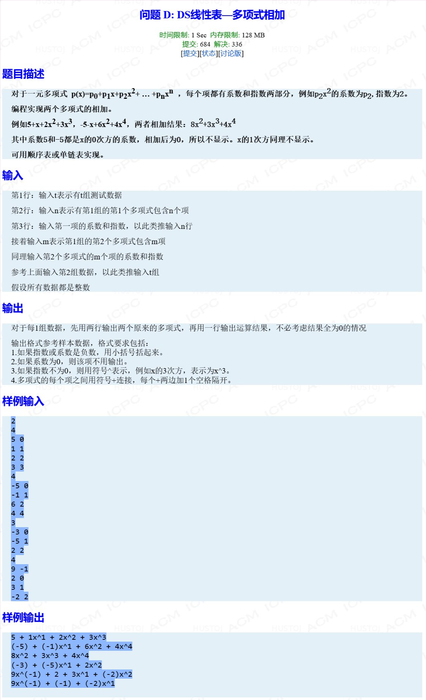

## KATA-NAME

### Information
* TIME: 2019/09/19
* TAG: `链表`

### Description


### My Answer
> 迭代思路
> * 指数小的节点入新链表，然后往后走
> * 若指数相等，把值加到链1上的节点后插入，删除链2节点
> * 如果相加结果是0，也把链1节点删除，不插入
```c++
#include<iostream>
#include<string>
using namespace std;
class Node{
public:
    Node* next;
    int index;
    int value;
    Node()
    {
        next = NULL;
        index = 0;
        value = 0;
    }
    Node(int idx,int val):index(idx),value(val)
    {
        next = NULL;
    }
};

class MyList
{
public:
    Node* head;
    Node* tail;
    MyList()
    {
        head = new Node();
        tail = head;
    }
    ~MyList()
    {
        Node* tmpHead = head;
        while(head)
        {
            tmpHead = head->next;a
            delete head;
            head = tmpHead;
        }
    }
    void myInsert(int idx,int val)
    {
        Node* newNode = new Node(idx,val);
        tail->next = newNode;
        tail = newNode;
    }
    //插入一个已有节点
    void insertNode(Node* newNode)
    {
        newNode->next = NULL;   //封住next
        tail->next = newNode;
        tail = newNode;
    }
    //打印多项式
    //to_string(int) 将整型转成字符串
    void print()
    {
        string res = "";
        int idx,val,cnt=0;
        Node* tmpHead = head->next;
        while(tmpHead)
        {
            if(cnt)
                res += " + ";
            idx = tmpHead->index,val = tmpHead->value;
            res += val<0? ("("+to_string(val)+")"):to_string(val);
            res += idx==0? "":"x^";
            if(idx!=0)
                res += idx<0? ("("+to_string(idx)+")"):to_string(idx);

            tmpHead = tmpHead->next;
            cnt++;
        }
        cout<<res<<endl;
    }
};

MyList* input(int n)
{
    int idx,val;
    MyList* formula = new MyList();
    for(int i=0;i<n;i++)
    {
        cin>>val>>idx;
        formula->myInsert(idx,val);
    }
    return formula;
}

//多项式相加
MyList* add(MyList* formula_1,MyList* formula_2)
{
    MyList* sum = new MyList();
    Node* head_1 = formula_1->head->next;
    Node* head_2 = formula_2->head->next;
    while(head_1&&head_2)
    {
        /*
            指数小的节点入新链表，然后往后走
            若指数相等，把值加到链1上的节点后插入，删除链2节点
            如果相加结果是0，也把链1节点删除，不插入
        */
        if(head_1->index<head_2->index)
        {
            Node* willInsert = head_1;
            head_1 = head_1->next;
            sum->insertNode(willInsert);
        }
        else if(head_1->index>head_2->index)
        {
            Node* willInsert = head_2;
            head_2 = head_2->next;
            sum->insertNode(willInsert);
        }
        else
        {
            head_1->value += head_2->value;
            Node* willInsert = head_1;
            Node* willDelete = head_2;
            head_1 = head_1->next;
            head_2 = head_2->next;
            if(willInsert->value)
                sum->insertNode(willInsert);
            else
                delete willInsert;
            delete willDelete;
        }
    }
    //连接非空链
    if(head_1||head_2)
        sum->tail->next = head_1!=NULL? head_1:head_2;
    //封住链12的头节点，确保此时有效节点都在sum或者已释放，不造成越界
    formula_1->head->next = NULL;
    formula_2->head->next = NULL;
    return sum;
}
int main()
{
    int T,n;
    cin>>T;
    while(T--)
    {
        cin>>n;
        MyList* formula_1 = input(n);

        cin>>n;
        MyList* formula_2 = input(n);

        formula_1->print();
        formula_2->print();

        MyList* sum = add(formula_1,formula_2);
        sum->print();

        delete sum;
        delete formula_1;
        delete formula_2;
    }
    return 0;
}

```
