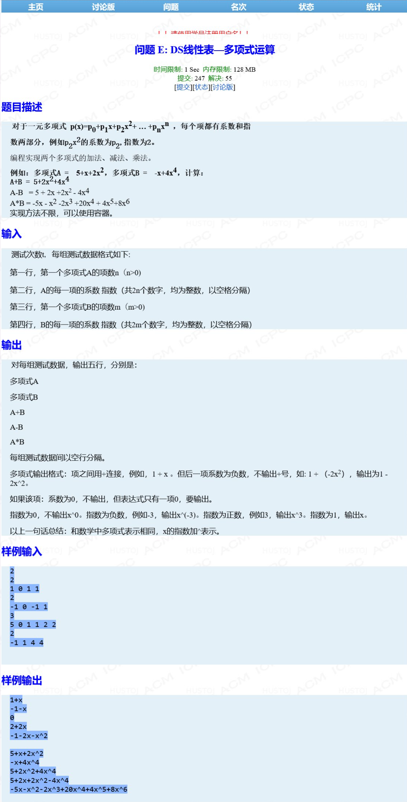

## 多项式运算

### Information
* TIME: 2019/09/20（补）
* TAG: `链表`

### Description


### My Answer
> 在[多项式相加](20190919.md)的基础上，拓展减法和乘法
> 
> 减法：在上一题的基础上增加`method`参数，并且不释放操作数空间
>
> 乘法：多次执行加分，把操作数1的每个数都与2的每项相乘，然后累加
```c++
#include<iostream>
#include<string>
#include<cstdlib>
using namespace std;
class Node{
public:
    Node* next;
    int index;
    int value;
    Node()
    {
        next = NULL;
        index = 0;
        value = 0;
    }
    Node(int idx,int val):index(idx),value(val)
    {
        next = NULL;
    }
};

class MyList
{
public:
    Node* head;
    Node* tail;
    MyList()
    {
        head = new Node();
        tail = head;
    }

    MyList(MyList* oriList,int val,int idx)
    {
        Node* oriHead = oriList->head->next;
        head = new Node();
        tail = head;
        while(oriHead)
        {
            Node* willInsert = new Node(oriHead->index+idx,oriHead->value*val);
            insertNode(willInsert,1);
            oriHead = oriHead->next;
            delete willInsert;
        }
    }

    ~MyList()
    {
        Node* tmpHead = head;
        while(head)
        {
            tmpHead = head->next;
            delete head;
            head = tmpHead;
        }
    }
    void myInsert(int idx,int val)
    {
        Node* newNode = new Node(idx,val);
        tail->next = newNode;
        tail = newNode;
    }
    void insertNode(Node* willNode,int method)
    {
        Node* newNode = new Node(willNode->index,willNode->value*method);
        newNode->next = NULL;
        tail->next = newNode;
        tail = newNode;
    }

    void print()
    {
        if(!head->next)
        {
            cout<<"0"<<endl;
            return;
        }
        string res = "";
        int idx,val,cnt=0;
        Node* tmpHead = head->next;
        while(tmpHead)
        {
            idx = tmpHead->index,val = tmpHead->value;
            res += val<0? "-" : cnt==0? "" :"+";
            res += abs(val)==1&&idx!=0? "" : to_string(abs(val));
            res += idx==0? "":"x";
            if(idx!=0)
                res += idx<0? ("^("+to_string(idx)+")"): idx==1? "" : "^"+to_string(idx);

            tmpHead = tmpHead->next;
            cnt++;
        }
        cout<<res<<endl;
    }
};

MyList* input(int n)
{
    int idx,val;
    MyList* formula = new MyList();
    for(int i=0;i<n;i++)
    {
        cin>>val>>idx;
        if(val)
            formula->myInsert(idx,val);
    }
    return formula;
}

MyList* add_sub(MyList* formula_1,MyList* formula_2,int method) //1-add,-1-sub
{
    MyList* sum = new MyList();
    Node* head_1 = formula_1->head->next;
    Node* head_2 = formula_2->head->next;
    while(head_1&&head_2)
    {
        if(head_1->index<head_2->index)
        {
            Node* willInsert = head_1;
            head_1 = head_1->next;
            sum->insertNode(willInsert,1);
        }
        else if(head_1->index>head_2->index)
        {
            Node* willInsert = head_2;
            head_2 = head_2->next;
            sum->insertNode(willInsert,method);
        }
        else
        {
            Node* willInsert = new Node(head_1->index,head_1->value+(method*head_2->value));
            head_1 = head_1->next;
            head_2 = head_2->next;
            if(willInsert->value)
                sum->insertNode(willInsert,1);
            delete willInsert;
        }
    }

    while(head_1){
        sum->insertNode(head_1,1);
        head_1 = head_1->next;
    }
    while(head_2){
        sum->insertNode(head_2,method);
        head_2 = head_2->next;
    }
    return sum;
}

MyList* multi(MyList* formula_1,MyList* formula_2)
{
    MyList* res = new MyList();
    Node* head1 = formula_1->head->next;
    Node* head2 = formula_2->head->next;

    while(head1)
    {
        MyList* oneMulti = new MyList(formula_2,head1->value,head1->index);
        MyList* willDel = res;
        /*cout<<"one:";
        oneMulti->print();
        cout<<"res:";
        res->print();*/
        res = add_sub(oneMulti,res,1);
        delete willDel;
        delete oneMulti;
        head1 = head1->next;
    }
    return res;
}
int main()
{
    int T,n;
    cin>>T;
    while(T--)
    {
        cin>>n;
        MyList* formula_1 = input(n);

        cin>>n;
        MyList* formula_2 = input(n);

        formula_1->print();
        formula_2->print();

        MyList* add_res = add_sub(formula_1,formula_2,1);
        add_res->print();

        MyList* sub_res = add_sub(formula_1,formula_2,-1);
        sub_res->print();

        MyList* multi_sub = multi(formula_1,formula_2);
        multi_sub->print();
        cout<<endl;

        delete add_res;
        delete sub_res;
        delete multi_sub;
        delete formula_1;
        delete formula_2;
    }
    return 0;
}
```
