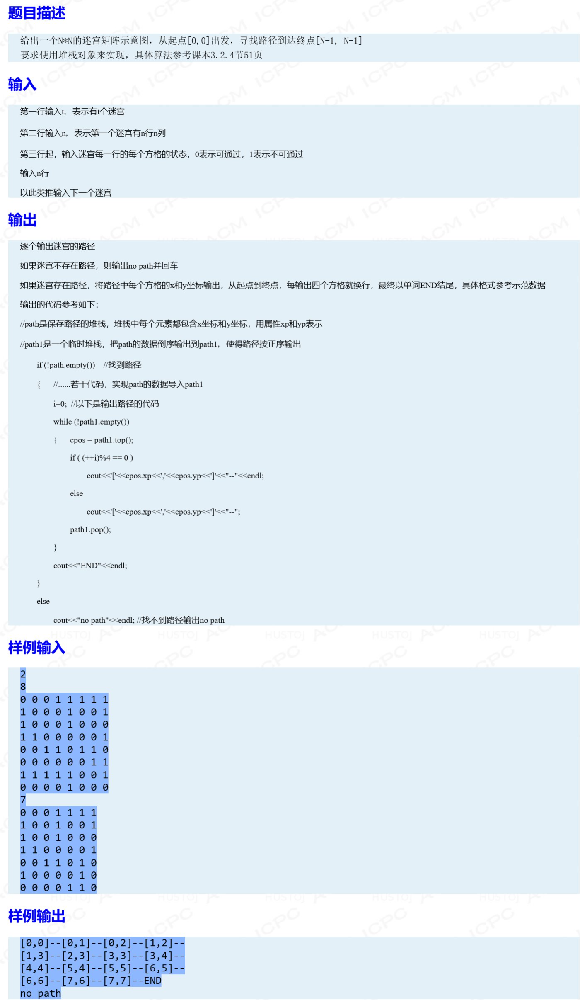

## 走迷宫

### Information
* TIME: 2019/09/23
* TAG: `栈`

### Description


### My Answer
> dfs变形，主要是记录路径，对于遍历四个方向仍没有找到的节点做出栈处理
```c++
#include<iostream>
#include<stack>
#include<memory.h>
#define MAX_SIZE 20
using namespace std;
int confuseMap[MAX_SIZE][MAX_SIZE];
bool visited[MAX_SIZE][MAX_SIZE];
int go[][2] = {{0,1},{1,0},{0,-1},{-1,0}};
struct dirct
{
    int x;
    int y;
    int d_num;
    dirct(int _x,int _y,int _d):x(_x),y(_y),d_num(_d){}
};
void init()
{
    memset(visited,false,sizeof(visited));
 
    for(int i=0;i<MAX_SIZE;i++)
        for(int j=0;j<MAX_SIZE;j++)
            confuseMap[i][j]=-1;
}
 
int main()
{
    int T;
    int n;
    cin>>T;
    while(T--)
    {
        init();
        cin>>n;
        for(int i=1;i<=n;i++)
            for(int j=1;j<=n;j++)
                cin>>confuseMap[i][j];
        stack<dirct> path;
        path.push(dirct(1,1,0));
        bool getFlag=false;
        while(!path.empty())
        {
            dirct local = path.top();path.pop();
            visited[local.x][local.y]=true;
            if(local.x==n&&local.y==n){
                path.push(local);
                getFlag = true;
                break;
            }
            int d_num = local.d_num;
            if(d_num<4){
                path.push(dirct(local.x,local.y,d_num+1));
                int _x = local.x + go[d_num][0];
                int _y = local.y + go[d_num][1];
                if(!visited[_x][_y]&&confuseMap[_x][_y]!=-1&&confuseMap[_x][_y]!=1){
                    path.push(dirct(_x,_y,0));
                }
            }else{
                if(!path.empty())
                    path.pop();
            }
            /*for(int i=0;i<4;i++)
            {
                int _x = local.x + go[i][0];
                int _y = local.y + go[i][1];
                if(!visited[_x][_y]&&confuseMap[_x][_y]!=-1&&confuseMap[_x][_y]!=1)
                    path.push(dirct(_x,_y));
            }*/
        }
        if(!getFlag)
            cout<<"no path"<<endl;
        else{
            stack<dirct> tmpPath;
            while(!path.empty()){
                tmpPath.push(path.top());
                path.pop();
            }
            int i=0;
            while(!tmpPath.empty()){
                i++;
                dirct local = tmpPath.top();
                tmpPath.pop();
                cout<<"["<<local.x-1<<","<<local.y-1<<"]--";
                if(!(i%4))
                    cout<<endl;
            }
            cout<<"END"<<endl;
        }
    }
    return 0;
}
```
