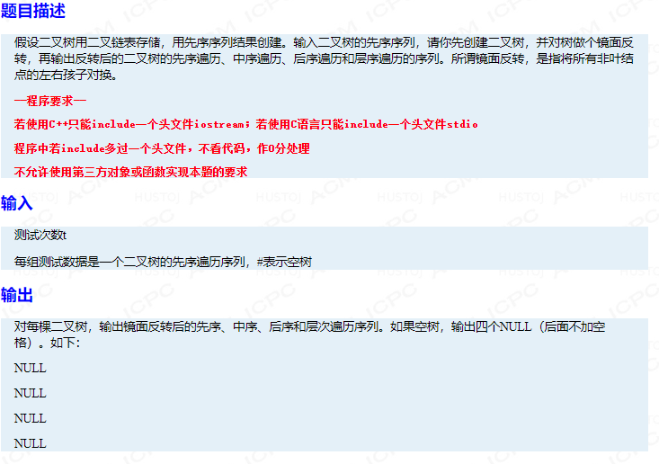

## 二叉树镜面反转

### Information
* TIME: 2019/10/22
* TAG: `BT`

### Description
> 

### Example
```text
3
41#32###65##7##
AB#C##D##
AB##C##

4 6 7 5 1 3 2 
7 6 5 4 3 2 1 
7 5 6 2 3 1 4 
4 6 1 7 5 3 2 
A D B C 
D A C B 
D C B A 
A D B C 
A C B 
C A B 
C B A 
A C B 
```

### My Answer
> 利用后序遍历的思路，当遍历到根时，把左孩子和右孩子调转
```c++
#include<iostream>
#include<queue>
#include<stack>
using namespace std;


struct TreeNode{
    char data;
    TreeNode* left;
    TreeNode* right;
    TreeNode(char _data){
        data = _data;
        left = right = NULL;
    }
};

void createTree(TreeNode*& root){
    char c;
    cin>>c;
    if(c=='#')
        return;
    root = new TreeNode(c);
    createTree(root->left);
    createTree(root->right);
}


TreeNode* reverseTree(TreeNode* root){
    if(root==NULL){
        return root;
    }
    TreeNode* leftTree = reverseTree(root->left);
    TreeNode* rightTree = reverseTree(root->right);
    root->left = rightTree;
    root->right = leftTree;
    return root;
}


void preOrder(TreeNode* root){
    if(root==NULL){
        cout<<"NULL"<<endl;
        return;
    }
    stack<TreeNode*> nodeStack;
    nodeStack.push(root);
    while(!nodeStack.empty()){
        TreeNode* top = nodeStack.top();
        nodeStack.pop();
        cout<<top->data<<" ";
        if(top->right!=NULL){
            nodeStack.push(top->right);
        }
        if(top->left!=NULL){
            nodeStack.push(top->left);
        }
    }
    cout<<endl;
}

void inOrder(TreeNode* root){
    if(root==NULL){
        cout<<"NULL"<<endl;
        return;
    }
    stack<TreeNode*> nodeStack;
    TreeNode* cur = root;
    while(cur!=NULL||!nodeStack.empty()){
        while(cur!=NULL){
            nodeStack.push(cur);
            cur = cur->left;
        }
        cur = nodeStack.top();
        nodeStack.pop();
        cout<<cur->data<<" ";
        cur = cur->right;
    }
    cout<<endl;
}

void postOrder(TreeNode* root){
    if(root==NULL){
        cout<<"NULL"<<endl;
        return;
    }
    stack<TreeNode*> nodeStack;
    TreeNode* cur = root;
    TreeNode* pre = NULL;
    while(cur!=NULL||!nodeStack.empty()){
        while(cur!=NULL){
            nodeStack.push(cur);
            cur = cur->left;
        }
        cur = nodeStack.top();
        if(cur->right==NULL||cur->right==pre){
            cout<<cur->data<<" ";
            nodeStack.pop();
            pre = cur;
            cur = NULL;
        }else{
            cur = cur->right;
        }
    }
    cout<<endl;
}

void levelOrder(TreeNode* root){
    if(root==NULL){
        cout<<"NULL"<<endl;
        return;
    }
    queue<TreeNode*> nodeQueue;
    nodeQueue.push(root);
    while(!nodeQueue.empty()){
        int num = nodeQueue.size();
        for(int i=0;i<num;i++){
            TreeNode* top = nodeQueue.front();
            nodeQueue.pop();
            cout<<top->data<<" ";
            if(top->left!=NULL)
                nodeQueue.push(top->left);
            if(top->right!=NULL)
                nodeQueue.push(top->right);
        }
    }
    cout<<endl;
}


int main(){
    int t;
    cin>>t;
    while(t--){
        TreeNode* root = NULL;
        createTree(root);
        root = reverseTree(root);
        preOrder(root);
        inOrder(root);
        postOrder(root);
        levelOrder(root);
    }
    return 0;
}

```
