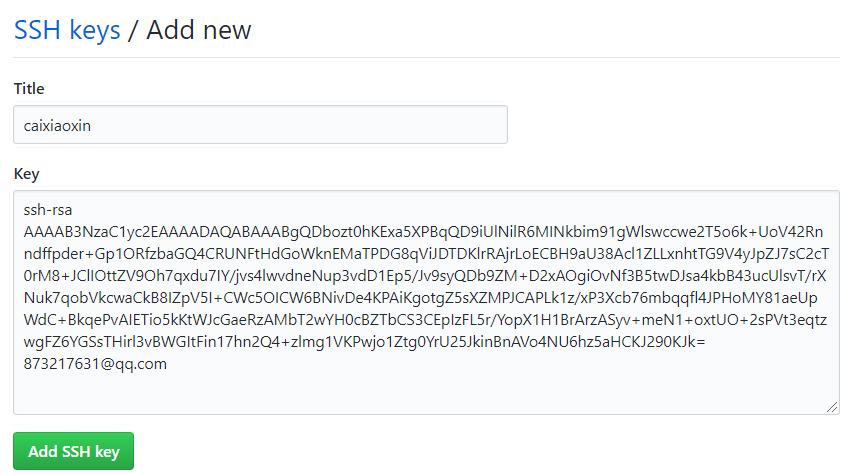
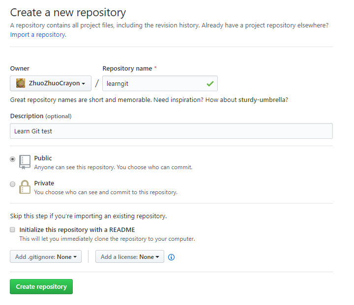
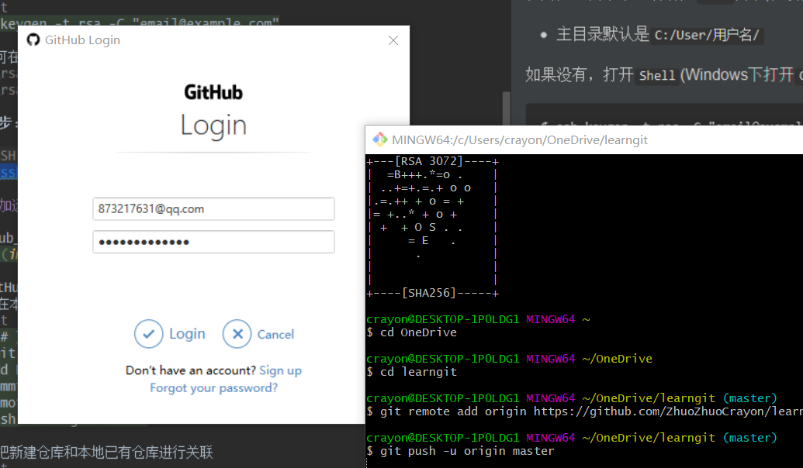

## 2-远程仓库Github

### 关联Github
**第一步：创建SSH key**

在用户主目录下查看有无`.ssh`目录,在该目录下且又`id_rsa`和`id_rsa.pub`
* 主目录默认是`C:/User/用户名/`

如果没有，打开`Shell`(Windows下打开`Git Bash`)，创建`SSH Key`,一路回车默认
```text
$ ssh-keygen -t rsa -C "email@example.com"
```
之后便可在主目录下看到`.ssh`文件，在该目录下
* `id_rsa` 是私钥
* `id_rsa_pub`是公钥

**第二步：登陆GitHub，打开`Settings`->`SSH Keys`页面**

`Add SSH Key`，`title`任意，在Key文本框中填入`id_rsa.pub`文件的内容


### 添加远程库

在GitHub上创建一个新仓库`learngit`


根据GitHub的提示
* 可以在本地新建一个`learngit`仓库
```text
echo "# learngit" >> README.md
git init
git add README.md
git commit -m "first commit"
git remote add origin https://github.com/ZhuoZhuoCrayon/learngit.git
git push -u origin master
```
* 可以把新建仓库和本地已有仓库进行关联
```text
git remote add origin https://github.com/ZhuoZhuoCrayon/learngit.git
git push -u origin master
```
选择后者，在本地`learngit`仓库下执行`git remote add origin https://github.com/ZhuoZhuoCrayon/learngit.git`，`origin`是远程库的名字，可以修改

下一步，把本地库所有内容推送到远程库 `git push -u origin master`，弹出登陆窗口

```text
$ git push -u origin master
Enumerating objects: 20, done.
Counting objects: 100% (20/20), done.
Delta compression using up to 4 threads
Compressing objects: 100% (15/15), done.
Writing objects: 100% (20/20), 1.61 KiB | 183.00 KiB/s, done.
Total 20 (delta 5), reused 0 (delta 0)
remote: Resolving deltas: 100% (5/5), done.
To https://github.com/ZhuoZhuoCrayon/learngit.git
 * [new branch]      master -> master
Branch 'master' set up to track remote branch 'master' from 'origin'.
```
将本地库内容推送到远程是采用`git push`命令，实际上是把当前分支`master`推送到远程

由于远程库是空的，第一次推送分支加上了`-u`参数，Git不但会把本地的`master`分支内容推送到远程新的`master`分支，还会把本地的`master`和远程的`master`分支关联

### 从远程库克隆

在GitHub上创建一个叫`gitskills`的新仓库\
利用`git clone`克隆一个本地库
```text
$ git clone git@github.com:ZhuoZhuoCrayon/gitskills.git
remote: Enumerating objects: 3, done.
remote: Counting objects: 100% (3/3), done.
Receiving objects: 100% (3/3), done.
remote: Total 3 (delta 0), reused 0 (delta 0), pack-reused 0
```
**git 目录操作**
* `cd ..` 返回上一级目录
* `cd path` 进入某一目录 
* `pwd` 显示当前目录

---
>### Acknowledgement & Notice
>>**[致谢]** 在Git学习的过程中，`Init` `1-Git基本操作` `2-远程仓库Github` 完全参考廖雪峰老师的Git教程，并结合本地操作环境及本人对Git的需求进行编写，笔记简略，注重操作
>>* 在此推荐 [廖雪峰Git教程](https://www.liaoxuefeng.com/wiki/896043488029600)
>>
>>**[版权声明]** 如上，内容方面是廖老师教程的压缩版，并且目录齐全，非常欢迎`star` `folk` 后根据目录增添自己所需，但**严禁商用**，一切不以学习目的使用本仓库所造成一切后果自负！
>>
>>**[学习进度说明]** 鉴于本人当前需要，前三篇笔记学习内容截止到廖老师Git教程的`远程仓库`部分