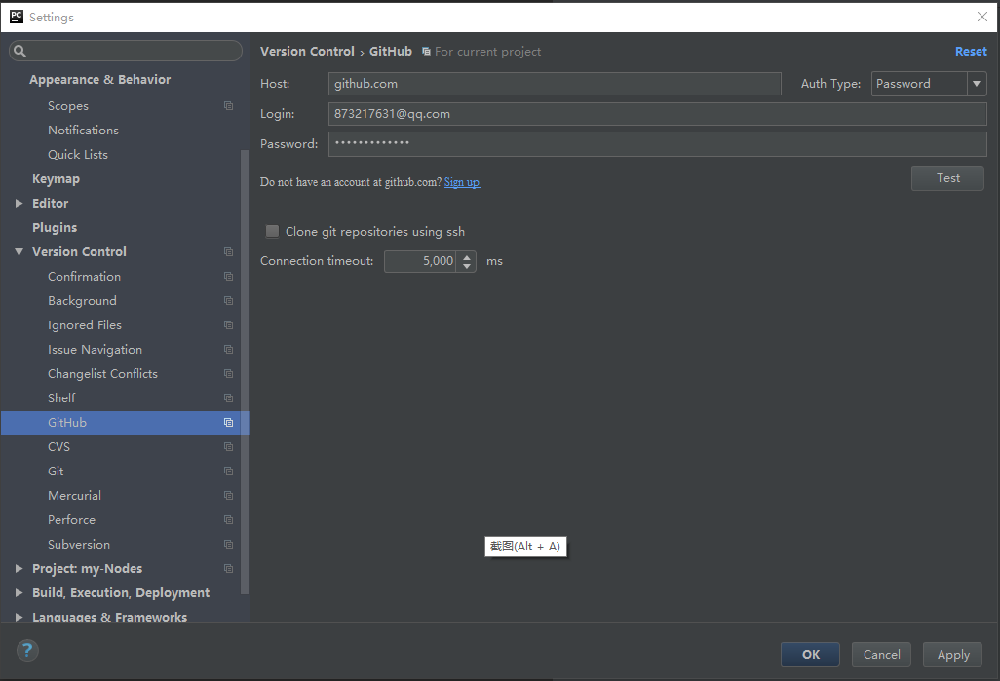
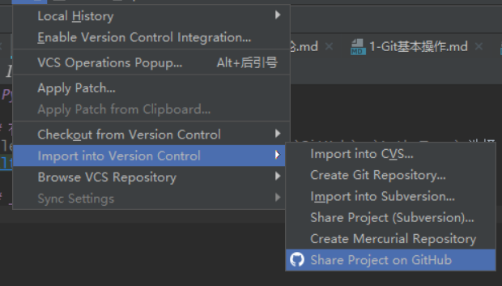
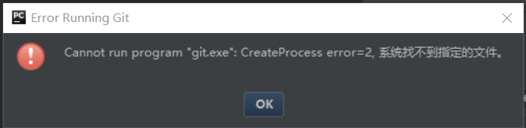
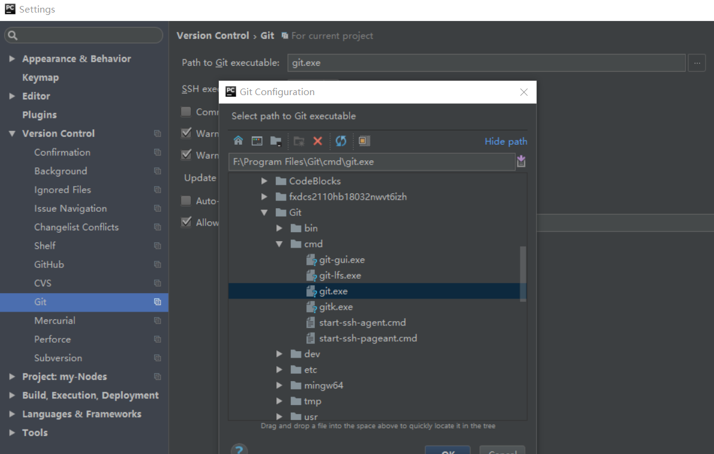

## Pycharm-Git操作

### 在Pycharm添加GitHub账户
`File`->`Settings`->`Version Control`->`GitHub`，`Auth Type` 选择 `password`，输入账户密码，点击`Test`



### 上传仓库

`VCS`->`Import into Version Control`->`Share Poject on GitHub`



出现报错，需要修改Git默认路径


`File`->`Settings`->`Git`，将`Path to Git ..`修改为本机`git.exe`的位置


再重复上传的步骤，就可以成功将仓库上传到GitHub

### 利用命令行批量更新仓库

**查看本地仓库状态**
```text
$ git status
On branch master
Your branch is up to date with 'origin/master'.

Changes to be committed:
  (use "git reset HEAD <file>..." to unstage)

        new file:   .idea/vcs.xml
        modified:   "Git/Pychram-Git\346\223\215\344\275\234.md"
        modified:   "html+css/2.1-HTML\346\240\207\347\255\276.md"
        modified:   "java\347\274\226\347\250\213\346\200\235\346\203\263/\347\254\254\344\270\200\347\253\240-\345\257\271\350\261\241\345\257\274\350\256\272.md"

Untracked files:
  (use "git add <file>..." to include in what will be committed)

        .idea/workspace.xml
```

**利用`git add *`或者`git add .`更新当前目录**
```text
$ git add .
warning: LF will be replaced by CRLF in .idea/workspace.xml.
The file will have its original line endings in your working directory
```

**`git commit -m "commit"` 更新备注**
```text
$ git commit -m "type change"
[master e53659a] type change
 5 files changed, 740 insertions(+), 7 deletions(-)
 create mode 100644 .idea/vcs.xml
 create mode 100644 .idea/workspace.xml
```

**`git fetch --all` 拉取当前分支最新代码**
```text
$ git fetch --all
Fetching origin
```

**push代码到远程分支**
```text
$ git push origin master
Enumerating objects: 19, done.
Counting objects: 100% (19/19), done.
Delta compression using up to 4 threads
Compressing objects: 100% (11/11), done.
Writing objects: 100% (11/11), 5.15 KiB | 1.71 MiB/s, done.
Total 11 (delta 6), reused 0 (delta 0)
remote: Resolving deltas: 100% (6/6), completed with 6 local objects.
To https://github.com/ZhuoZhuoCrayon/my-Nodes.git
   c447767..e53659a  master -> master
```
