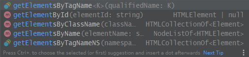

## 5.1浏览器对象

### window
> `window`对象不单单是全局作用域，而且也表示**浏览器窗口**

具有`innerWidth`和`innerHeight`属性，表示浏览器窗口的内部宽高(除去菜单工具边框等占位元素，用于显示网页的净宽高)

`outerWidth`和`outerHeight`用于获取整个浏览器的宽高

**兼容性:** IE>9

### navigator
`navigator`对象用于表示浏览器信息
* `navigator.appName` 浏览器名称
    * appName = Netscape
* `navigator.appVersion` 浏览器版本
    * appVersion = 5.0 (Windows NT 10.0; Win64; x64) AppleWebKit/537.36 (KHTML, like Gecko) Chrome/76.0.3809.132 Safari/537.36
* `navigator.language` 浏览器设置语言
    * language = zh-CN
* `navigator.platform` 操作系统类型
    * platform = Win32
* `navigator.userAgent` 浏览器设定的`User-Agent`
    * userAgent = Mozilla/5.0 (Windows NT 10.0; Win64; x64) AppleWebKit/537.36 (KHTML, like Gecko) Chrome/76.0.3809.132 Safari/537.36
   
`navigator`信息很容易被用户修改。

不要使用`if`判断浏览器版本，如下
```javascript
var width;
if(getIEVersion(navigator.userAgent)<9){
    width = document.body.clientWidth;
}else{
    width = window.innerWidth;
}
```
正确的方法是重复利用JS对不存在返回`undefined`的特性，用短路运算符计算
```javascript
var width = window.innerWidth || document.body.clientWidth;
```

### screen
`screen`表示对屏幕的信息
* `screen.width` 屏幕宽度，以像素为单位
* `screen.height` 屏幕高度，以像素为单位
* `screen.colorDepth` 返回颜色位数，如8、16、24

### location

`location`对象表示当前页面的URL信息
* `href` 返回完整的url
    * `'http://www.example.com:8080/path/index.html?a=1&b=2#TOP'`
* `protocol` 返回URL协议
    * `'http'`
* `host` 返回URL的主机名和端口号
    * `'www.example.com'`
* `port` 返回端口号
    * `'8080'`
* `pathname` 返回当前页面相对路径
    * `'/path/index.html'`
* `search` 返回URL的查询部分
    * `'?a=1&b=2'`
* `hash` 返回一个URL`#`以后的部分
    * `'TOP'`

`location.assgin(URL or Path)` 加载新页面，参数可以是一个URL，也可以是相对于该网站主机的相对地址

`loacation.reload()` 重新加载当前页面

`location`
```javascript
`use strict`
if(confirm('reload ' + location.href + '?')){
    location.reload();
}else{
    //location.assign('/')
    location.assign('https://www.liaoxuefeng.com/wiki/1022910821149312/1023022272084160')
}
```

### document
`document`对象表示当前页面，HTML在浏览器中以**DOM形式表示为树形结构**，`document`对象就是整个DOM树的根节点（对应源码的`<html>`)

通过JS调用`document`对象，可以对文档进行动态修改

```html
<dl id="drink-menu" style="border:solid 1px #ccc;padding:6px;">
    <dt>摩卡</dt>
    <dd>热摩卡咖啡</dd>
    <dt>酸奶</dt>
    <dd>北京老酸奶</dd>
    <dt>果汁</dt>
    <dd>鲜榨苹果汁</dd>
</dl>
```
`document`提供`getElementById()`和`getElementsByTagName()`可以提供ID获取**一个**DOM节点，或者提供Tag获取**一组**DOM节点

看代码提示大体有四个方法，分别通过标签、`id`、`class`、`name`四个属性查找节点，这提示html命名不能胡来



```javascript
'use strict'
var memu = document.getElementById('drink-menu');
var drinks = document.getElementsByTagName('dt');

for(var i=0;i<drinks.length;i++){
    console.log(drinks[i].innerHTML)
}
```

### cookie
`cookie` 属性源自`document`对象，用于获取当前页面的cookie

Cookie是由服务器发送的`key-value`标识符，解决HTTP无状态无法区分用户的缺点

由于JS可以通过`document.cookie`读取当前页面的cookie，使用服务器设置Cookie时可以使用`httpOnly`，连IE都已支持该功能

### history
`history`对象保存的浏览器的历史记录，通过调用`back()`或`forward()`可以实现后退前进，但由于现代Web大量使用AJAX和页面角度，使用这两个方法会造成用户体验下降，一般不要用！
