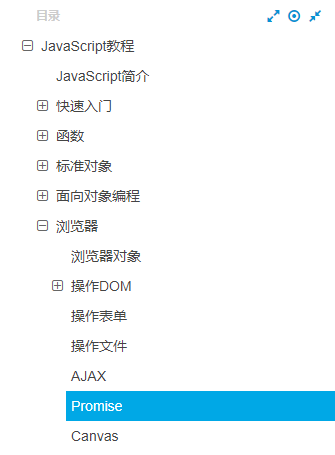
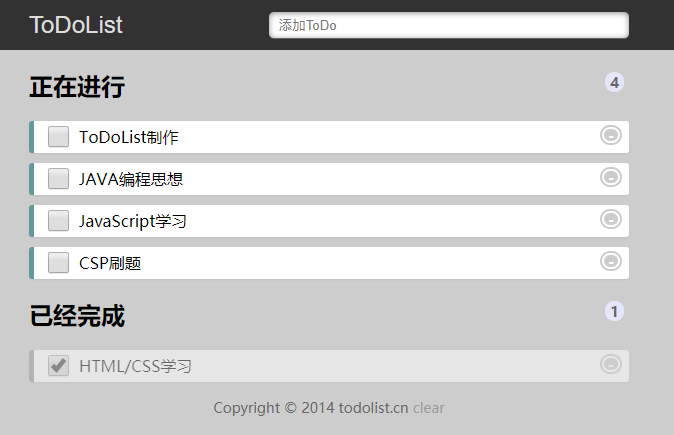

## JavaScript 学习计划

### 阶段一
> [廖雪峰-JavaScript教程](https://www.liaoxuefeng.com/wiki/1022910821149312)
> 完成学习至`浏览器->Promise`
> 
> 
>
> [有空打怪闯关](https://www.codewars.com/dashboard)
> 

### 阶段二
> [ToDoList制作](http://www.todolist.cn/)
>> [增删改查] 增删改查是指可以实现“增加”、“删除”、“修改”、“查询”四个功能。 其中“查询”不代表“搜索”，只要页面刷新后，数据能够正常显示即可
>> 
>> [状态] 可以储存 “内容” 与 “是否已完成” 的状态，使用 localStorage 储存数据
>>
>> [加分项] 给每一条 todo 添加 “完成日期”，已过期的条目有不同的样式
>
> 

### 阶段三
> 继续廖雪峰教程的学习
>
> 实验楼项目实战
> 