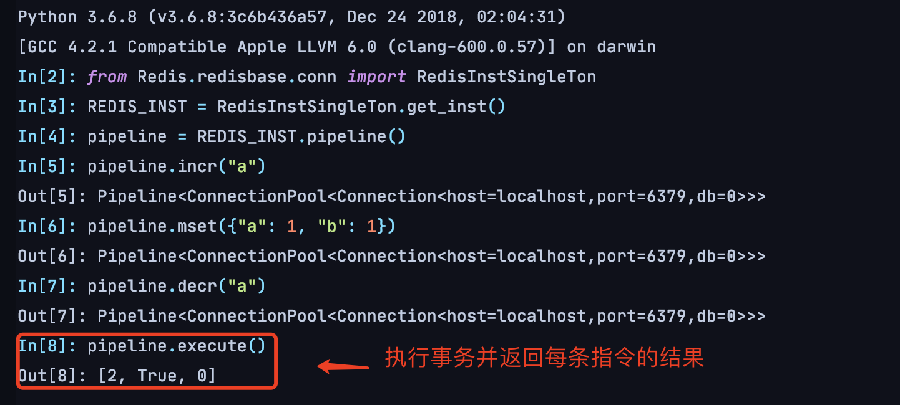

[TOC]

# 3.7.2 Redis 事务

> 在复杂场景下，我们可能需要操作多个Redis容器完成开发逻辑，这意味着需要向Redis发送多条命令，并发条件下，同一段Redis操作逻辑的命令是交叉执行的，不具备线程安全。
>
> 对此，Redis提供`WATCH` `MULTI` `EXEC` `UNWATCH` `DISCARD`，保证可以在不被打断（interruption）的情况下执行多条命令（多条命令为一次原子操作）。

## Redis基本事务

### 基本概念

Redis基本事务（basic transaction）需要用到`MULTI` `EXEC`命令，被`MULTI` `EXEC`包围的命令集合会按先后顺序执行（称为一个事务），多条命令执行不会被其他客户端打断。

```shell
127.0.0.1:6379> MULTI
OK
127.0.0.1:6379> incr a
QUEUED
127.0.0.1:6379> incr b
QUEUED
127.0.0.1:6379> incr a
QUEUED
127.0.0.1:6379> decr a
QUEUED
127.0.0.1:6379> EXEC
1) (integer) 1
2) (integer) 1
3) (integer) 2
4) (integer) 1
```

如上，Redis会将`MULTI`后的命令暂存到队列，直到接收`EXEC`，按顺序执行队列中的命令，并返回每条命令的结果


### 在Python中使用Redis事务

Redis事务在Python客户端上由`pipline`实现：`pipeline()`方法将创建一个事务，客户端会暂存用户调用的命令，直到用户调用`pipeline.execute()`方法，客户端会自动使用`MULTI` `EXEC`包裹用户调用指令，一次性发送到Server




## 没有用Redis事务会发生什么？

### 并行执行命令引起的线程安全问题

```python
# 3.7.2 3-13 缺少事务造成线程安全问题
def notrans(key: str, order: int) -> None:
    # 对键进行自增
    incr_result = REDIS_INST.incr(key)

    time.sleep(.1)

    print(f"# [{order}]incr_result: {incr_result}")

    REDIS_INST.decr(key)


def no_trans_main() -> None:
    key = f"{REDIS_KEY_PREFIX}notrans:"

    # 初始化时删除键
    REDIS_INST.delete(key)

    thread_pool = ThreadPoolExecutor(max_workers=1024)
    for order in range(3):
        thread_pool.submit(notrans, key=key, order=order)
```

上述代码的`notrans`方法在**没有添加事务**的情况下，对`key`进行自增后自减，`no_trans_main`启动三个线程调用`notrans`方法

输出如下：

```
# [1]incr_result: 2
# [2]incr_result: 3
# [0]incr_result: 1
```

由于`notrans` incr/decr操作中间休眠了100ms，加剧体现并发下的线程安全问题，在某个线程incr后休眠还未decr时，另外的线程也inrc，最终导致key的结果不是期望值——1

### 添加事务保证单个线程执行多命令不被打断

```python
# 3.7.2 3-14 使用事务处理命令并行执行问题
def trans(key: str, order: int) -> None:
    pipeline = REDIS_INST.pipeline()
    pipeline.incr(key)
    time.sleep(.1)
    pipeline.decr(key)
    responses = pipeline.execute()
    incr_result = responses[0]

    print(f"# [{order}]incr_result: {incr_result}")


def trans_main() -> None:
    key = f"{REDIS_KEY_PREFIX}trans:"

    # 初始化时删除键
    REDIS_INST.delete(key)

    thread_pool = ThreadPoolExecutor(max_workers=1024)
    for order in range(3):
        thread_pool.submit(trans, key=key, order=order)
```

在`notrans`的基础上使用`pipeline()`声明一个事务型（transactional）流水线对象，包含incr/decr命令

输出如下：

```
# [1]incr_result: 1
# [0]incr_result: 1
# [2]incr_result: 1
```

通过添加事务使得多条命令执行不被其他线程干扰


## 事务利弊

* 将原本多指令逻辑封装成原子操作
* 对于执行时间可忽略不计的多条指令，通过使用流水线，向服务器**一次性**发送多条命令并批量返回执行结果，可以减少Rdis Server与客户端之间的通信往返次数，从而降低等待指令执行结果的时间（原本执行N条指令需要发送N次请求，通过pipeline减少为1）


# 3.7.3 键的过期时间

> 使用Redis缓存的数据很多都不是永久数据，通过设置合理的过期时间，可以节约内存。

用于处理过期时间的Redis命令

| 命令      | 描述                                                         |
| --------- | ------------------------------------------------------------ |
| PERSIST   | PERSIST key-name —— 移除键的过期时间                         |
| TTL       | TTL key-name —— 查看给定键距离过期还有多少秒                 |
| EXPIRE    | EXPIRE key-name seconds —— 让给定键在指定秒数后过期          |
| EXPIREAT  | EXPIREAT key-name timestamp —— 将键的过期时间设置为给定的UNIX时间戳 |
| PTTL      | PTTL key-name —— 查看给定键距离过期还有多少毫秒，下述支持毫秒级别的命令在Redis2.6及以上可用 |
| PEXPIRE   | PEXPIRE key-name milliseconds —— 让给定键在指定毫秒数后过期  |
| PEXPIREAT | PEXPIRE key-name timestamp-milliseconds —— 将键的过期时间设置为给定的UNIX时间戳（毫秒级精度） |

