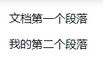
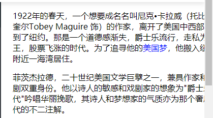
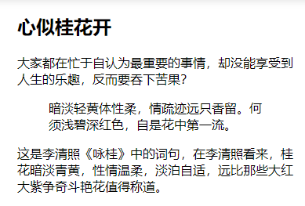
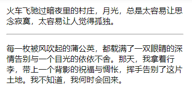

##2.1-HTML标签

### 语义化
根据标签的用途合理利用
* 更容易被搜索引擎收录
* 更容易让屏幕阅读器读出网页内容

### \<p>标签
语法 `<p>段落文本</p>`
```html
<body>
<p>文档第一个段落</p>
<p>我的第二个段落</p>
</body>
```

`<p>`段前后会有空白,可以通过css删除或给改变

### \<hx>标题
语法：`<hx>标题文本</hx>` ___x为1-6___

### 强调语气`<strong>`和`<em>`标签
content标注为斜体 `<em>content</em>`
content标注为粗体 `<strong>content</strong>`

### 使用`<span>`标签为文字设置单独样式
`<span>`标签__没有语义__,为设置单独样式而存在\
示例：用`<span>`修饰`美国梦`文本,在`style`中插入css代码设置成蓝色
```html
<!DOCTYPE HTML>
<html>
<head>
<meta http-equiv="Content-Type" content="text/html; charset=utf-8">
<title>了不起的盖茨比</title>
<style>
span{
    color:blue;
}
</style>
</head>
<body>
    <p>1922年的春天，一个想要成名名叫尼克•卡拉威（托比•马奎尔Tobey Maguire 饰）的作家，离开了美国中西部，来到了纽约。那是一个道德感渐失，爵士乐流行，走私为王，股票飞涨的时代。为了追寻他的<span>美国梦</span>，他搬入纽约附近一海湾居住。</p>
    <p>菲茨杰拉德，二十世纪美国文学巨擘之一，兼具作家和编剧双重身份。他以诗人的敏感和戏剧家的想象为"爵士乐时代"吟唱华丽挽歌，其诗人和梦想家的气质亦为那个奢靡年代的不二注解。</p>
</body>
</html>
```


### 短文本引用`<q>`标签
自动为标签内的文本添加双引号\
`<q>引用文本</q>`

### 长文本引用`<blockquote>`标签
语法:\
`<blockquote>引用文本</blockquote>`
作用:\
浏览器解析效果 `自动缩进`
```html
<!DOCTYPE HTML>
<html>
<head>
<meta http-equiv="Content-Type" content="text/html; charset=utf-8">
<title>blockquote标签的使用</title>
</head>
<body>
<h2>心似桂花开</h2>
<p>大家都在忙于自认为最重要的事情，却没能享受到人生的乐趣，反而要吞下苦果？</p>
<blockquote>暗淡轻黄体性柔，情疏迹远只香留。何须浅碧深红色，自是花中第一流。</blockquote>
<p>这是李清照《咏桂》中的词句，在李清照看来，桂花暗淡青黄，性情温柔，淡泊自适，远比那些大红大紫争奇斗艳花值得称道。</p>
</body>
</html>
```


### 分行显示`<br>`标签
__语法__
* xhtml1.0写法
    * `<br />`
* html4.01写法
    * `<br>`

__一般使用 xhtml1.0 的版本的写法（其它标签也是），这种版本比较规范__\
__html中忽略`回车`和`换行`__

### 添加空格
__语法：__\
`&nbsp;`\
表示一个空格符

### 使用`<hr>`标签添加水平横线
__语法:__
* html4.01版本 `<hr>`
* xhtml1.0版本 `<hr />`

__一般使用 xhtml1.0 的版本（其它标签也是），这种版本比较规范__
```html
<!DOCTYPE HTML>
<html>
<head>
<meta http-equiv="Content-Type" content="text/html; charset=utf-8">
<title>hr标签使用</title>
</head>
<body>
<p>火车飞驰过暗夜里的村庄，月光，总是太容易让思念寂寞，太容易让人觉得孤独。</p>
<hr />
<p>每一枚被风吹起的蒲公英，都载满了一双眼睛的深情告别与一个目光的依依不舍。那天，我拿着行李，带上一个背影的祝福与惆怅，挥手告别了这片土地。我不知道，我何时会回来。</p>
</body>
</html>
```


### `<address>`标签为网页添加地址信息
__语法:__\
`<address>联系地址信息</address>`\
__默认换行斜体__

### `<code>`标签插入一行代码
__语法：__\
`<code>代码语言</code>`\
__tip:__ 只能插入单行代码，如果是多行代码，可以使用`<pre>`标签

### `<pre>`标签插入代码段
__语法:__\
`<pre>语言代码段</pre>`\
保留了原格式的回车空格等符号，在pre标签内可以正常使用回车换行，无需使用`<br />`和`&nbsp;`

