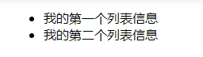
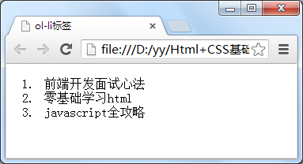
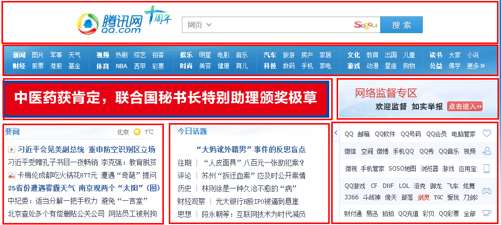
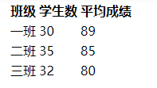
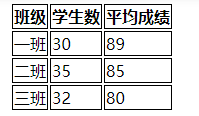
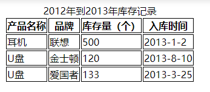

## 2.2-HTML标签

### `ul-li`结构列表
__语法：__
```html
<ul>
  <li>信息</li>
  <li>信息</li>
   ......
</ul>
```
```html
<!DOCTYPE HTML>
<html>
<head>
<meta http-equiv="Content-Type" content="text/html; charset=utf-8">
<title> p标签</title>
</head>
<body>
    <ul>
        <li>我的第一个列表信息</li>
        <li>我的第二个列表信息</li>
    </ul>

</body>
</html>
```


### `ol-li`有序列表
__语法:__
```html
<ol>
   <li>前端开发面试心法 </li>
   <li>零基础学习html</li>
   <li>JavaScript全攻略</li>
</ol>
```


### `<div>`逻辑分块
__语法:__\
`<div>…</div>`\
作用：作为容器,划分栏目模块,便于css渲染\
__分块示例__


### `div`命名
__语法:__\
`<div  id="版块名称">…</div>`

### `<table>`标签-网页表格
__创建表格四元素__
1. `<table>…</table>`
    * 整个表格以`<table>`标记开始、`</table>`标记结束
2. 分段
    * `<thead>` `<tbody>` `<tfooter>` 通过分段，table 可以按结构一块块的显示，不在等整个表格加载完后显示
3. `<th>…</th>`
    * 表头单元格，默认`粗体居中`
4. `<tr>…</tr>`
    * 表格行
5. `<td>…</td>`
    * 单元格
```html
<!DOCTYPE HTML>
<html>
<head>
<meta http-equiv="Content-Type" content="text/html; charset=utf-8" />
<title>认识table表标签</title>
</head>
<body>
<table>
  <tbody>
    <tr>
        <th>班级</th>
        <th>学生数</th>
        <th>平均成绩</th>
    </tr>
    <tr>
        <td>一班</td>
        <td>30</td>
        <td>89</td>
    </tr>
    <tr>
        <td>二班</td>
        <td>35</td>
        <td>85</td>
    </tr>
    <tr>
        <td>三班</td>
        <td>32</td>
        <td>80</td>
    </tr>

  </tbody>
</table>
</body>
</html>
```


__用css样式，为表格加入边框__\
在上面代码的头部中添加如下代码
```html
<style type="text/css">
table tr td,th{border:1px solid #000;}
</style>
```


__`caption`标签-添加`标题`和`摘要`__\
* __摘要__
    * `<table summary="表格简介文本">`
* __标题__
    * `<caption>标题文本</caption>`

结构如下
```html
<table summary="摘要">
    <caption>标题</caption>
    <tr>
        <td>…</td>
        <td>…</td>
        …
    </tr>
…
</table>
```
实例
```html
<!DOCTYPE HTML>
<html>
<head>
<meta http-equiv="Content-Type" content="text/html; charset=utf-8" />
<title>认识table表标签</title>
<style type="text/css">
table tr td,th{
    border:1px solid #000;
}
</style>
</head>
<body>
<table summary="本表格记录2012年到2013年库存记录，记录包括U盘和耳机库存量">
  <caption>2012年到2013年库存记录</caption>
  <tr>
    <th>产品名称 </th>
    <th>品牌 </th>
    <th>库存量（个） </th>
    <th>入库时间 </th>
  </tr>
  <tr>
    <td>耳机 </td>
    <td>联想 </td>
    <td>500</td>
    <td>2013-1-2</td>
  </tr>
  <tr>
    <td>U盘 </td>
    <td>金士顿 </td>
    <td>120</td>
    <td>2013-8-10</td>
  </tr>
  <tr>
    <td>U盘 </td>
    <td>爱国者 </td>
    <td>133</td>
    <td>2013-3-25</td>
  </tr>
</table>
</body>
</html>
```



