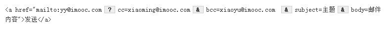

## 2.3-HTML标签
 
### `<a>`标签实现超链接
__语法：__\
`<a  href="目标网址"  title="鼠标滑过显示的文本">链接显示的文本</a>`

__在新建浏览器窗口打开链接__\
`<a>`标签在默认情况下，链接的网页是在`当前浏览器窗口`中打开，有时我们需要在新的浏览器窗口中打开,语法如下

`<a href="目标网址" target="_blank">click here!</a>`

### 使用`mailto`发送邮件
`<a>`标签还有一个作用是可以链接Email地址，使用mailto能让访问者便捷向网站管理者发送电子邮件\

__注意：__ 如果mailto后面同时有多个参数的话，第一个参数必须以“`?`”开头，后面每个参数以“`&`”结尾，如下

### ``标签
__语法：__\
``\
__属性：__
* `src` 标识图像的位置
* `alt` 当图像不可见时（下载不成功时），可看到该属性指定的文本
* `title` 提供在图像可见时对图像的描述(鼠标滑过图片时显示的文本)
* 图像可以是GIF，PNG，JPEG格式的图像文件

