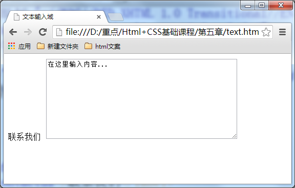
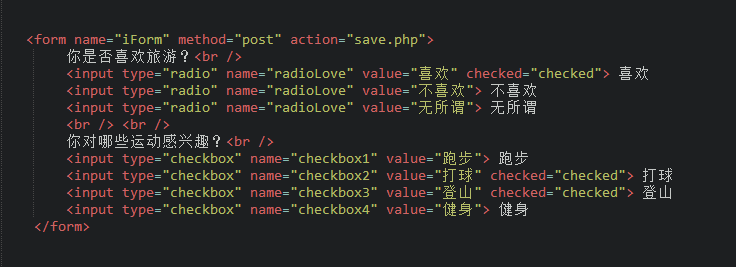
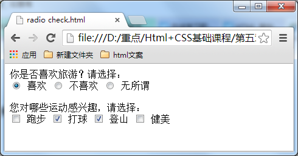
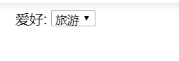
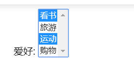
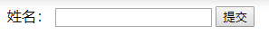
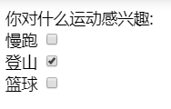
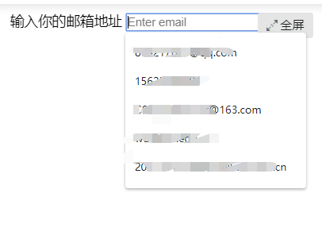

## 3-使用表单标签交互

### 使用表单与用户交互

语法
```html
<form method="传送方式"   action="服务器文件">
    <label for="username">用户名:</label>
    <input type="text" name="username" />
    <label for="pass">密码:</label>
    <input type="password" name="pass" />
</form>
```
讲解
* `method` 数据传送的方式(get/post)
* `action` 浏览器输入的数据被传送到的地方
* `method` 数据传送的方式 `get` or `post`

### 文本输入框、密码输入框

举例
```html
<form>
    姓名：
    <input type="text" name="myName" value="name" />
    <br>
    密码：
    <input type="password" name="pass" value="password" />
</form>
```
参数说明
* `type`
    * `type="text"` 输入框为 __文本输入框__
    * `type="password` 输入框为 __密码输入框__
* `name`
    * 为文本框命名，以便后台程序ASP、PHP使用
* `value`
    * 为文本输入框设置默认值，起提示作用

### 文本域，支持多行文本输入
语法
```html
<textarea rows="行数" cols="列数">文本</textarea>
```
举例
```html
<form  method="post" action="save.php">
        <label>联系我们</label>
        <textarea cols="50" rows="10" >在这里输入内容...</textarea>
</form>
```
显示结果



### 单选框，复用框
语法
```html
<input type="radio/checkox" value="值" name="名称" checked="checked"/> 
```
规则
* type
    * `type="radio"` 控件为单选框
    * `type="checkbox"` 控件为复选框
* value
    * 提交数据到服务器的值，后台程序使用
* name
    * 控件命名
    * __同一组的单选按钮`name`值要一致，这样才能实现单选效果__
* checked
    * `checked="checked"` 该选项默认选中

举例



效果



### 下拉列表框

实例
```html
<!DOCTYPE HTML>
<html>
<head>
<meta http-equiv="Content-Type" content="text/html; charset=utf-8">
<title>下拉列表框</title>
</head>
<body>
<form action="save.php" method="post" >
    <label>爱好:</label>
    <select>
      <option value="看书">看书</option>
      <option value="旅游" selected="selected">旅游</option>
      <option value="运动">运动</option>
      <option value="购物">购物</option>
    </select>
</form>
</body>
</html>
```
规则
* `<option value="value">name</option>`
    * `value` 向服务器提交的值
    * `name` 浏览器显示的值
* `selected="selected"` 默认选中的选项，没有添加默认第一项

效果



__实现多选__
* 在select标签中设置`multiple="multiple"`
* 在windows系统下，`Ctrl+单击`实现多选
* Mac系统下，`Command+单击`实现多选

效果



### 提交按钮

当用户需要提交信息到服务器时，需要**用到提交按钮**

语法
```html
<input type="submit" value="提交">
```
> `type` 只有type值设置为 __submit__ 时，按钮才有提交作用
>
> `value` 按钮上显示的文字

实例
```html
<!DOCTYPE HTML>
<html>
<head>
<meta http-equiv="Content-Type" content="text/html; charset=utf-8">
<title>提交按钮</title>
</head>
<body>
<form  method="post" action="save.php">
    <label for="myName">姓名：</label>
    <input type="text" value=" " name="myName " />
    <input type="submit" value="提交" name="submitBtn" />
</form>
</body>
</html>
```
效果



### 重置按钮

表单填写有误时，可以使用`重置按钮`使输入框恢复到初始状态

语法
```html
<input type="reset" value="重置">
```
> `type` 只有type值设置为 __reset__ 时，按钮才有重置作用
>
> `value` 按钮上显示的文字

### form表单中的label标签

label标签不会向用户呈现任何特殊效果，它的作用是为鼠标用户改进了可用性。
如果你在 label 标签内点击文本，就会触发此控件。就是说，当用户单击选中该label标签时，
浏览器就会自动将焦点转到和标签相关的表单控件上（就自动选中和该label标签相关连的表单控件上）。

简单说，就是点击label会关联到控件，比如关联复用框，原本只能通过点击那个小点选择，现在点击
`label`也能触发选择效果

语法
```html
<label for="控件id名称">
<input id="控件id名称">
```

规则
* `for属性值`与相关控件的`id属性值`要一致

实例
```html
<!DOCTYPE HTML>
<html>
<head>
<meta http-equiv="Content-Type" content="text/html; charset=utf-8">
<title>form中的lable标签</title>
</head>

<body>
<form>
   你对什么运动感兴趣:
   <br/>
   <label for="run">慢跑</label>
   <input type="checkbox" name="box1" value="慢跑" id="run"/>
   <br/>
   <label for="climb">登山</label>
   <input type="checkbox" name="box2" value="登山" id="climb"/>
   <br/>
   <label for="basketball">篮球</label>
   <input type="checkbox" name="box3" value="篮球" id="basketball"/>
</form>
</body>
</html>
```
**效果**：点击`登山`文本也可以进行选择



### 彩蛋

在`input`中设置的`id属性`可以影响浏览器交互效果

实例：把输入框的`id属性`设置为`email`，单击输入时，谷歌浏览器自动识别并提供智能输入
```html
<!DOCTYPE HTML>
<html>
<head>
<meta http-equiv="Content-Type" content="text/html; charset=utf-8">
<title>form中的lable标签</title>
</head>

<body>
<form>
  <label for="email">输入你的邮箱地址</label>
  <input type="email" id="email" placeholder="Enter email">
</form>
</body>
</html>
```

