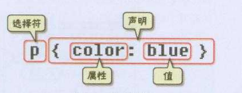

## 4-CSS入门

### CSS
CSS全称为“层叠样式表 (Cascading Style Sheets)”，它主要是用于定义HTML内容在浏览器内的显示样式，如文字大小、颜色、字体加粗等

### CSS代码语法

> __选择符(选择器)：__  指明网页中要应用样式规则的元素
>
> __声明：__ 在英文大括号“｛｝”中的的就是声明，属性和值之间用英文冒号“：”分隔。当有多条声明时，中间可以英文分号“;”分隔

### CSS注释
```css
{
    /*注释内容*/
}
```

### 内联式CSS样式
`内联式` css代码直接写在现有的HTML标签中

```html
<p style="color:blue;font-size:12px">这里文字是红色。</p>
```
> css样式代码写在`style`属性中
>
> 多条css样式代码用`分号`隔开

### 嵌入式CSS样式

```html
<style type="text/css">
span
{
    color:red;
}
</style>
```
> css样式代码写在`<style type="text/css"></style>`标签之间
>
> 入式css样式写在`<head></head>`之间

### 外部式css样式

```html
<link href="base.css" rel="stylesheet" type="text/css" />
```
> `rel="stylesheet" type="text/css"` 是固定写法不可修改
>
> `<link>`标签位置一般写在`<head>`标签之内

### CSS代码优先级
> `内联式 > 嵌入式 > 外部式`
> 满足**就近原则**，离被设置元素越近优先级别越高

