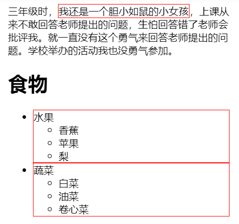
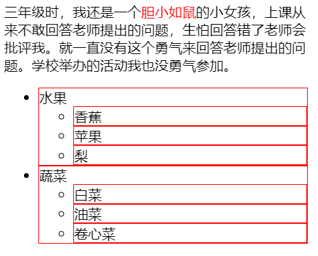
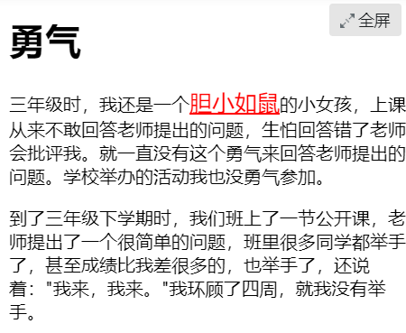

## 5-CSS选择器

### 选择器
css样式声明如下
```text
选择器{
    样式;
}
```
> `{}`之前的部分就是选择器
> 
> 选择器指明了`{}`中**样式**的作用对象，也就是`样式·作用了网页中的哪些元素

```html
<!DOCTYPE HTML>
<html>
<head>
<meta http-equiv="Content-Type" content="text/html; charset=utf-8">
<title>选择器</title>
<style type="text/css">
body{
    font-size:12px;
    color:red;	
}
</style>
</head>
<body>
<p>慕课网（IMOOC）是学习编程最简单的免费平台。慕课网提供了丰富的移动端开发、php开发、web前端、html5教程以及css3视频教程等课程资源。它富有交互性及趣味性，并且你可以和朋友一起编程。</p>
</body>
</html>
```
> `body`就是选择器
>
> `font-size:12px;color:red;`就是样式，作用于**选择器-body**

### 标签选择器

```html
<!DOCTYPE HTML>
<html>
<head>
<meta http-equiv="Content-Type" content="text/html; charset=utf-8">
<title>认识html标签</title>
<style type="text/css">
h1{
    font-weight:normal;
    color:red;
}
</style>
</head>
<body>
    <h1>勇气</h1>
    <p>三年级时，我还是一个胆小如鼠的小女孩，上课从来不敢回答老师提出的问题，生怕回答错了老师会批评我。就一直没有这个勇气来回答老师提出的问题。学校举办的活动我也没勇气参加。</p>
    <p>到了三年级下学期时，我们班上了一节公开课，老师提出了一个很简单的问题，班里很多同学都举手了，甚至成绩比我差很多的，也举手了，还说着："我来，我来。"我环顾了四周，就我没有举手。</p>
    
</body>
</html>
```
> 通过选择`html代码`中的**标签**，如上代码的`<html>` `<body>` `<h1>` `<p>` ``

### 类选择器

语法
* **英文圆点开头**
* `类选器`名称任起，但不能是中文
```text
.类选器名称{css样式代码;}
```
使用方法
> 用合适的标签对修饰内容进行标记
>```text
><span>胆小如鼠</span>
>```
> 使用`class`为标签设置一个类，**类可以修饰多个标签**
>```text
><span class="stress">胆小如鼠</span>
>```
> 设置类选器css样式
> ```text
> .stress{color:red;}/*类前面要加入一个英文圆点*/
>```

### ID选择器

与类选择器的区别
* 使用`#`号选择
* 为标签设置为`id="idname"`

```css
#setGreen{
   color:green;
}
```
### ID选择器与类选择器的区别

ID选择器同个id只能修饰一个标签，而类选择器一个类名可以指向多个标签

正确示例：类选择器一个类名指向多个标签
```html
 <p>三年级时，我还是一个<span class="stress">胆小如鼠</span>
 的小女孩，上课从来不敢回答老师提出的问题，生怕回答错了老师会批评我。就一直没有这个
 <span class="stress">勇气</span>来回答老师提出的问题。</p>
```

错误示例：ID选择器同一id修饰多个标签
```html
<p>三年级时，我还是一个<span id="stress">胆小如鼠</span>
的小女孩，上课从来不敢回答老师提出的问题，生怕回答错了老师会批评我。就一直没有这个
<span id="stress">勇气</span>来回答老师提出的问题。</p>
```

可以使用类选择器词列表方法为一个元素同时设置多个样式,但是ID选择器不行

正确示例：一个标签可以用多个类修饰
```html
.stress{
    color:red;
}
.bigsize{
    font-size:25px;
}
<p>到了<span class="stress bigsize">三年级</span>
下学期时，我们班上了一节公开课...</p>
```

错误示例：不支持多id修饰同一标签
```html
#stressid{
    color:red;
}
#bigsizeid{
    font-size:25px;
}
<p>到了<span id="stressid bigsizeid">三年级</span>
下学期时，我们班上了一节公开课...</p>
```

### 子选择器

```html
<!DOCTYPE HTML>
<html>
<head>
<meta http-equiv="Content-Type" content="text/html; charset=utf-8">
<title>子选择符</title>
<style type="text/css">
.food>li{border:1px solid red;}/*添加边框样式（粗细为1px， 颜色为红色的实线）*/
.first>span{
    border:1px solid red;
}
</style>
</head>
<body>
<p class="first">三年级时，<span>我还是一个<span>胆小如鼠</span>的小女孩</span>，上课从来不敢回答老师提出的问题，生怕回答错了老师会批评我。就一直没有这个勇气来回答老师提出的问题。学校举办的活动我也没勇气参加。</p>
<h1>食物</h1>
<ul class="food">
    <li>水果
        <ul>
        	<li>香蕉</li>
            <li>苹果</li>
            <li>梨</li>
        </ul>
    </li>
    <li>蔬菜
    	<ul>
        	<li>白菜</li>
            <li>油菜</li>
            <li>卷心菜</li>
        </ul>
    </li>
</ul>
</body>
</html>
```
>`.food>li{border:1px solid red;}`使class名为food下的子元素li（水果、蔬菜）加入红色实线边框。
>
>

### 后代选择器

将上述代码的`.food>li`改为`.food li`,作用于food修饰的标签下的所有`li`，也就是所有的**子孙后代**

效果：只要是food下的li标签都加上了线框



通用选择器

>通用选择器是功能最强大的选择器，它使用一个（*）号指定，它的作用是匹配html中 **所有标签元素**

### 伪类选择符

>允许给html不存在的标签（标签的某种状态）设置样式，
比如说我们给html中一个标签元素的鼠标滑过的状态来设置字体颜色
>
>由于兼容性问题，现在常用的伪类选择符格式一般为`a:hover`
```html
<!DOCTYPE HTML>
<html>
<head>
<meta http-equiv="Content-Type" content="text/html; charset=utf-8">
<title>伪类选择符</title>
<style type="text/css">
a:hover{
    color:red;
    
}
a:hover{
    font-size:20px;
}
</style>
</head>
<body>
    <h1>勇气</h1>
    <p class="first">三年级时，我还是一个<a href="http://www.imooc.com">胆小如鼠</a>的小女孩，上课从来不敢回答老师提出的问题，生怕回答错了老师会批评我。就一直没有这个勇气来回答老师提出的问题。学校举办的活动我也没勇气参加。</p>
    <p id="second">到了三年级下学期时，我们班上了一节公开课，老师提出了一个很<span>简单</span>的问题，班里很多同学都举手了，甚至成绩比我差很多的，也举手了，还说着："我来，我来。"我环顾了四周，就我没有举手。</p>
    
</body>
</html>
```
效果：鼠标经过，字体变红变大



### 分组选择符

>当你想为html中多个标签元素设置同一个样式时，可以使用分组选择符（，）
>
>支持`标签选择器` `类选择器` `ID选择器`的标签搜索

```html
<!DOCTYPE HTML>
<html>
<head>
<meta http-equiv="Content-Type" content="text/html; charset=utf-8">
<title>分组选择符</title>
<style type="text/css">
h1,span{color:red;}
.first,#second span{color:green;}
</style>
</head>
<body>
    <h1>勇气</h1>
    <p class="first">三年级时，我还是一个<span>胆小如鼠</span>的小女孩，上课从来不敢回答老师提出的问题，生怕回答错了老师会批评我。就一直没有这个勇气来回答老师提出的问题。学校举办的活动我也没勇气参加。</p>
    <p id="second">到了三年级下学期时，我们班上了一节公开课，老师提出了一个很<span>简单</span>的问题，班里很多同学都举手了，甚至成绩比我差很多的，也举手了，还说着："我来，我来。"我环顾了四周，就我没有举手。</p>
    
</body>
</html>
```
`h1,span{color:red;}` 把所有的h1和span标签的字体都变成绿色

`.first,#second span{color:green;}` 把`first类标签` `second id下的所有span标签`的字体变成绿色
