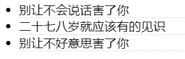
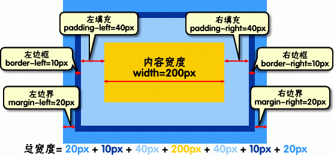

## 8-CSS盒模型

### 元素分类

> 块状元素
>> `<div>` `<p>` `<h1>`...`<h6>`
>>
>> `<ol>` `<ul>` `<dl>` `<table>`
>>
>> `<address>` `<blockquote>` `<form>`
>> 
>> 转换为块级元素:display:block;
>>
>> 块级元素的特点
>> * 每个块级元素都从新的一行开始，并且其后的元素也另起一行
>> * 元素的高度、宽度、行高以及顶和底边距都可设置
>> * 元素宽度在不设置的情况下，是它本身父容器的100%（和父元素的宽度一致），除非设定一个宽度
>
> 内联元素(行内元素)
>> `<a>` `<span>` `<br>` `<i>`
>>
>> `<em>` `<strong>` `<label>` `<q>`
>>
>> `<var>` `<cite>` `<code>`
>>
>> 转换为内联元素：`display:inline`
>>
>> 内联元素的特点
>> * 和其他元素都在一行上
>> * 元素的高度、宽度及顶部和底部边距**不可设置**
>> * 元素的宽度就是它包含的文字或图片的宽度，不可改变
>
> 内联块状元素
>> `` `<input>`
>>
>> 转换为块级元素:`display:inline-block;`
>>
>> 内联块状元素的特点
>> * 和其他元素都在一行上
>> * 元素的高度、宽度、行高以及顶和底边距都可设置
>
> **`块状元素`都可利用`text-align`进行排版**
>

### 盒模型

**边框**

盒子模型的边框就是**围绕着内容及补白的线**，这条线你可以设置它的**粗细、样式和颜色(边框三个属性)**

设置边框粗细为 2px、样式为实心的、颜色为红色的边框
```css
div{
    border:2px  solid  red;
}
```

上述为缩写形式，以下是分开形式
```css
div{
    border-width:2px;
    border-style:solid;
    border-color:red;
}
```

border-style-边框样式
> dashed-虚线
>
> dotted-点线
>
> solid-实线

border-color-边框颜色

border-style-边框样式
> 像素设置-px

css 样式中允许为任意方向的边框设置样式(上下右左)
>
> border-top:1px solid red;
>
> border-bottom:1px solid red;
>
> border-right:1px solid red;
>
> border-left:1px solid red;

```html
<!DOCTYPE HTML>
<html>
<head>
<meta http-equiv="Content-Type" content="text/html; charset=gb2312">
<title>边框</title>
<style type="text/css">
li{
    border-bottom:1px dotted #ccc;
}
</style>
</head>
<body>
<ul>
    <li>别让不会说话害了你</li>
    <li>二十七八岁就应该有的见识</li>
    <li>别让不好意思害了你</li>
</ul>
</body>
</html>
```
>

**宽度和高度**

元素实际宽度（盒子的宽度）=左边界+左边框+左填充+内容宽度+右填充+右边框+右边界
>

在谷歌下查看盒模型(边界->边框->填充->内容)
>

**填充**

设置边框和内容之间的距离

顺时针-上右下左
`div{padding:20px 10px 15px 30px;}`

分开设置
```html
padding-top:20px;
padding-right:10px;
padding-bottom:15px;
padding-left:30px;
```

上下,左右设置
```html
padding:10px 20px;
```

统一设置
```html
div{padding:10px;}
```

**边界**

设置元素与元素之间的距离

设置方法如上

边界与填充的区别：边界在边框外，填充在边框内
