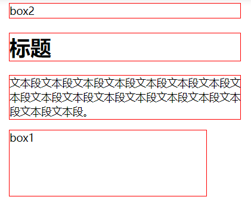
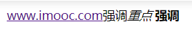
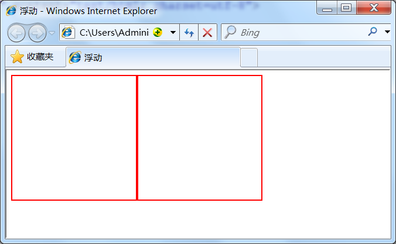
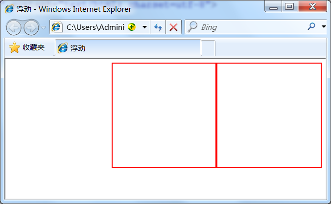
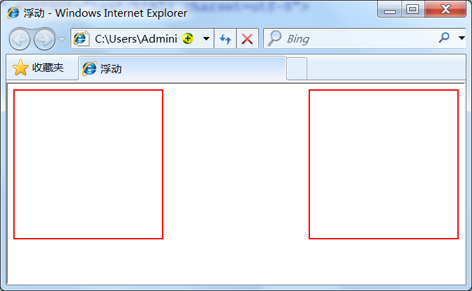
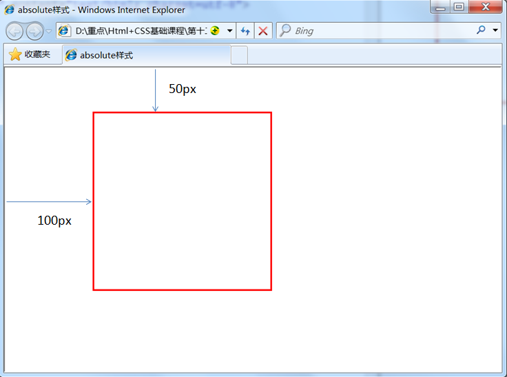
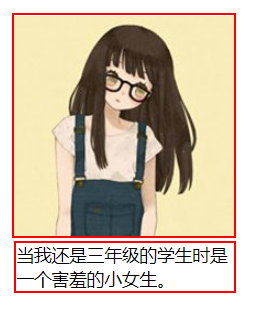

## 9-CSS布局模型

### 流动模型

> 流动(Flow)是默认的网页布局模式

流动模型的特征
* **块状元素**在所处的包含元素内按自上而下的顺序*垂直延伸分布*
    * 因为在默认条件下块状元素的宽度都是100%
* **内联元素**都会在所处包含元素内从左到右*水平分布显示*
    * `a` `span` `em` `strong` 都是内联元素
    
块状元素分布
>

内联元素分布
>


## 浮动模型

> 主要解决块状元素无法并排显示的缺陷

语法：`float:left/right`

并排靠左
```css
div{
    width:200px;
    height:200px;
    border:2px red solid;
    float:left;
}
<div id="div1"></div>
<div id="div2"></div>
```
> 

并排靠右
```css
div{
    width:200px;
    height:200px;
    border:2px red solid;
    float:right;
}
```
> 

并排左右
```css
div{
    width:200px;
    height:200px;
    border:2px red solid;
}
#div1{float:left;}
#div2{float:right;}
```
> 


### 层模型

绝对布局

> 设置：`position:absolute`
>
> 使用left、right、top、bottom属性**相对于其最接近的一个具有定位属性的父包含块进行绝对定位**。
如果不存在这样的包含块，则相对于body元素，即相对于浏览器窗口

实现div元素相对于浏览器窗口向右移动100px，向下移动50px
```css
div{
    width:200px;
    height:200px;
    border:2px red solid;
    position:absolute;
    left:100px;
    top:50px;
}
<div id="div1"></div>
```
> 

相对布局

> `position:relative`
>
> 设置方式同绝对布局

**相对布局和绝对布局的区别**
* 绝对布局的元素位置在变动时会跟着变动
* 相对布局在元素相对于之前的位置发生改变后，原来的位置还是没有改变，无法显示其他非本块元素

固定定位
> 与视图（屏幕内的网页窗口）相对移动，使得元素不会随着浏览器滚动条的滚动而变化
>
> 设置：`position:fixed`

### Relative与Absolute组合使用

> 使用`position:absolute`可以实现被设置元素相对于浏览器（body）定位，通过组合使用//，可以实现相对元素间的定位

步骤
* 父元素设置 `position:relative`，作为参考系
* 定位元素设置 `position:absolute`,使用top、bottom、left、right相对于父元素定位

实践

修改前代码
```html
<!DOCTYPE HTML>
<html>
<head>
<meta http-equiv="Content-Type" content="text/html; charset=utf-8">
<title>相对参照元素进行定位</title>
<style type="text/css">
div{border:2px red solid;}
/*下面是任务部分*/
#box3{
    width:200px;
    height:200px;
}
#box4{
    width:99%;
}
</style>
</head>

<body>

<h1>下面是任务部分</h1>
<div id="box3">
    
    <div id="box4">当我还是三年级的学生时是一个害羞的小女生。</div>
</div>
</body>
</html>
```
> 

修改后：文字挪入图片
```html
<!DOCTYPE HTML>
<html>
<head>
<meta http-equiv="Content-Type" content="text/html; charset=utf-8">
<title>相对参照元素进行定位</title>
<style type="text/css">
div{border:2px red solid;}
/*下面是任务部分*/
#box3{
    width:200px;
    height:200px;
    position:relative;  
}
#box4{
    width:99%;
    position:absolute;
	bottom:0px;
    left:0px;
}
</style>
</head>

<body>

<h1>下面是任务部分</h1>
<div id="box3">
    
    <div id="box4">当我还是三年级的学生时是一个害羞的小女生。</div>
</div>
</body>
</html>
```
> 
