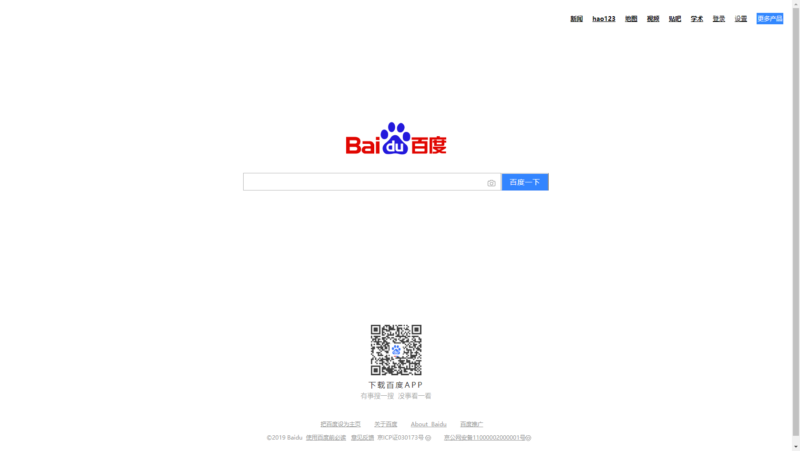

## 百度主页复刻

### Introduce
> 通过本阶段对HTML和CSS的学习，对百度主页进行页面视觉复刻
>
> 对百度主页的位置、颜色还原度超过90%

### Learning
> 通过本次复刻项目，发觉自己对最基本的Relative-Absolute定位模式仍不熟悉，对元素的属性（块状、内联）的了解仍不够充分
>
> 后续的HTML和CSS的学习围绕《HTML&CSS设置与构建网站》对语法的特性进行进一步的挖掘，补充笔记！

### Result
> 百度主页的复刻效果
> 

### Contribute
> **关于my-Nodes:**   是全部由本人整理的编程笔记，涵盖前端、后台、算法、数据结构等方面的内容，如对您有帮助，欢迎`star` `folk` `download`，如需商用或公众号发布
> 请联系我（873217631@qq.com)，未经本人同意将笔记作商业用途所造成的一切法律后果自负。
> 学习过程中参考各种来源网络的资料，**如有侵权，请联系我删除**。
> 
> **Author:**   caixiaoxin
> 
> **Date:**   2019/08/23
> 
> **Lang:**   HTML/CSS
> 
> **[CopyRight]**   ©ZhuoZhuoCrayon