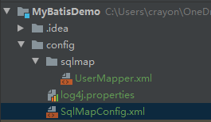
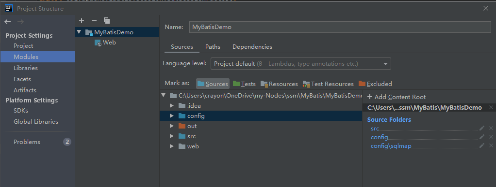
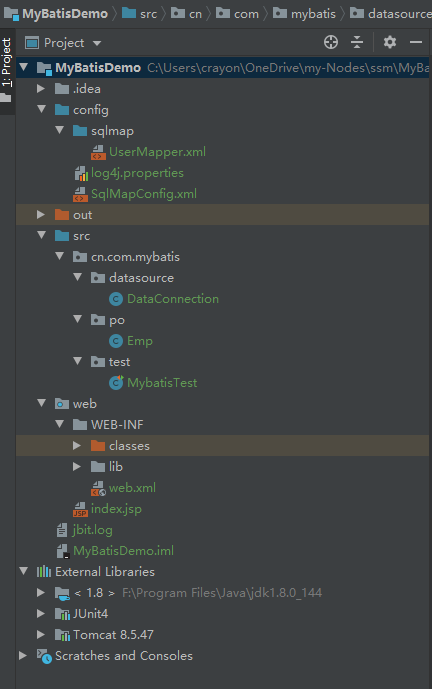

# 搭建Mybatis工程环境

## 创建JavaWeb工程

新建工程


在WEB-INF下新建`lib` `classes`目录

导入依赖包至`web/WEB-INF/lib`，并右键`lib`->`add to Libraries`


将`Ouput path` `Test output path`的目标修改至`classes`


## 安装并配置Tomcat
### 下载并解压
> 在配置好java环境后，只需在安装目录下的`lib`中运行`startup.bat`测试即可

### 解决中文乱码问题
> 在`conf`目录下打开`logging.properties`,将`encoding=UTF-8`修改为`encoding=GBK`

### 在IDEA中配置Tomat

打开`Run->Edit Configurations...`


`Configure..`选择Tomcat的安装目录导入


`File->Project Settings->Modules->Dependencies`添加Tomcat


### 运行测试
运行`index.jsp`

成功打开表示配置完成

## IDEA连接MySQL

### 修改MySQL的默认密码

#### 修改密码
```mysql
update user set authentication_string=PASSWORD('root') where user='root';
```
#### 更新修改
```mysql
flush privileges;
```


### IDEA添加数据库

#### 时区错误
MySQL默认的时区是UTC时区，比北京时间晚8个小时。
所以要修改mysql的时长
在mysql的命令模式下，输入：
set global time_zone='+8:00';
再次连接成功


### 建立EMP表

```mysql
CREATE TABLE EMP
(
EMPNO INT NOT NULL,
ENAME VARCHAR(20) NOT NULL,
JOB VARCHAR(20) NOT NULL,
MGB INT,
HIREDATE DATE NOT NULL,
SAL INT NOT NULL,
COMM INT,
DEPTNO INT NOT NULL,
PRIMARY KEY (EMPNO)
);
```

### 将原先的表值导入
```mysql
INSERT INTO EMP
SELECT * FROM EMP2017151019;
```

## 建立配置文件

### 文件结构
* sqlmap
    * UserMapper.xml:用于处理User数据的SQL映射文件
* log4j.properties:作为日志输出环境的配置文件
* SqlMapConfig:数据库连接池配置文件

> 

### 编写日志输出环境配置文件:log4j.properties
>使用开源的log4j日志记录工具，以便在控制台查看程序输出的日志信息

```properties
### 设置Logger输出级别和输出目的地 ###
log4j.rootLogger=debug,stdout,logfile

### 把日志信息输出到控制台 ###
log4j.appender.stdout=org.apache.log4j.ConsoleAppender
#log4j.appender.stdout.Target=System.err
log4j.appender.stdout.layout=org.apache.log4j.SimpleLayout

### 把日志信息输出到文件：jbit.log ###
log4j.appender.logfile=org.apache.log4j.FileAppender
log4j.appender.logfile.File=jbit.log
log4j.appender.logfile.layout=org.apache.log4j.PatternLayout
log4j.appender.logfile.layout.ConversionPattern=%d{yyyy-MM-dd HH:mm:ss} %F %p %m%n

###显示SQL语句部分
log4j.logger.com.ibatis=DEBUG
log4j.logger.com.ibatis.common.jdbc.SimpleDataSource=DEBUG
log4j.logger.com.ibatis.common.jdbc.ScriptRunner=DEBUG
log4j.logger.com.ibatis.sqlmap.engine.impl.SqlMapClientDelegate=DEBUG
log4j.logger.java.sql.Connection=DEBUG
log4j.logger.java.sql.Statement=DEBUG
log4j.logger.java.sql.PreparedStatement=DEBUG
```

### 编写处理User的映射文件：UserMapper.xml

#### 命名`namespace`
> 在测试类中需要根据`namespace`定位语句

#### SQL语句
SQL语句标签根据数据库的基本功能，具有`select` `delete` `update` `insert`

每一个SQL配置标签都具有
* `parameterType` 输入参数数据类型
* `parameterMap` 输入参数集合
* `resultType` 结果类型
* `resultClass` 结果类
* `resultMap` 结果集合

```xml
<?xml version="1.0" encoding="UTF-8" ?>
<!DOCTYPE mapper
        PUBLIC "-//mybatis.org//DTD Mapper 3.0//EN"
        "http://mybatis.org/dtd/mybatis-3-mapper.dtd">
<!--mapper为根元素，namespace指定了命名空间-->
<mapper namespace="EmpMapper">
    <!--定义一个SELECT查询-->
    <select id="selectAll" resultType="cn.com.mybatis.po.Emp">
        SELECT * FROM emp;
    </select>
</mapper>
```


### 编写数据库连接池配置文件:SqlMapConfig

#### ERROR1
>Error parsing SQL Mapper Configuration. Cause: java.io.IOException: Could not find resource jdbc.properties

缺少`jdbc.properties`配置，原因是所看demo把数据库的账号、密码状态写到了该文件中，而本项目直接写在`SqlMapConfig`中

#### ERROR2
> java.lang.ClassNotFoundException: Cannot find class: org.git.mm.mysql.Driver

忘记加载Mysql驱动了，把该驱动放到`WEB-INF/lib`文件夹下

#### 将Mapper文件`UserMapper.xml`路径配置到该文件中
> 使得MyBatis资源文件加载类可以解析Mapper文件

```
<?xml version="1.0" encoding="UTF-8" ?>
<!DOCTYPE configuration
        PUBLIC "-//mybatis.org//DTD Config 3.0//EN"
        "http://mybatis.org/dtd/mybatis-3-config.dtd">
<configuration>
    <!--
    <properties resource="jdbc.properties"></properties>
    -->
    <!--settings配置LOG4J输出日志 -->
    <settings>
        <setting name="logImpl" value="LOG4J"/>
    </settings>
    <!--typeAliases配置包的别名-->
    <!--<typeAliases>-->
    <!--<package name=""-->
    <!--</typeAliases>-->

    <!--environments配置了数据库连接，配置了driver、url、username、password属性-->
    <environments default="development">
        <environment id="development">
            <!--使用JDBC事务管理-->
            <transactionManager type="JDBC"/>
            <!--数据库连接池-->
            <dataSource type="POOLED">
                <property name="driver" value="com.mysql.jdbc.Driver" />
                <property name="url" value="jdbc:mysql://localhost:3306/company_manage?
                characterEncoding=utf-8" />
                <property name="username" value="root" />
                <property name="password" value="root" />
            </dataSource>

        </environment>
    </environments>
    <!--配置一个SQL语句和映射的配置文件-->
    <mappers>
        <!-- Mapper的位置  Mapper.xml 写Sql语句的文件的位置 -->
        <mapper resource="sqlmap/UserMapper.xml" />
    </mappers>
</configuration>
```

## 工程代码

### 代码结构
* cn.com.mybatis
    * datasource 数据库连接
        * `DataConnection`
    * po 持久层对象
        * `Emp`
    * test 测试主程序
        * `MybatisTest`

#### 查找不到配置文件
> java.io.IOException: Could not find xxxxxx.xml

由于没有用Maven进行版本管理，IDEA不会自动加载`src` `resource`外的配置文件，需要自行设置

`Project Structure`->`Module`中将`config`文件夹添加到根目录中
* 点击文件夹->`source` 此时`config`目录会变蓝



 
### 持久层实体类
一般用于存放
* 与数据库表字段一一对应为类成员变量的Java类
* 用于程序中封装间接数据的实体类

一般具有
* 构造方法
* 成员变量的`set` `get`方法

```java
package cn.com.mybatis.po;

import java.io.Serializable;
import java.util.Date;

public class Emp implements Serializable {
    private int empno;
    private String ename;
    private String job;
    private int mgb;
    private Date hiredate;
    private int sal;
    private int comm;
    private int deptno;
    public Emp(){};
    public Emp(int empno,String ename,String job,int mgb,
               Date hiredate,int sal,int comm,int deptno){
        this.empno = empno;
        this.ename = ename;
        this.job = job;
        this.mgb = mgb;
        this.hiredate = hiredate;
        this.sal = sal;
        this.comm = comm;
        this.deptno = deptno;
    }

    /*省略get/set方法*/

    @Override
    public String toString() {
        return "EMPNO:{" + empno + "}|"+
                "ENAME:{" + ename + "}|"+
                "JOB:{" + job + "}|"+
                "MGB:{" + mgb + "}|"+
                "HIREDATE:{" + hiredate.toString() + "}|"+
                "SAL:{" + sal + "}|"+
                "COMM:{" + comm + "}|"+
                "DEPTNO:{" + deptno + "}|";
    }
}

```

### 数据库连接类
> 资源文件加载类（test）会读取数据库连接池配置文件(`SqlMapConfig.xml`),
> 然后SqlSessionFactory会获取数据库连接数据和Mapper映射规则，从而创建出能与数据库交互的`SqlSession`类
> ，这样就可以获取`SqlSession`数据库交互类

```java
package cn.com.mybatis.datasource;

import org.apache.ibatis.session.SqlSession;
import org.apache.ibatis.session.SqlSessionFactory;
import org.apache.ibatis.io.Resources;
import org.apache.ibatis.session.SqlSessionFactoryBuilder;

import java.io.IOException;
import java.io.InputStream;

public class DataConnection {
    //取数据库连接池配置文件
    private String resource = "SqlMapConfig.xml";
    private SqlSessionFactory sqlSessionFactory;
    private SqlSession sqlSession;

    public SqlSession getSqlSession() throws IOException{
        InputStream inputStream = Resources.getResourceAsStream(resource);
        //创建会话工厂，传入Mybatis配置信息文件
        sqlSessionFactory = new SqlSessionFactoryBuilder().build(inputStream);
        sqlSession = sqlSessionFactory.openSession();
        return sqlSession;
    }
}
```

### 编写测试类
> 获取了数据库交互对象`sqlSession`后，可以执行在`UserMapper.xml`中的sql语句
>
> `sqlSession`的参数配置
> 
> <namespace.id, <需要的参数>paramteType>
>
> 执行后会按SQL映射文件`UserMapper.xml`中规定的返回类型`resultType`进行返回


```java
package cn.com.mybatis.test;

import cn.com.mybatis.datasource.DataConnection;
import cn.com.mybatis.po.Emp;
import org.apache.ibatis.session.SqlSession;
import org.junit.Test;

import java.io.IOException;
import java.util.List;

public class MybatisTest {
    public DataConnection dataConnection = new DataConnection();
    @Test
    public void TestSelect() throws IOException{
        SqlSession sqlSession = dataConnection.getSqlSession();
        List<Emp> empList = sqlSession.selectList("EmpMapper.selectAll");

        for(Emp emp:empList){
            System.out.println(emp.toString());
        }
    }
}
```

## Mybatis环境工程文件结构
> 


