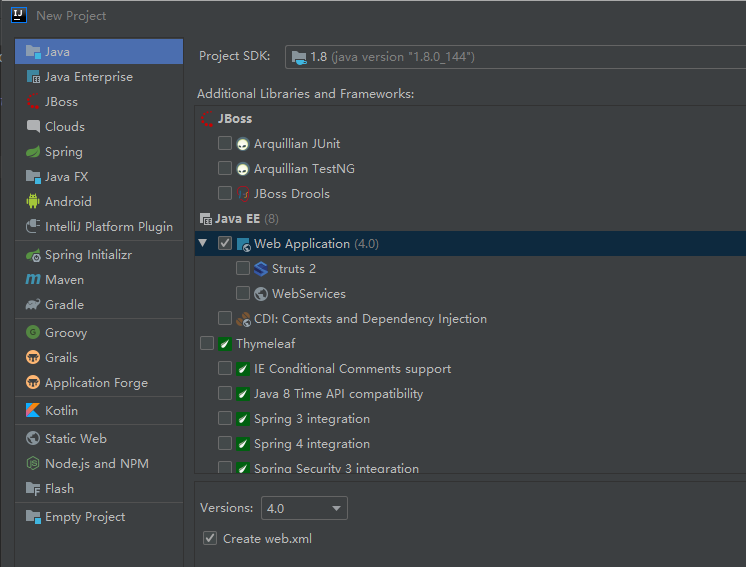
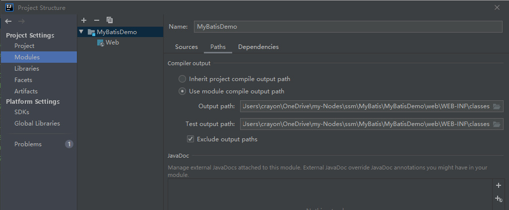
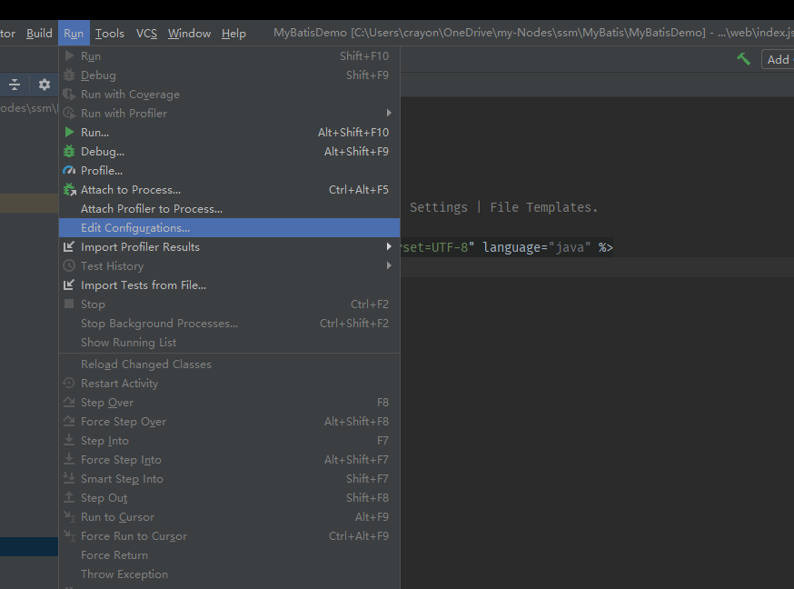
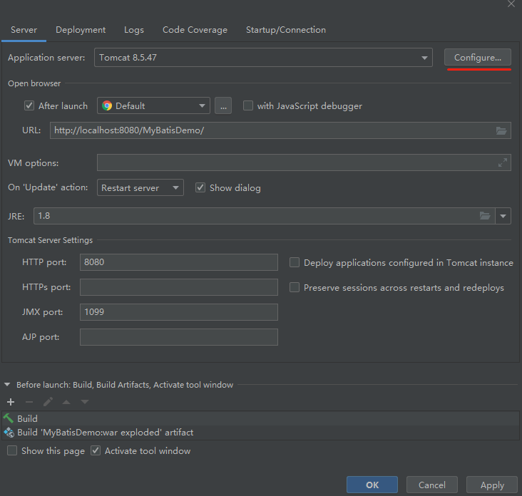
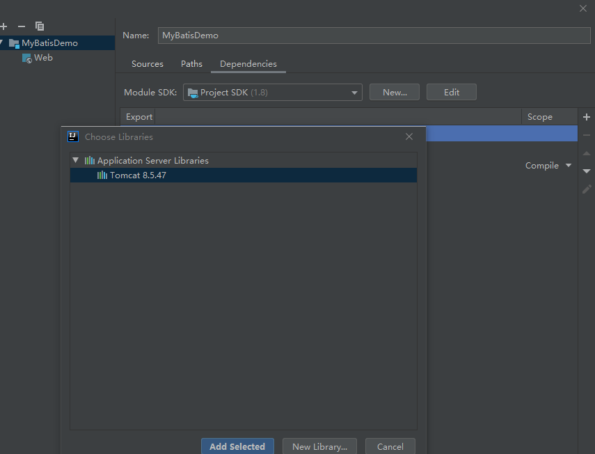
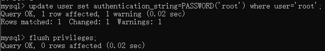
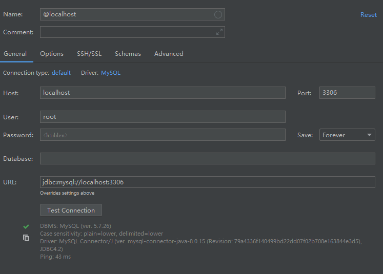

# 搭建Mybatis工程环境

## 创建JavaWeb工程

新建工程


在WEB-INF下新建`lib` `classes`目录

导入依赖包至`web/WEB-INF/lib`，并右键`lib`->`add to Libraries`


将`Ouput path` `Test output path`的目标修改至`classes`


## 安装并配置Tomcat
### 下载并解压
> 在配置好java环境后，只需在安装目录下的`lib`中运行`startup.bat`测试即可

### 解决中文乱码问题
> 在`conf`目录下打开`logging.properties`,将`encoding=UTF-8`修改为`encoding=GBK`

### 在IDEA中配置Tomat

打开`Run->Edit Configurations...`


`Configure..`选择Tomcat的安装目录导入


`File->Project Settings->Modules->Dependencies`添加Tomcat


### 运行测试
运行`index.jsp`

成功打开表示配置完成

## IDEA连接MySQL

### 修改MySQL的默认密码

#### 修改密码
```mysql
update user set authentication_string=PASSWORD('root') where user='root';
```
#### 更新修改
```mysql
flush privileges;
```



### IDEA添加数据库

#### 时区错误
MySQL默认的时区是UTC时区，比北京时间晚8个小时。
所以要修改mysql的时长
在mysql的命令模式下，输入：
set global time_zone='+8:00';
再次连接成功


