# IceMall 基础环境搭建


## Maven 本地配置


### 更换本地仓库

在`conf/setting.xml`文件中查找`<localRepository>/path/to/local/repo</localRepository>`

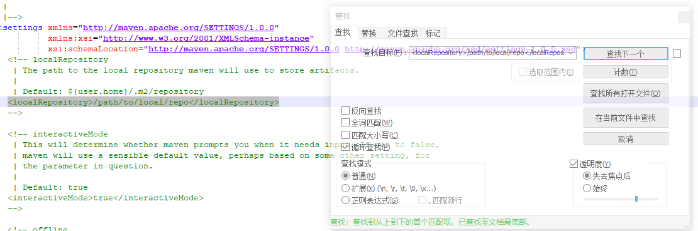


在安装目录中新建`maven-repository`，并将该目录注入上述标签，如下：

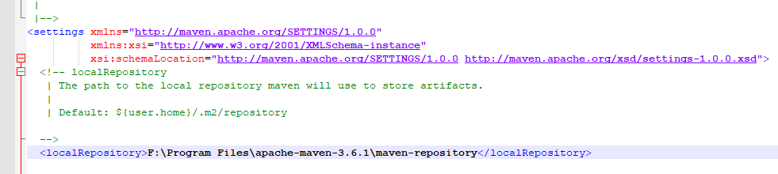


### 更换阿里云镜像

在`setting.xml`中的`<mirrors>`标签内加入：

```xml
	<mirror>
     <id>aliyunmaven</id>
     <mirrorOf>*</mirrorOf>
     <name>阿里云公共仓库</name>
     <url>https://maven.aliyun.com/repository/public</url>
    </mirror>
     <mirror>
     <id>aliyunmaven</id>
     <mirrorOf>*</mirrorOf>
     <name>阿里云谷歌仓库</name>
     <url>https://maven.aliyun.com/repository/google</url>
    </mirror>
    <mirror>
     <id>aliyunmaven</id>
     <mirrorOf>*</mirrorOf>
     <name>阿里云阿帕奇仓库</name>
     <url>https://maven.aliyun.com/repository/apache-snapshots</url>
    </mirror>
    <mirror>
     <id>aliyunmaven</id>
     <mirrorOf>*</mirrorOf>
     <name>阿里云spring仓库</name>
     <url>https://maven.aliyun.com/repository/spring</url>
    </mirror>
    <mirror>
     <id>aliyunmaven</id>
     <mirrorOf>*</mirrorOf>
     <name>阿里云spring插件仓库</name>
     <url>https://maven.aliyun.com/repository/spring-plugin</url>
    </mirror>
```


### 配置环境变量

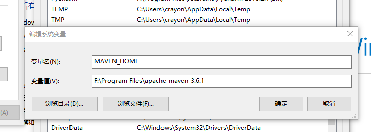

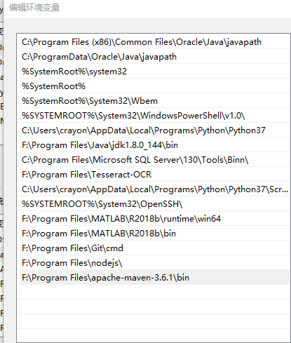

### CMD命令

`mvn -v` 查看是否导入

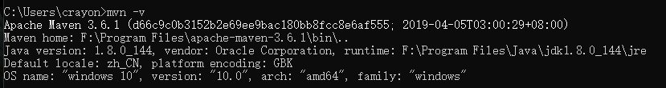

`mvn help:system` 配置，如果成功，在本地仓库可以看到新增文件

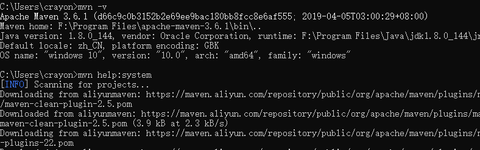


### Idea中配置Maven

在`Setting`中找到`Maven`，配置为本地maven，注意同时导入本地配置和仓库

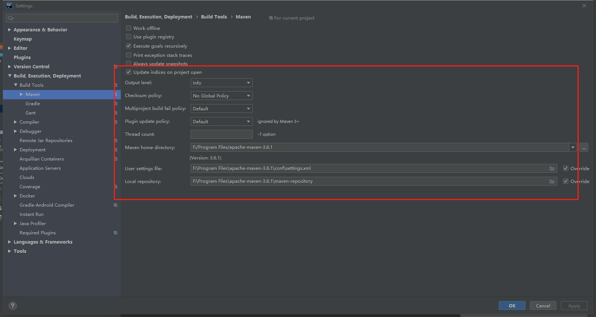


---


## 搭建ssm项目-新建部分

### 新建项目

#### 选择Maven项目进行创建

> 选择webapp，如下

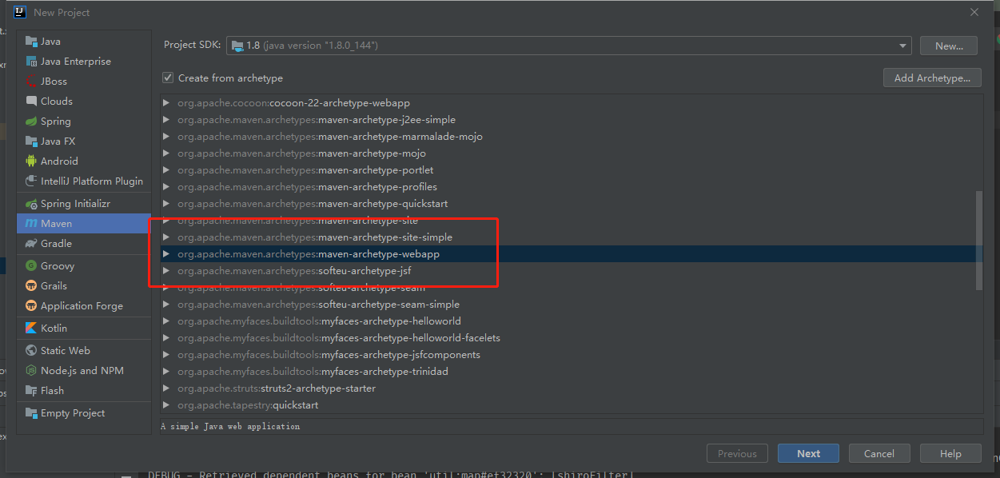


#### 填写项目id及版本号

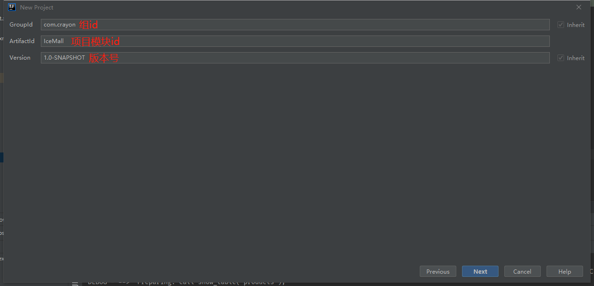


#### 选择本地maven仓库

需要同时更换本地的maven配置，因为有镜像比较快

* `F:\Program Files\apache-maven-3.6.3\conf\settings.xml`

仓库地址也使用本地仓库

* `F:\Program Files\apache-maven-3.6.3\maven-repository`

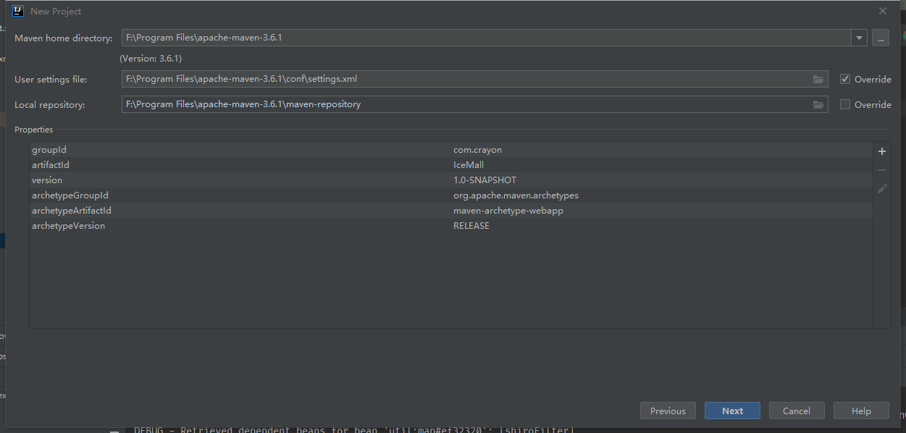


#### 设置项目名称及地址

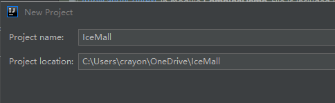

#### 项目构建完成

等待Maven下载依赖包

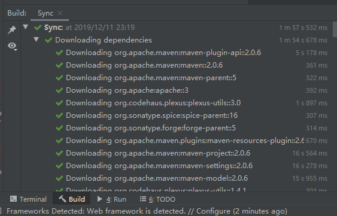

**设置Maven自动注入jar包**

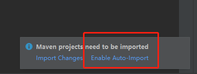


### 搭建ssm项目-项目前期搭建


#### 创建项目文件层次

建立如下文件层次

**src**

* **main**
  * `java`:存放java源码，(user_manage)是用户管理，与普通类区分
    * com.crayon
      * `controller` 控制层
      * `dao` dao层，Mapper层的抽象接口
      * `dto` 传输实体类
      * `pojo` 持久层对象
      * `service` 业务层逻辑
      * `shiro` shiro配置实体类
  * `resource`：项目配置文件
    * `mapper` 执行sql
    * `mybatis` mybatis配置文件
    * `spring` spring系列配置文件
    * `sql` 数据库建模语句
  * `webapp`:网页及图片资源文件
    * `static` 多媒体资源
    * `WEB.xml` web配置文件
    * `index.jsp` 主页

* **test**

* **target** 编译输出目标文件夹

**porm.xml**  maven依赖

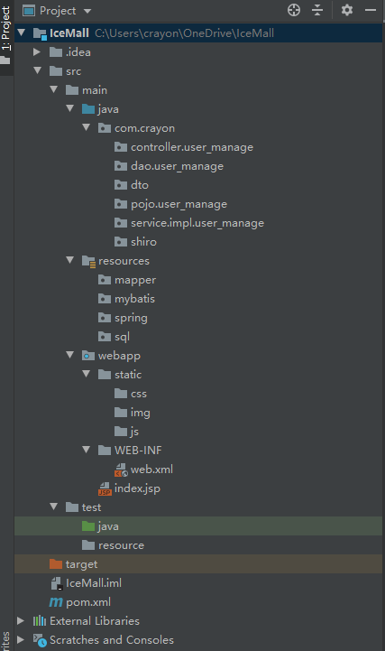

在`Project Structure->Modules`中指定文件夹类型

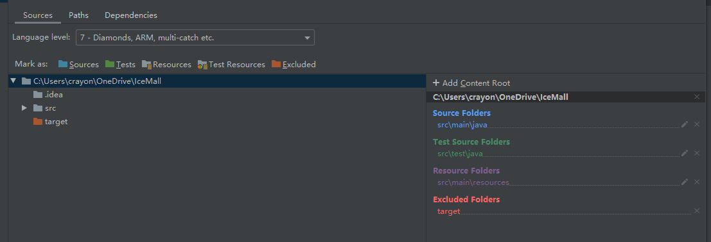


### Porm.xml

#### 约定版本号

> 设置项目依赖所需jar包的版本

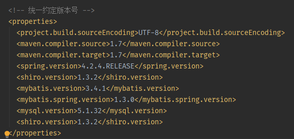

#### 配置相关依赖

>在`<<dependencies>>`标签中插入若干`<dependencie>`标签，即jar包导入

#### 下载依赖

> 点击`刷新`，maven会自动下载所需jar包

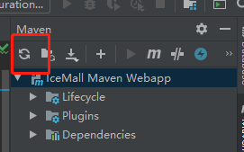

#### 完整配置

```xml
<?xml version="1.0" encoding="UTF-8"?>

<project xmlns="http://maven.apache.org/POM/4.0.0" xmlns:xsi="http://www.w3.org/2001/XMLSchema-instance"
  xsi:schemaLocation="http://maven.apache.org/POM/4.0.0 http://maven.apache.org/xsd/maven-4.0.0.xsd">
  <modelVersion>4.0.0</modelVersion>

  <groupId>com.crayon</groupId>
  <artifactId>IceMall</artifactId>
  <version>1.0-SNAPSHOT</version>
  <packaging>war</packaging>

  <name>IceMall Maven Webapp</name>
  <!-- FIXME change it to the project's website -->
  <url>http://www.example.com</url>

  <!-- 统一约定版本号 -->
  <properties>
    <project.build.sourceEncoding>UTF-8</project.build.sourceEncoding>
    <maven.compiler.source>1.7</maven.compiler.source>
    <maven.compiler.target>1.7</maven.compiler.target>
    <spring.version>4.2.4.RELEASE</spring.version>
    <shiro.version>1.3.2</shiro.version>
    <mybatis.version>3.4.1</mybatis.version>
    <mybatis.spring.version>1.3.0</mybatis.spring.version>
    <mysql.version>5.1.32</mysql.version>
    <shiro.version>1.3.2</shiro.version>
  </properties>

  <dependencies>
    <dependency>
      <groupId>junit</groupId>
      <artifactId>junit</artifactId>
      <version>4.9</version>
      <scope>test</scope>
    </dependency>

    <!-- shiro -->
    <dependency>
      <groupId>org.apache.shiro</groupId>
      <artifactId>shiro-core</artifactId>
      <version>${shiro.version}</version>
    </dependency>
    <dependency>
      <groupId>org.apache.shiro</groupId>
      <artifactId>shiro-web</artifactId>
      <version>${shiro.version}</version>
    </dependency>
    <dependency>
      <groupId>org.apache.shiro</groupId>
      <artifactId>shiro-ehcache</artifactId>
      <version>${shiro.version}</version>
    </dependency>
    <dependency>
      <groupId>org.apache.shiro</groupId>
      <artifactId>shiro-quartz</artifactId>
      <version>${shiro.version}</version>
    </dependency>
    <dependency>
      <groupId>org.apache.shiro</groupId>
      <artifactId>shiro-spring</artifactId>
      <version>${shiro.version}</version>
    </dependency>

    <!-- mysql && druid -->
    <dependency>
      <groupId>mysql</groupId>
      <artifactId>mysql-connector-java</artifactId>
      <version>${mysql.version}</version>
    </dependency>

    <!-- spring -->
    <dependency>
      <groupId>org.springframework</groupId>
      <artifactId>spring-jdbc</artifactId>
      <version>${spring.version}</version>
    </dependency>
    <dependency>
      <groupId>org.springframework</groupId>
      <artifactId>spring-context</artifactId>
      <version>${spring.version}</version>
    </dependency>
    <dependency>
      <groupId>org.springframework</groupId>
      <artifactId>spring-web</artifactId>
      <version>${spring.version}</version>
    </dependency>
    <dependency>
      <groupId>org.springframework</groupId>
      <artifactId>spring-webmvc</artifactId>
      <version>${spring.version}</version>
    </dependency>
    <dependency>
      <groupId>org.springframework</groupId>
      <artifactId>spring-test</artifactId>
      <version>${spring.version}</version>
    </dependency>

    <!-- MyBatis -->
    <dependency>
      <groupId>org.mybatis</groupId>
      <artifactId>mybatis</artifactId>
      <version>${mybatis.version}</version>
    </dependency>
    <dependency>
      <groupId>org.mybatis</groupId>
      <artifactId>mybatis-spring</artifactId>
      <version>${mybatis.spring.version}</version>
    </dependency>

    <!-- aspectj相关jar包-->
    <dependency>
      <groupId>org.aspectj</groupId>
      <artifactId>aspectjrt</artifactId>
      <version>1.7.4</version>
    </dependency>
    <dependency>
      <groupId>org.aspectj</groupId>
      <artifactId>aspectjweaver</artifactId>
      <version>1.7.4</version>
    </dependency>

    <!-- servlet -->
    <dependency>
      <groupId>javax.servlet</groupId>
      <artifactId>javax.servlet-api</artifactId>
      <version>3.0.1</version>
    </dependency>
    <dependency>
      <groupId>javax.servlet</groupId>
      <artifactId>jstl</artifactId>
      <version>1.2</version>
    </dependency>

    <!-- fastjson -->
    <dependency>
      <groupId>com.alibaba</groupId>
      <artifactId>fastjson</artifactId>
      <version>1.2.47</version>
    </dependency>
    <dependency>
      <groupId>com.fasterxml.jackson.core</groupId>
      <artifactId>jackson-databind</artifactId>
      <version>2.5.4</version>
    </dependency>

    <!-- 日志打印 -->
    <dependency>
      <groupId>commons-logging</groupId>
      <artifactId>commons-logging</artifactId>
      <version>1.1.1</version>
    </dependency>
    <dependency>
      <groupId>commons-collections</groupId>
      <artifactId>commons-collections</artifactId>
      <version>3.2.1</version>
    </dependency>
    <dependency>
      <groupId>org.bgee.log4jdbc-log4j2</groupId>
      <artifactId>log4jdbc-log4j2-jdbc4.1</artifactId>
      <version>1.16</version>
    </dependency>
    <dependency>
      <groupId>org.slf4j</groupId>
      <artifactId>slf4j-api</artifactId>
      <version>1.7.13</version>
    </dependency>
    <dependency>
      <groupId>org.slf4j</groupId>
      <artifactId>slf4j-log4j12</artifactId>
      <version>1.7.5</version>
    </dependency>
  </dependencies>

  <build>
    <finalName>IceMall</finalName>
    <pluginManagement><!-- lock down plugins versions to avoid using Maven defaults (may be moved to parent pom) -->
      <plugins>
        <plugin>
          <artifactId>maven-clean-plugin</artifactId>
          <version>3.1.0</version>
        </plugin>
        <!-- see http://maven.apache.org/ref/current/maven-core/default-bindings.html#Plugin_bindings_for_war_packaging -->
        <plugin>
          <artifactId>maven-resources-plugin</artifactId>
          <version>3.0.2</version>
        </plugin>
        <plugin>
          <artifactId>maven-compiler-plugin</artifactId>
          <version>3.8.0</version>
        </plugin>
        <plugin>
          <artifactId>maven-surefire-plugin</artifactId>
          <version>2.22.1</version>
        </plugin>
        <plugin>
          <artifactId>maven-war-plugin</artifactId>
          <version>3.2.2</version>
        </plugin>
        <plugin>
          <artifactId>maven-install-plugin</artifactId>
          <version>2.5.2</version>
        </plugin>
        <plugin>
          <artifactId>maven-deploy-plugin</artifactId>
          <version>2.8.2</version>
        </plugin>
      </plugins>
    </pluginManagement>
  </build>
</project>

```


### 配置Tomcat

#### 设置

打开`Run->Edit Configurations...`，`Configure..`选择Tomcat的安装目录导入

`File->Project Settings->Modules->Dependencies`添加Tomcat

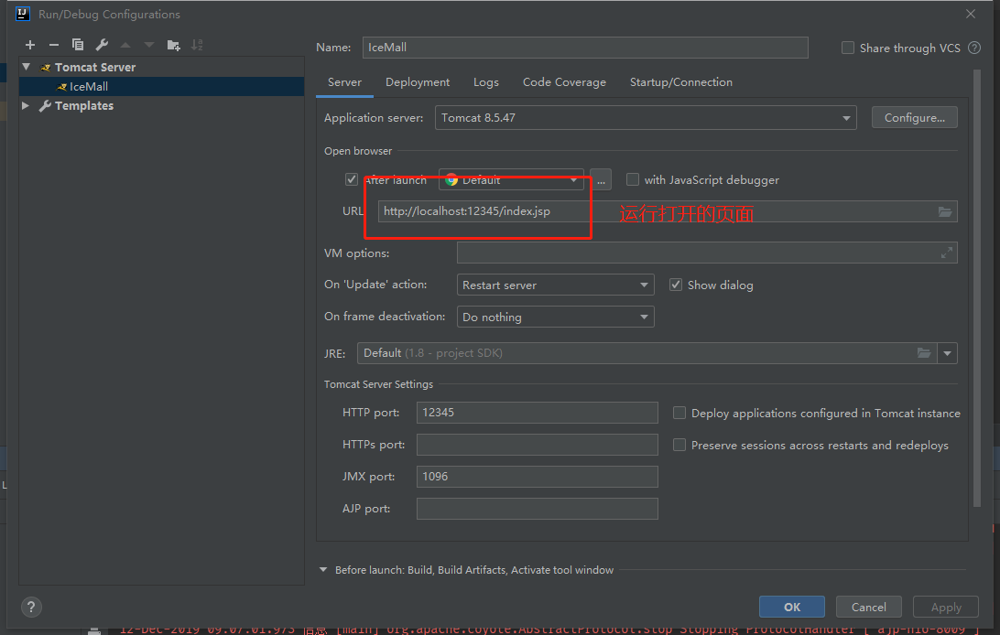

设置绝对访问地址，习惯设置为`/`

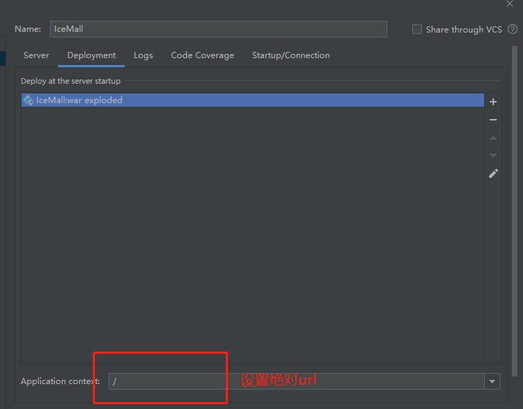

`File->Project Settings->Modules->Dependencies`添加Tomcat

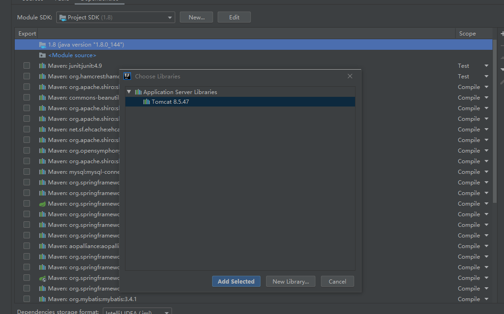

#### 运行测试

能成功打开`index.jsp`，表示配置完成


### MySQL配置

#### 创建数据库

`create database ice_mall` 在mysql中建立一个新的数据库


#### IDEA连接数据库

在侧栏找到`database`，创建`mysql`

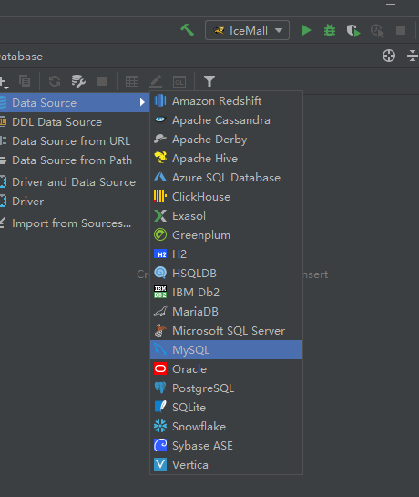

只需要填写数据库名称，其他系统会自动填充

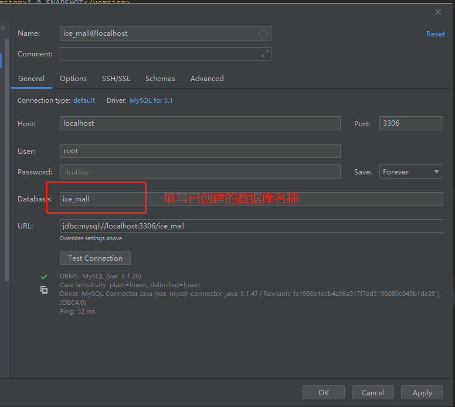


### 将项目提交到GitHub

`VCS` -> `Git` -> `create Git respo` 在所在项目中创建项目

`VCS`->`Git`->`share project on github` 将项目上传至GitHub