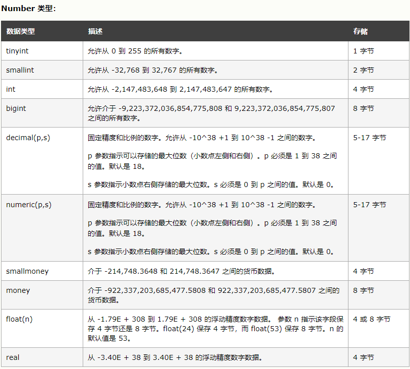
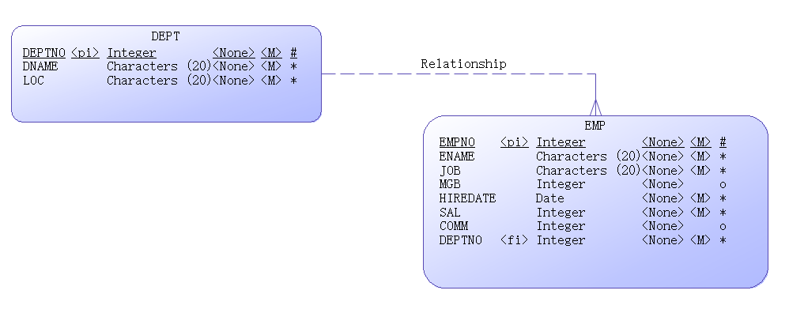
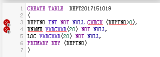
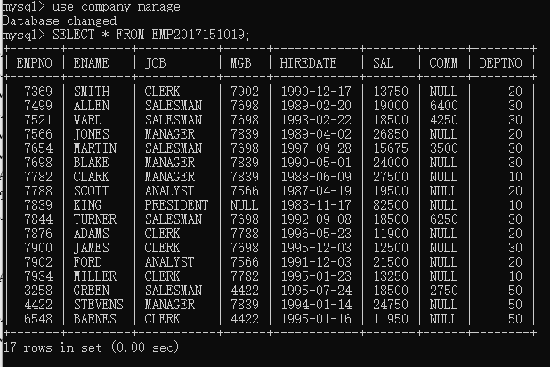

# EXE_1

## WampServer安装
### 浏览器选择
> 在安装结束前选择浏览器，一般选谷歌 路径：`..../google/Application/Chrome.exe

### 报错处理
> [启动wampserver时出现无法启动此程序,因为计算机中丢失MSVCR110.dll](https://blog.csdn.net/m0_37798046/article/details/79205415)

## 前导知识

### 创建索引

> [MySQL(五) MySQL中的索引详讲](https://www.cnblogs.com/whgk/p/6179612.html)
>
> [数据库索引到底是什么，是怎样工作的？](https://blog.csdn.net/weiliangliang111/article/details/51333169)

### 日期
> [数据库之日期类型](https://www.cnblogs.com/cjaaron/p/9215146.html)

### 数据类型
> [SQL Server 数据类型](https://www.w3school.com.cn/sql/sql_datatypes.asp)

字符串
> 

Number类型
> 

日期类型
> 


## 数据库建立

### 建立模型关系
DEPT
* 主键设置为唯一识别的DEPTNO


EMP
* 主键设置为EMPNO


关系图：DEPT的主键作为EMP的外键约束



### SQL语句创建数据库
用`CREATE DATABASE dbname;`语法建立一个名为`company_manage`的数据库

```sql
CREATE DATABASE company_manage
```

### SQL语句创建DEPT表
> 由于EMP的外键是DEPT.DEPTNO，为了安全起见先建立DEPT表，防止EMP表建立时寻找不到对应的外键而无法插入

约束三个属性非空，并且保证`DEPTNO>0`,设置`DEPTNO`为主键\
> 不知为何，加入CHECK会报错
>
> 
```sql
CREATE TABLE  DEPT2017151019
(
DEPTNO INT NOT NULL,
DNAME VARCHAR(20) NOT NULL,
LOC VARCHAR(20) NOT NULL,
PRIMARY KEY (DEPTNO)
)
```

添加对`DEPTNO>0`约束:在wamp...上也会提示格式错误mmp
```sql
ALTER TABLE DEPT2017151019
ADD CHECK (DEPTNO>0)
```

批量插入值
> [SQL insert into 插入的单行，多行的情况](https://blog.csdn.net/maymay_/article/details/80076110)
```sql
INSERT INTO DEPT2017151019
VALUES (10,'ACCOUNTING','LONDON'),
(20,'RESEARCH','PRESTON'),
(30,'SALES','LIVERPOOL'),
(40,'OPERATIONS','STAFFORD'),
(50,'MARKETING','LUTON');
```

查询当前插入情况
```sql
SELECT * FROM DEPT2017151019;
```
> 

### SQL语句创建EMP表
> `EMPNO` 和`MGB`是互相约束的，为了避免因为约束关系的存在而不能正常插入，选择先插入值后再定义约束关系

创建表
```sql
CREATE TABLE EMP2017151019
(
EMPNO INT NOT NULL,
ENAME VARCHAR(20) NOT NULL,
JOB VARCHAR(20) NOT NULL,
MGB INT,
HIREDATE DATE NOT NULL,
SAL INT NOT NULL,
COMM INT,
DEPTNO INT NOT NULL
)
```

添加约束条件:还是报错
```sql
ALTER TABLE EMP2017151019
ADD CONSTRAINT chk_emp CHECK (EMPNO>0 AND SAL>0 AND DEPTNO>0)
```


插入值
```sql
INSERT INTO EMP2017151019
VALUES (7369,'SMITH','CLERK',7902,'1990-12-17',13750,NULL,20),
(7499,'ALLEN','SALESMAN',7698,'1989-2-20',19000,6400,30),
(7521,'WARD','SALESMAN',7698,'1993-2-22',18500,4250,30),
(7566,'JONES','MANAGER',7839,'1989-4-2',26850,NULL,20),
(7654,'MARTIN','SALESMAN',7698,'1997-9-28',15675,3500,30),
(7698,'BLAKE','MANAGER',7839,'1990-5-1',24000,NULL,30),
(7782,'CLARK','MANAGER',7839,'1988-6-9',27500,NULL,10),
(7788,'SCOTT','ANALYST',7566,'1987-4-19',19500,NULL,20),
(7839,'KING','PRESIDENT',NULL,'1983-11-17',82500,NULL,10),
(7844,'TURNER','SALESMAN',7698,'1992-9-8',18500,6250,30),
(7876,'ADAMS','CLERK',7788,'1996-5-23',11900,NULL,20),
(7900,'JAMES','CLERK',7698,'1995-12-3',12500,NULL,30),
(7902,'FORD','ANALYST',7566,'1991-12-3',21500,NULL,20),
(7934,'MILLER','CLERK',7782,'1995-1-23',13250,NULL,10),
(3258,'GREEN','SALESMAN',4422,'1995-7-24',18500,2750,50),
(4422,'STEVENS','MANAGER','7839','1994-1-14',24750,NULL,50),
(6548,'BARNES','CLERK',4422,'1995-1-16',11950,NULL,50);
```

查看表
```sql
SELECT * FROM EMP2017151019
```


添加约束关系：`EMPNO`作为主键，`DEPTNO`作为外键
```sql
ALTER  TABLE EMP2017151019
ADD PRIMARY KEY (EMPNO),
ADD FOREIGN KEY (DEPTNO)
REFERENCES DEPT2017151019(DEPTNO);
```
