# EXERCISES.1 SIMPLE COMMANDS

## NO.1-NO.5

### NO.1
> List all information about the employees.
```sql
SELECT * FROM EMP2017151019;
```


### NO.2
> List all information about the departments
```sql
SELECT * FROM DEPT2017151019;
```
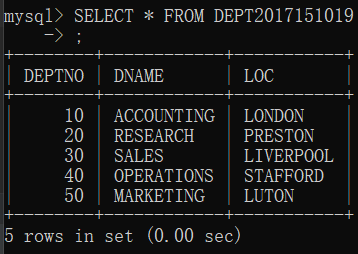

### NO.3
> List only the following information from the EMP table ( Employee name, employee number, salary, department number)
```sql
SELECT ENAME,EMPNO,SAL,DEPTNO FROM EMP201715109;
```
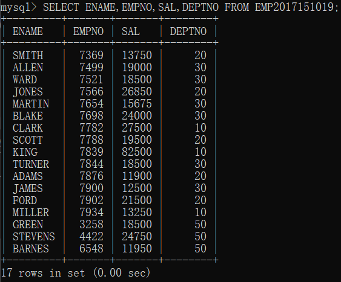

### NO.4
> List details of employees in departments 10 and 30.
```sql
SELECT * FROM EMP2017151019
WHERE DEPTNO BETWEEN 10 AND 30;
```
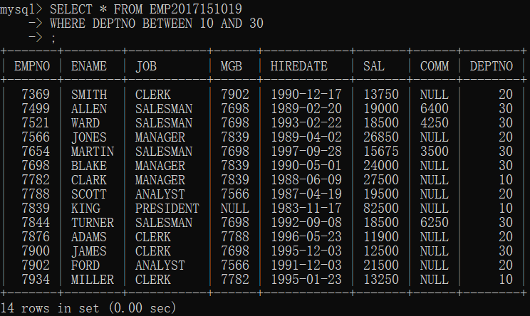

### NO.5
> List all the jobs in the EMP table eliminating duplicates（消除重复）.
```sql
SELECT DISTINCT JOB FROM EMP2017151019
```
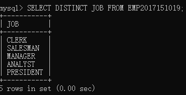


## NO.6-NO.10

### NO.6
> What are the names of the employees who earn less than £20,000?
```sql
SELECT COUNT(*) AS NUMS FROM EMP2017151019
WHERE SAL<20000;
```
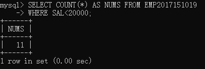

### NO.7
> What is the name, job title and employee number of the person in department 20 who earns more than £25000?
```sql
SELECT ENAME,JOB,EMPNO FROM EMP2017151019
WHERE DEPTNO=20 AND SAL>25000;
```


### NO.8
> Find all employees whose job is either Clerk or Salesman.
```sql
SELECT EMPNO,ENAME,JOB FROM EMP2017151019
WHERE JOB='CLERK' OR JOB='SALESMAN';
```
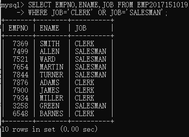

### NO.9
> Find any Clerk who is not in department 10.
```sql
SELECT * FROM EMP2017151019
WHERE JOB='CLERK' AND DEPTNO!=10;
```
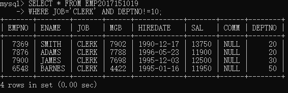

# NO.10
> Find everyone whose job is Salesman and all the Analysts in department 20.
```sql
SELECT * FROM EMP2017151019
WHERE JOB='SALESMAN' OR (JOB='ANALYST' AND DEPTNO=20);
```
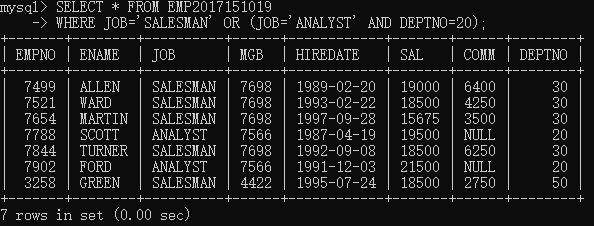


## NO.11-NO.15

### NO.11
> Find all the employees who earn between £15,000 and £20,000.Show the employee name, department and salary.
```sql
SELECT ENAME,DEPTNO,SAL FROM EMP2017151019
WHERE SAL BETWEEN 15000 AND 20000;
```
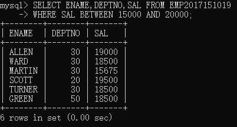

### NO.12
> Find the name of the President.
```sql
SELECT ENAME FROM EMP2017151019
WHERE MGB IS NULL;
```
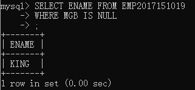

### NO.13
> Find all the employees whose last names end with S

```sql
SELECT ENAME FROM EMP2017151019
WHERE ENAME LIKE '%S';
```
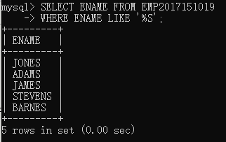

### NO.14
> List the employees whose names have TH or LL in them
```sql
SELECT ENAME FROM EMP2017151019
WHERE ENAME LIKE '%TH%' OR ENAME LIKE '%LL%'
```
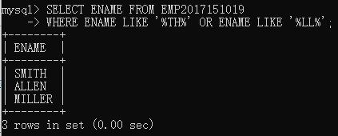

### NO.15
> List only those employees who receive commission.

```sql
SELECT * FROM EMP2017151019
WHERE COMM IS NOT NULL;
```
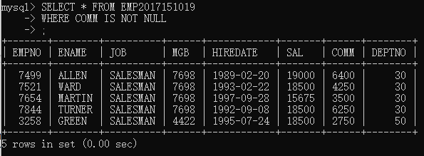

## NO.16-NO.21

### NO.16
> Find the name, job, salary, hiredate, and department number of all employees by alphabetical order of name.

```sql
SELECT ENAME,JOB,SAL,HIREDATE,DEPTNO FROM EMP2017151019
ORDER BY ENAME;
```
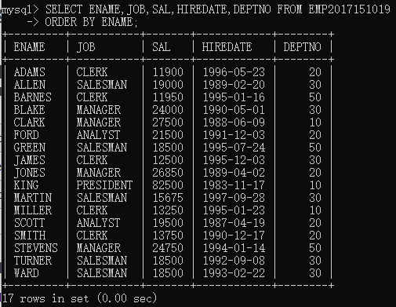

### NO.17
> Find the name, job, salary, hiredate and department number of all employees in ascending（上升） order by their salaries.

```sql
SELECT ENAME,JOB,SAL,HIREDATE,DEPTNO FROM EMP2017151019
ORDER BY SAL;
```
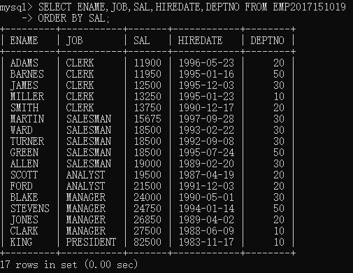

### NO.18
> List all salesmen in descending（降序）order by commission divided by their salary.
```sql
SELECT ENAME,JOB,SAL,HIREDATE,DEPTNO FROM EMP2017151019
ORDER BY SAL DESC;
```
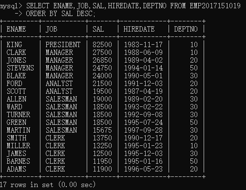

**备注**
> 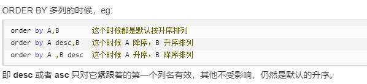

### NO.19
> Order employees in department 30 who receive commision, in ascending order by commission
```sql
SELECT * FROM EMP2017151019
WHERE DEPTNO=30 AND COMM IS NOT NULL
ORDER BY COMM;
```
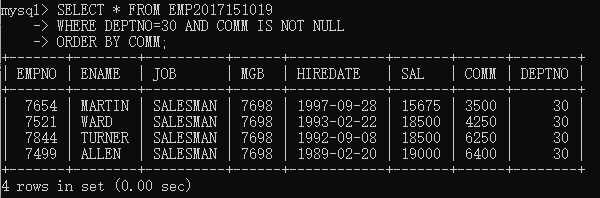


### NO.20
> Find the names, jobs, salaries and commissions of all employees who do not have managers.
```sql
SELECT ENAME,JOB,SAL,COMM FROM EMP2017151019
WHERE MGB IS NULL;
```
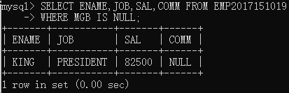

### NO.21
> Find all the salesmen in department 30 who have a salary greater than or equal to £18000.
```sql
SELECT * FROM EMP2017151019
WHERE DEPTNO=30 AND SAL>=18000;
```

