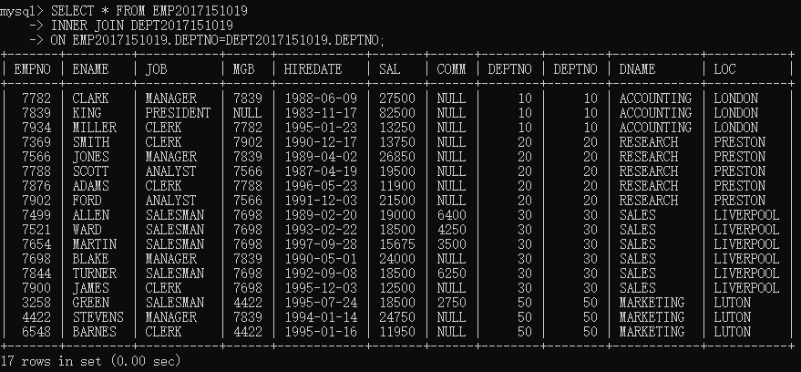

# EXERCISES	2 JOINS

## 多次尝试

### INNER JOIN
> 在表中存在至少一个匹配时，INNER JOIN 关键字返回行。
> * 通过匹配外键-主键，对表进行扩展
> * 比如`EMP`和`DEPT`的关联是`DEPTNO`，在`join`的时候会把`EMP`字段中的`DEPTNO`放到`DEPT`中查找
> * 把`DEPT`匹配的数据拉过来连接到`EMP`

```sql
SELECT * FROM EMP2017151019
INNER JOIN DEPT2017151019
ON EMP2017151019.DEPTNO=DEPT2017151019.DEPTNO;
```
> 


## NO.1-NO.5

### NO.1
> Find the name and salary of employees in Luton

```sql
SELECT * FROM EMP2017151019
INNER JOIN DEPT2017151019
ON EMP2017151019.DEPTNO=DEPT2017151019.DEPTNO;
```