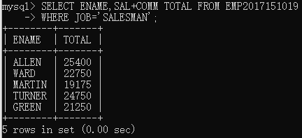
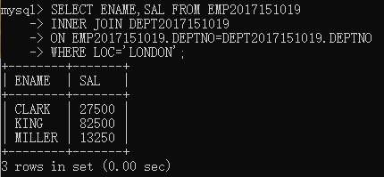
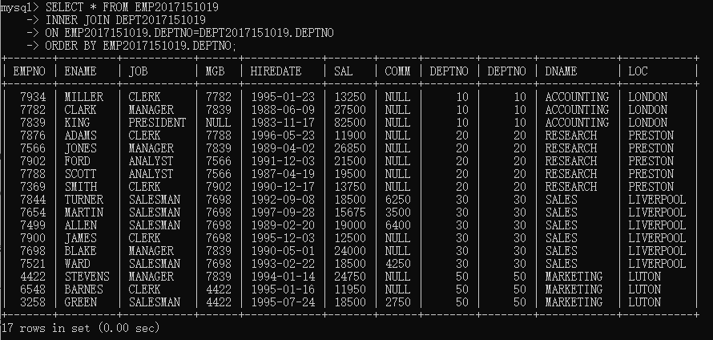
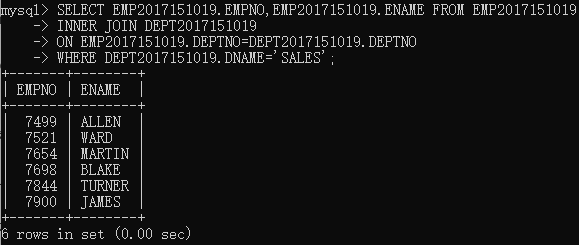
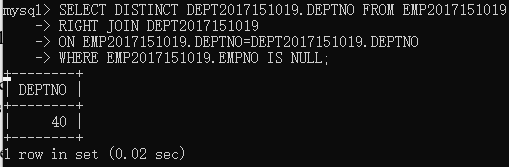
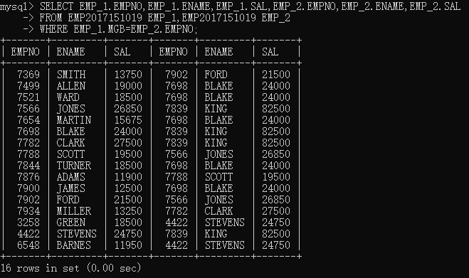
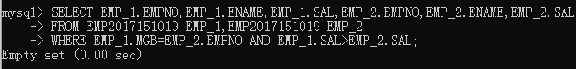
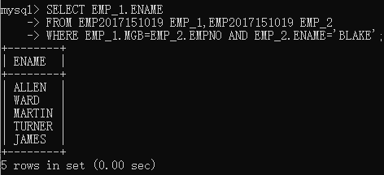

# EXERCISES	2 JOINS

## 多次尝试

### INNER JOIN
> 在表中存在至少一个匹配时，INNER JOIN 关键字返回行。
> * 通过匹配外键-主键，对表进行扩展
> * 比如`EMP`和`DEPT`的关联是`DEPTNO`，在`join`的时候会把`EMP`字段中的`DEPTNO`放到`DEPT`中查找
> * 把`DEPT`匹配的数据拉过来连接到`EMP`

```sql
SELECT * FROM EMP2017151019
INNER JOIN DEPT2017151019
ON EMP2017151019.DEPTNO=DEPT2017151019.DEPTNO;
```
> 

### 两列运算
> [sql中对两列数据进行运算作为新的列](https://blog.csdn.net/u013703363/article/details/62893063)
```sql
SELECT ENAME,SAL+COMM TOTAL FROM EMP2017151019
WHERE JOB='SALESMAN';
```
> 


## NO.1-NO.5

### NO.1
> Find the name and salary of employees in Luton

```sql
SELECT ENAME,SAL FROM EMP2017151019
INNER JOIN DEPT2017151019
ON EMP2017151019.DEPTNO=DEPT2017151019.DEPTNO
WHERE LOC='LONDON';
```


### NO.2
> Join the DEPT table to the EMP table and show in department number order.
```sql
SELECT * FROM EMP2017151019
INNER JOIN DEPT2017151019
ON EMP2017151019.DEPTNO=DEPT2017151019.DEPTNO
ORDER BY EMP2017151019.DEPTNO;
```


### NO.3
> List the names of all salesmen who work in SALES
```sql
SELECT EMP2017151019.EMPNO,EMP2017151019.ENAME FROM EMP2017151019
INNER JOIN DEPT2017151019
ON EMP2017151019.DEPTNO=DEPT2017151019.DEPTNO
WHERE DEPT2017151019.DNAME='SALES';
```


### NO.4
> List all departments that do not have any employees.

把`EMP`和`DEPT`以右映射的形式加入，可以展示`DEPT`全部的信息，出现`EMPNO=NULL`即表示该部门没有人
```sql
SELECT DISTINCT DEPT2017151019.DEPTNO FROM EMP2017151019
RIGHT JOIN DEPT2017151019
ON EMP2017151019.DEPTNO=DEPT2017151019.DEPTNO
WHERE EMP2017151019.EMPNO IS NULL;
```


### NO.5
> For each employee whose salary exceeds his manager's salary, list the employee's name and salary and the manager's name and salary

对`emp`表进行自加操作，列举出雇员和leader的关系
```sql
SELECT EMP_1.EMPNO,EMP_1.ENAME,EMP_1.SAL,EMP_2.EMPNO,EMP_2.ENAME,EMP_2.SAL
FROM EMP2017151019 EMP_1,EMP2017151019 EMP_2
WHERE EMP_1.MGB=EMP_2.EMPNO;
```


添加条件`EMP_1.SAL>EMP_2.SAL`筛出大于雇主佣金的人
```sql
mysql> SELECT EMP_1.EMPNO,EMP_1.ENAME,EMP_1.SAL,EMP_2.EMPNO,EMP_2.ENAME,EMP_2.SAL
    -> FROM EMP2017151019 EMP_1,EMP2017151019 EMP_2
    -> WHERE EMP_1.MGB=EMP_2.EMPNO AND EMP_1.SAL>EMP_2.SAL;
```


### NO.6
>  List the employees who have BLAKE as their manager.

