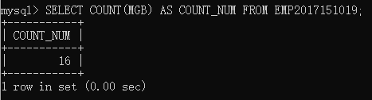

## EXE 3
### NO.1
> Find how many employees have a title of manager without listing them.

> COUNT不会计算空值
```sql
SELECT COUNT(MGB) AS COUNT_NUM FROM EMP2017151019;
```
> 

### NO.2
> Compute the average annual salary plus commission for all salesmen

验证：找出所有的`JOB='SALESMAN'`，发现`COMM`皆非空
```sql
SELECT ENAME,SAL,COMM FROM EMP2017151019
WHERE JOB='SALESMAN';
```


使用`AVG`函数计算平均值
```sql
SELECT AVG(SAL+COMM) AS TOTAL_AVG FROM EMP2017151019
WHERE JOB='SALESMAN';
```


### NO.3
> Find the highest and lowest salaries and the difference between them (single SELECT statement)

```sql
SELECT MAX(SAL)-MIN(SAL) AS DIFF FROM EMP2017151019;
```


### NO.4
> Find the number of characters in the longest department name
踩坑：mysql的len函数是`LENGTH`

```sql
SELECT DNAME,MAX(LENGTH(DNAME)) AS MAX_LENGTH FROM DEPT2017151019;
```


### NO.5
