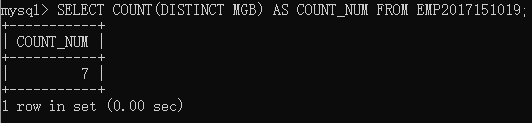
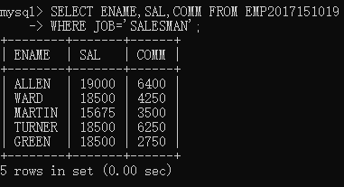
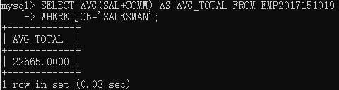
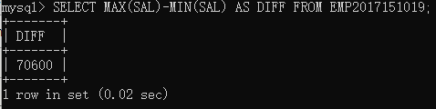
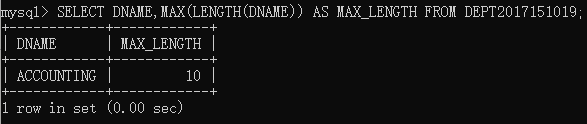
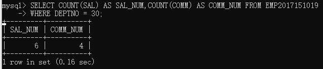
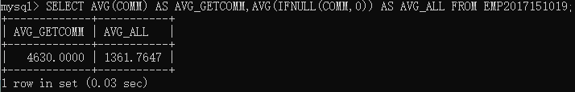
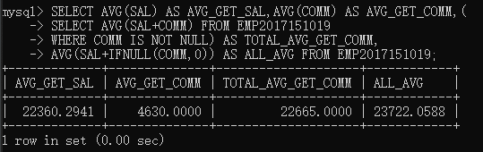
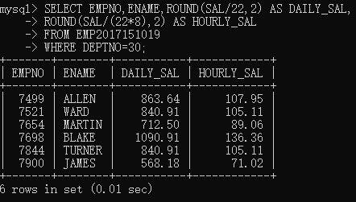
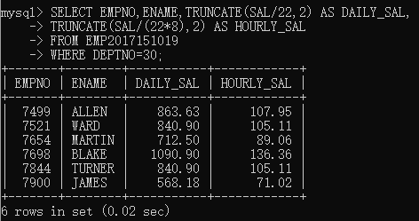

# EXERCISES	3 FUNCTIONS

## NO.1-NO.5

### NO.1
> Find how many employees have a title of manager without listing them.

> COUNT不会计算空值,用`DISTINCT`去重
```sql
SELECT COUNT(DISTINCT MGB) AS COUNT_NUM FROM EMP2017151019;
```
> 

### NO.2
> Compute the average annual salary plus commission for all salesmen

验证：找出所有的`JOB='SALESMAN'`，发现`COMM`皆非空
```sql
SELECT ENAME,SAL,COMM FROM EMP2017151019
WHERE JOB='SALESMAN';
```


使用`AVG`函数计算平均值
```sql
SELECT AVG(SAL+COMM) AS TOTAL_AVG FROM EMP2017151019
WHERE JOB='SALESMAN';
```


### NO.3
> Find the highest and lowest salaries and the difference between them (single SELECT statement)

```sql
SELECT MAX(SAL)-MIN(SAL) AS DIFF FROM EMP2017151019;
```


### NO.4
> Find the number of characters in the longest department name
踩坑：mysql的len函数是`LENGTH`

```sql
SELECT DNAME,MAX(LENGTH(DNAME)) AS MAX_LENGTH FROM DEPT2017151019;
```


### NO.5
> Count the number of people in department 30 who receive a salary and the number of people who receive a commission (single statement).
```sql
SELECT COUNT(SAL) AS SAL_NUM,COUNT(COMM) AS COMM_NUM FROM EMP2017151019
WHERE DEPTNO = 30;
```


## NO.6-NO.10

### NO.6
> List the average commission of employees who receive a commission,
>and the average commission of all employees (assume employees who do not receive a commission attract zero commission)

`AVG()`函数内部处理就是除去空值的，对于将空值置0计算，需要利用`IFNULL()`函数转换
```mysql
SELECT AVG(COMM) AS AVG_GETCOMM,AVG(IFNULL(COMM,0)) AS AVG_ALL FROM EMP2017151019;
```


### NO.7
> 列出领`SAL`的雇员的平均薪水，列出领取`COMM`的雇员的平均佣金，列出有领`COMM`的雇员的平均总收入
> `SAL+COMM`，列出所有员工的平均总收入（考虑空值转化为0）

发现了，sql语句是可以嵌套！然后多张表/一张表获取不同的信息整合在一张表里的qwq
```mysql
SELECT AVG(SAL) AS AVG_GET_SAL,AVG(COMM) AS AVG_GET_COMM,(
SELECT AVG(SAL+COMM) FROM EMP2017151019
WHERE COMM IS NOT NULL) AS TOTAL_AVG_GET_COMM,
AVG(SAL+IFNULL(COMM,0)) AS ALL_AVG FROM EMP2017151019;
```


### NO.8
> Compute the daily and hourly salary for employees in department 30, round to the nearest penny. Assume there are 22 working days in a month and 8 working hours in a day.

计算30部门的时薪和日薪，利用`ROUND`函数精确到分位
```mysql
SELECT EMPNO,ENAME,ROUND(SAL/22,2) AS DAILY_SAL,
ROUND(SAL/(22*8),2) AS HOURLY_SAL
FROM EMP2017151019
WHERE DEPTNO=30;
```


### NO.9
在`NO.8`的基础上不是四舍五入到分，而是直接截断到分，利用`TRUNCATE(DECIMAL,INT)`函数
```mysql
SELECT EMPNO,ENAME,TRUNCATE(SAL/22,2) AS DAILY_SAL,
TRUNCATE(SAL/(22*8),2) AS HOURLY_SAL
FROM EMP2017151019
WHERE DEPTNO=30;
```



