# EXERCISES4 DATES

## 尝试

### EXTRACT()
> EXTRACT() 函数用于返回日期/时间的单独部分，比如年、月、日、小时、分钟等等。

语法
> `EXTRACT(UNIT FROM DATE)`

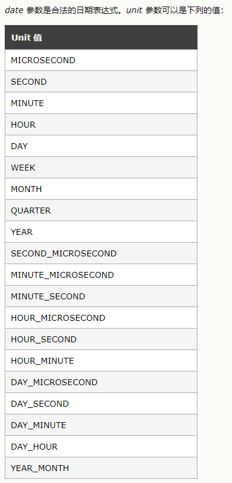

**实例**
> 列举出`HIREDATE`的年月日周
```mysql
SELECT EXTRACT(YEAR FROM HIREDATE) AS YEAR,
EXTRACT(MONTH FROM HIREDATE) AS MONTH,
EXTRACT(DAY FROM HIREDATE) AS DAY,
EXTRACT(WEEK FROM HIREDATE) AS WEEK
FROM EMP2017151019;
```
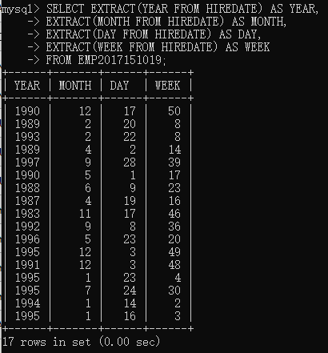

### DATE_ADD()
> DATE_ADD() 函数向日期添加指定的时间间隔。

语法
> `DATE_ADD(date,INTERVAL expr type)`

单位同上表

**实例**
> 增加1年1月

```mysql
SELECT DATE_ADD(HIREDATE,INTERVAL 1 YEAR_MONTH) AS NEW_DATE
FROM EMP2017151019;
```
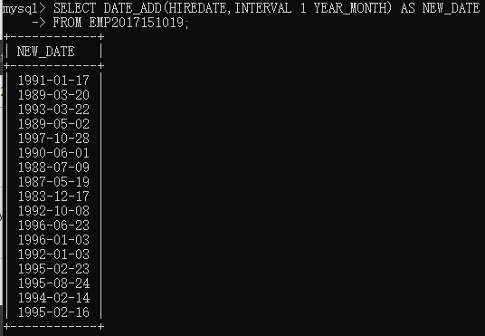

### DATE_SUB()
> DATE_SUB() 函数从日期减去指定的时间间隔

**同`DATE_ADD()`**

### DATEDIFF()
> DATEDIFF() 函数返回两个日期之间的天数。

语法
> `DATEDIFF(date1,date2)`

如果date1比date2晚，返回值为正，否则返回值为负

### DATE_FORMAT()
> DATE_FORMAT() 函数用于以不同的格式显示日期/时间数据。

[MySQL DATE_FORMAT() 函数](https://www.w3school.com.cn/sql/func_date_format.asp)

### mysql使用别名作为判断条件
> 有些时候可能需要把前面查询的字段（一般会起别名），作为筛选条件，避免重写代码

[SQL语句Where中使用别名作为判断条件](https://www.cnblogs.com/dwfbenben/archive/2013/09/07/3307941.html)

## NO.1-N0.5

### NO.1
> Select the name, job, and date of hire of the employees in department 20. (Format the HIREDATE column to MM/DD/YY) 

* `%y`实现2位制的年份
* `%m`实现两位值的月份
* `%d`实现两位制的日
```mysql
SELECT ENAME,JOB,DATE_FORMAT(HIREDATE,'%m/%d/%y') AS HIRE_DATE
FROM EMP2017151019
WHERE DEPTNO=20;
```
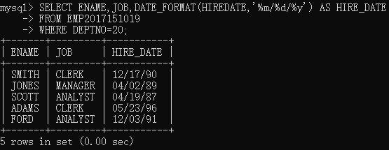

### NO.2
> Then format the HIREDATE column into DoW (day of the week), Day (day of the month), MONTH (name of the month) and YYYY(year)
* `%w` 周的天 （0=星期日, 6=星期六）
* `%d` 月的天，数值(00-31)
* `%M` 月名
* `%Y` 4位年

```mysql
SELECT ENAME,JOB,DATE_FORMAT(HIREDATE,'%w-%d-%M-%Y') AS HIRE_DATE
FROM EMP2017151019;
```


### NO.3
> Which employees were hired in April?

* `EXTRACT(UNIT FROM DATE)`可以筛选出需要的日期部分
    * `extract-提取`
```mysql
SELECT EMPNO,ENAME,HIREDATE FROM EMP2017151019
WHERE EXTRACT(MONTH FROM HIREDATE)=4;
```
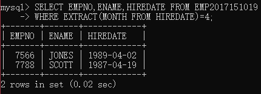


### NO.4
> Which employees were hired on a Tuesday?

`EXTRACT()`函数没有筛选星期几的参数，于是用`DATE_FORMAT`提取`%w(0-6)`
```mysql
SELECT EMPNO,ENAME,HIREDATE FROM EMP2017151019
WHERE DATE_FORMAT(HIREDATE,'%w')=2;
```
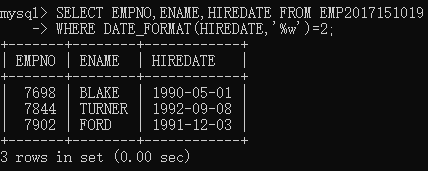


### NO.5
> Are there any employees who have worked more than 30 years for the company?

利用`DATE_ADD(DATE,INTERVAL N UNIT)`计算30年后的日期，与当前日期`CURDATE()`利用`DATEDIFF(date1,date2)`进行对比
```mysql
SELECT EMPNO,ENAME,HIREDATE FROM EMP2017151019
WHERE DATEDIFF(DATE_ADD(HIREDATE,INTERVAL 30 YEAR),CURDATE())<=0;
```
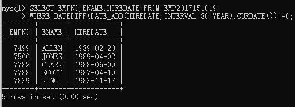

## NO.6-NO.8
### NO.6(不理解)
> Show the weekday of the first day of the month in which each employee was hired. (plus their names)

按我的理解就是他们入职后的上班第一天，按照中国的传统，如果入职时间刚好是周六，那么时间+2，周日+1

[CASE WHEN 及 SELECT CASE WHEN的用法](https://blog.csdn.net/rocling/article/details/82083332)

[Mysql数据库if语句的使用](https://www.jianshu.com/p/79b25bd005d4)
> MySQL 中 DAYOFWEEK(d) 函数返回 d 对应的一周中的索引（位置）。1 表示周日，2 表示周一，……，7 表示周六。这些索引值对应于ODBC标准。
```mysql
SELECT EMPNO,ENAME,DATE_FORMAT(HIREDATE,'%Y-%m-%d-%a') AS HIREDATE,
CASE DAYOFWEEK(HIREDATE)
WHEN 7 THEN DATE_FORMAT(DATE_ADD(HIREDATE,INTERVAL 2 DAY),'%Y-%m-%d-%a')
WHEN 1 THEN DATE_FORMAT(DATE_ADD(HIREDATE,INTERVAL 1 DAY),'%Y-%m-%d-%a')
ELSE DATE_FORMAT(HIREDATE,'%Y-%m-%d-%a') END AS WEEKDAY
FROM EMP2017151019;
```
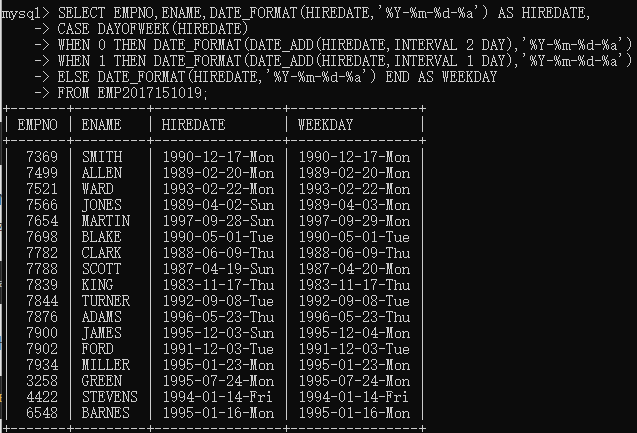

### NO.7
> Show details of employee hiredates and the date of their first payday. (Paydays occur on the last Friday of each month) (plus their names)

* 利用`LAST_DAY`获取入职月的下一个月最后一天
* 利用`DATE_FORMAT`的`%w`参数获取星期值
    * 星期天-星期六分布`0-6`
* 基本思路：获取最后一天的星期值，然后减去相应天数得到本月最后一个周五
* 总结公式  `应减去天数 = (2+最后一天的星期值)%7`


>[Mysql 获取当月和上个月第一天和最后一天的解决方案](https://www.cnblogs.com/maohuidong/p/7976222.html)
```mysql
SELECT EMPNO,ENAME,DATE_FORMAT(HIREDATE,'%Y-%m-%d-%a') AS HIREDATE,
DATE_FORMAT(
DATE_SUB(
LAST_DAY(DATE_ADD(HIREDATE,INTERVAL 1 MONTH)),
INTERVAL
(
(2+DATE_FORMAT(LAST_DAY(DATE_ADD(HIREDATE,INTERVAL 1 MONTH)),'%w')) MOD 7) DAY),
'%Y-%m-%d-%a') AS PAYDAY
FROM EMP2017151019;
```
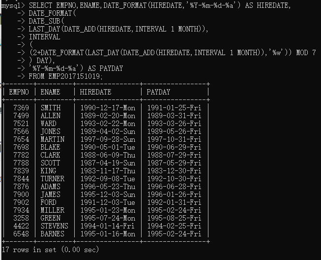

看到第八题，忽然觉得自己做错了，还是在雇佣月份进行

应该是这样
```mysql
SELECT ENAME,EMPNO,DATE_FORMAT(HIREDATE,'%Y-%m-%d-%a') AS HIREDATE,
DATE_FORMAT(DATE_SUB(LAST_DAY(HIREDATE),INTERVAL ((2+DATE_FORMAT(LAST_DAY(HIREDATE),'%w')) MOD 7) DAY),'%Y-%m-%d-%a')
AS PAYDAY
FROM EMP2017151019;
```
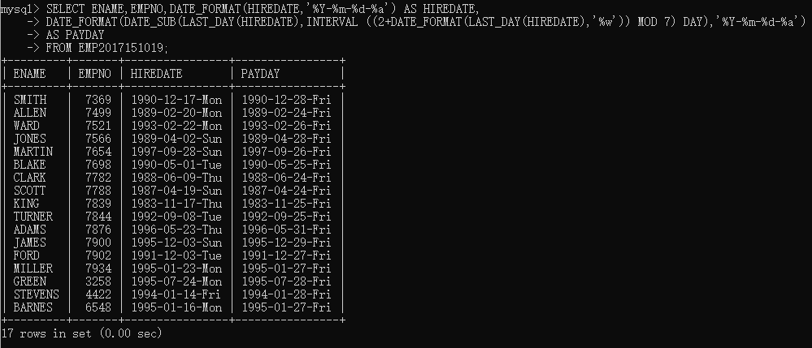

### NO.8
> Refine your answer to 7 such that it works even if an employee is hired after the last Friday of the month (cf Martin)

于是乎结合第七题的两种思路，就得到了本题的答案

条件判断：
* 本月最后一个周五是在聘用期前
    * 转到下个月
* 本月最后一个周五在聘用时间后
    * 按本月算
```mysql
SELECT EMPNO,HIREDATE,
IF(
DATE_FORMAT(DATE_SUB(LAST_DAY(HIREDATE),INTERVAL ((2+DATE_FORMAT(LAST_DAY(HIREDATE),'%w')) MOD 7) DAY),'%d')<
DATE_FORMAT(HIREDATE,'%d'),
DATE_FORMAT(
DATE_SUB(
LAST_DAY(DATE_ADD(HIREDATE,INTERVAL 1 MONTH)),
INTERVAL
(
(2+DATE_FORMAT(LAST_DAY(DATE_ADD(HIREDATE,INTERVAL 1 MONTH)),'%w')) MOD 7) DAY),
'%Y-%m-%d-%a'),
DATE_FORMAT(
DATE_SUB(
LAST_DAY(HIREDATE),
INTERVAL
(
(2+DATE_FORMAT(LAST_DAY(HIREDATE),'%w')) MOD 7) DAY),
'%Y-%m-%d-%a')
) AS PAYDAY
FROM EMP2017151019;
```
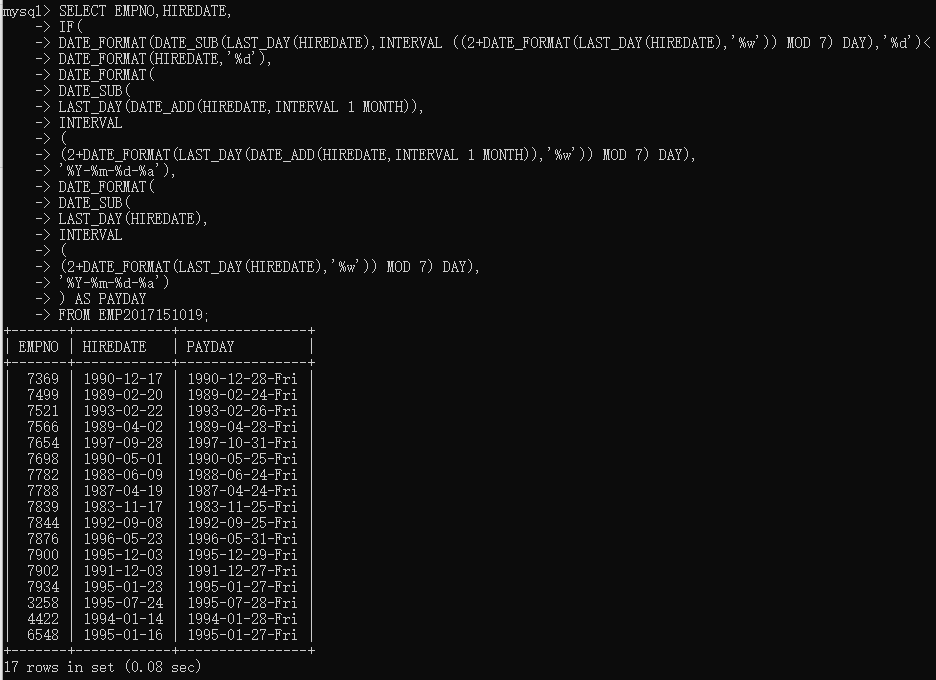