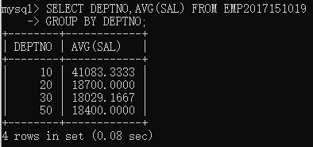
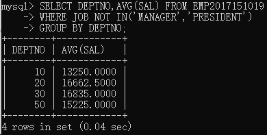
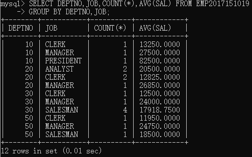
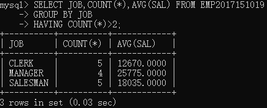
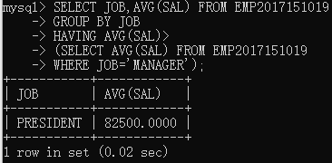
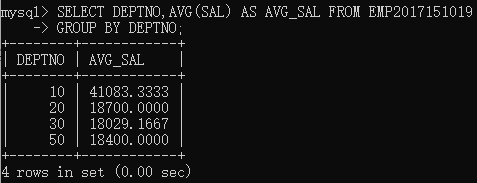
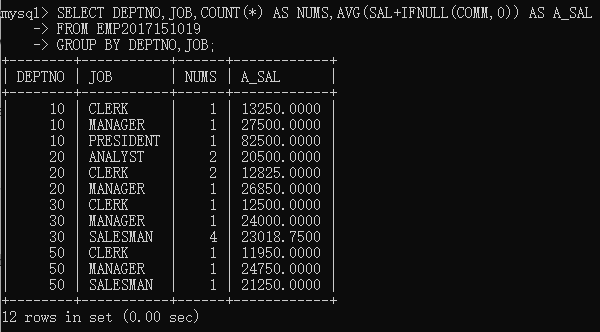
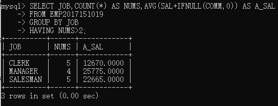
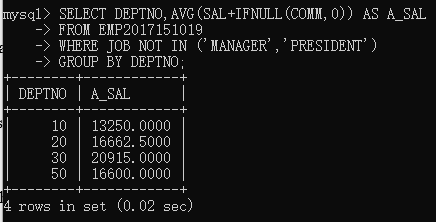
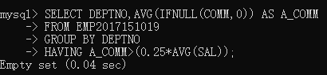

# EXERCISES	5 GROUP BY & HAVING

## 前导知识

### GROUP BY
> GROUP BY是结合合计函数一起使用的，用于对某一列、多列进行分组运算

**语法**
>```mysql
>SELECT column_name, aggregate_function(column_name)
>FROM table_name
>WHERE column_name operator value
>GROUP BY column_name
>```

一般的，`GROUP BY`在选择列时，会选择参照分组的列作为第一列，便于标注分组标签对应的合计结果

下列语句用于对`DEPTNO`进行分组计算，计算每个部门`DEPTNO`的平均工资
```mysql
SELECT DEPTNO,AVG(SAL) FROM EMP
GROUP BY DEPTNO;
```
>

### WHERE IN GROUP BY

下面语句用于统计每个`DEPTNO`中不包含`MANAGER`和`PRESIDENT`的平均薪水
```mysql
SELECT DEPTNO,AVG(SAL) FROM EMP2017151019
WHERE JOB NOT IN('MANAGER', 'PRESIDENT')
GROUP BY DEPTNO;
```
> 

**注意：** `WHERE`不可用于对分组结果的筛选

比如要列举出每个`DEPTNO`的最低工资的员工，用WHERE是做不到的，
这说明`WHERE`是适用于在分组前对某些条件进行过滤，然后再进行分组

### 多个分组条件

下面语句统计每个`DEPTNO`中的每个`JOB`的平均工资，由此可以看出划分的顺序是
先按第一个分组条件`DEPTNO`划分，再用下一个分组条件`JOB`细化

```mysql
SELECT DEPTNO,JOB,COUNT(*),AVG(SAL)
FROM EMP2017151019
GROUP BY DEPTNO,JOB;
```
> 


### HAVING
> HAVING 是专用于`GROUP BY`后的分组结果的筛选关键字，作用对象是每一个分组

HAVING 和 WHERE的区别
* HAVING的最小筛选单位是**分组**
* WHERE的最小筛选单位是**列**

下列语句用于统计每一个职业的平均工资，但需要把低于两个人的职业的平均工资筛除
> 利用HAVING语句作用于分组后的结果，把`COUNT`计算出来的每个分组的数目进行筛选

```mysql
SELECT JOB,COUNT(*),AVG(SAL) FROM EMP2017151019
GROUP BY JOB
HAVING COUNT(*)>2;
```
> 

HAVING 可以使用别名！！！

该语句和上面等价
```mysql
SELECT JOB,COUNT(*) AS NUM,AVG(SAL) FROM EMP2017151019
GROUP BY JOB
HAVING COUNT(*)>2;
```

### HAVING 比较的常量
> 这个常量其实也可以是计算得出的

如下例子，筛出平均工资大于`MANAGER`这个职业的职业
```mysql
SELECT JOB,AVG(SAL) FROM EMP2017151019
GROUP BY JOB
HAVING AVG(SAL)>
(SELECT AVG(SAL) FROM EMP2017151019
WHERE JOB='MANAGER');
```

> 


## NO.1-NO.5

### NO.1
> List the department number and average salary of each department

```mysql
SELECT DEPTNO,AVG(SAL) AS AVG_SAL FROM EMP2017151019
GROUP BY DEPTNO;
```



### NO.2
> Divide all employees into groups by department and by job within 			department. Count the employees in each group and compute each group's average annual salary.

```mysql
SELECT DEPTNO,JOB,COUNT(*) AS NUMS,AVG(SAL+IFNULL(COMM,0)) AS A_SAL
FROM EMP2017151019
GROUP BY DEPTNO, JOB;
```



### NO.3
> Issue the same query as above except list the department name rather than the department number.

按NO.2，只不过把`DEPTNO`换成了`DNAME`，需要利用`INNER JOIN`集成两张表
```mysql
SELECT DNAME,JOB,COUNT(*) AS NUMS,AVG(SAL+IFNULL(COMM,0)) AS A_SAL
FROM EMP2017151019
GROUP BY DEPTNO,JOB;
```

### NO.4
> List the average annual salary for all job groups having more than 2 employees in the group.

这道题也提示：`HAVING`是可以引用别名的！！！



### NO.5
> Find each department's average annual salary for all its employees except the managers and the president.

```mysql
SELECT DEPTNO,AVG(SAL+IFNULL(COMM,0)) AS A_SAL
FROM EMP2017151019
WHERE JOB NOT IN ('MANAGER','PRESIDENT')
GROUP BY DEPTNO;
```


## NO.6-

### NO.6
> Find all departments with an average commission greater than 25% of average salary.

```mysql
SELECT DEPTNO,AVG(IFNULL(COMM,0)) AS A_COMM
FROM EMP2017151019
GROUP BY DEPTNO
HAVING A_COMM>(0.25*AVG(SAL));
```

问题：`HAVING`的比较常量如果是一个分组的汇总函数值，如上的`(0.25*AVG(SAL))`

这会是每个分组的特征值还是整一个表？

