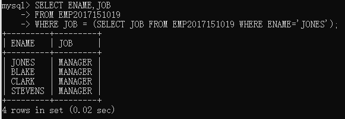
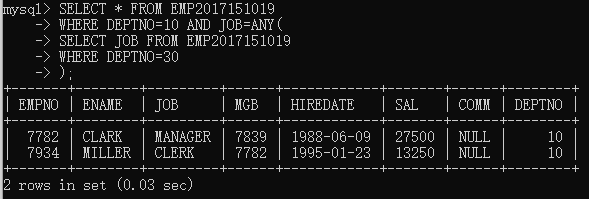
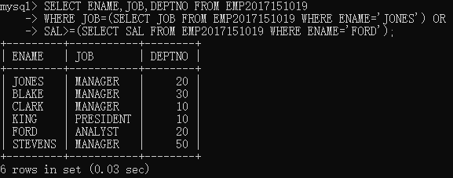
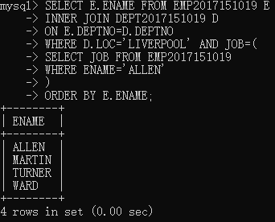
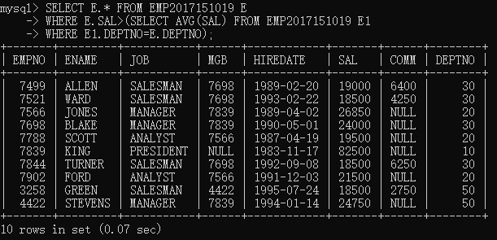
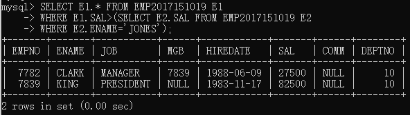

# EXERCISES 6 SUB QUERIES.

## NO.1-NO.5

### NO.1
> List the name and job of employees who have the same job as Jones.

子查询:查找`jones`的工作，接着列举出所有和`jones`有相同工作的人

```mysql
SELECT ENAME,JOB
FROM EMP2017151019
WHERE JOB = (SELECT JOB FROM EMP2017151019 WHERE ENAME='JONES');
```
> 


### NO.2
> Find all the employees in Department 10 that have a
> job that is the same as anyone in department 30.

感觉像表达的是，找出在部门10并且工作岗位出现在部门30的人

#### 思路
* 子查询：找出部门30的所有工作
* 利用`ANY`函数筛选

```mysql
SELECT * FROM EMP2017151019
WHERE DEPTNO=10 AND JOB=ANY(
SELECT JOB FROM EMP2017151019
WHERE DEPTNO=30
);
```
>


### NO.3
> List the name, job, and department of employees who have the same
> job as Jones or a salary greater than or equal to Ford.

思路
* 子查询1：找出`JONES`的工资
* 子查询2：找出`FORD`的工资

```mysql
SELECT ENAME,JOB,DEPTNO FROM EMP2017151019
WHERE JOB=(SELECT JOB FROM EMP2017151019 WHERE ENAME='JONES') OR
SAL>=(SELECT SAL FROM EMP2017151019 WHERE ENAME='FORD');
```
> 


### NO.4
> Find all employees in department 10 that have a job that is the same as
> anyone in the Sales department

#### 思路
* 需要查找部门名称为`SALES`的所有岗位
* 所以需要连表查询


```mysql
SELECT * FROM EMP2017151019
WHERE DEPTNO=10 AND JOB=ANY(
SELECT E.JOB FROM EMP2017151019 E
INNER JOIN DEPT2017151019 D
ON E.DEPTNO=D.DEPTNO
WHERE D.DNAME='SALES'
);
```

### NO.5
> Find the employees located in Liverpool who have the same job as Allen.
> Return the results in alphabetical order by employee name.

思路：
* 对`DEPT`和`EMP`两张表做连接，确定`local`在`Liverpool`的员工
* 子查询部分：查询`ALLEN`的工作
* 对员工姓名进行排序
```mysql
SELECT E.ENAME FROM EMP2017151019 E 
INNER JOIN DEPT2017151019 D
ON E.DEPTNO=D.DEPTNO
WHERE D.LOC='LIVERPOOL' AND JOB=(
SELECT JOB FROM EMP2017151019
WHERE ENAME='ALLEN'
)
ORDER BY E.ENAME;
```
> 

## NO.6-NO.7

### NO.6
> Find all the employees that earn more than the average salary of employees in their department.

思路
* 子查询部分：计算当前员工所在部门的平均工资

问题：earn需要加上COMM么？

```mysql
SELECT E.* FROM EMP2017151019 E
WHERE E.SAL>(SELECT AVG(SAL) FROM EMP2017151019 E1
WHERE E1.DEPTNO=E.DEPTNO);
```
> 

### NO.7
> Find all the employees that earn more than JONES, using temporary labels to abbreviate table names.

思路
* 子查询：`JONES`的收入

```mysql
SELECT E1.* FROM EMP2017151019 E1
WHERE E1.SAL>(SELECT E2.SAL FROM EMP2017151019 E2
WHERE E2.ENAME='JONES');
```
> 