# EXERCISES	7 Data Manipulation

## 前导知识

### VIEW

#### 视图的作用
* 视图隐藏了底层的表结构，简化了数据访问操作，客户端不再需要知道底层表的结构及其之间的关系。

* 视图提供了一个统一访问数据的接口。（即可以允许用户通过视图访问数据的安全机制，而不授予用户直接访问底层表的权限）

* 从而加强了安全性，使用户只能看到视图所显示的数据。

* 视图还可以被嵌套，一个视图中可以嵌套另一个视图。


## NO.1-NO.5

### NO.1
> Create a new table called loans with columns named LNO NUMERIC(3), EMPNO NUMERIC (4), TYPE CHAR(1), AMNT NUMERIC (8,2)

```mysql
CREATE TABLE LOANS
(
LNO NUMERIC(3),
EMPNO NUMERIC(4),
TYPE CHAR(1),
AMNT NUMERIC(8,2)
);
```
> 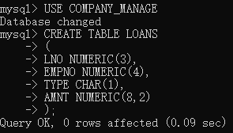


### NO.2
> Insert the following data
```text
LNO		EMPNO		TYPE		AMNT
23		7499		 M		20000.00
42		7499		 C		 2000.00
65		7844		 M		 3564.00
```
```mysql
INSERT INTO LOANS
VALUES (23,7499,'M',20000.00),
(42,7499,'C',2000.00),
(65,7844,'M',3564.00);
```
> 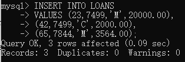
>

### NO.3
> Check that you have created 3 new records in Loans

```mysql
SELECT* FROM LOANS;
```
> 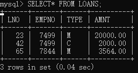


### NO.4
> The Loans table must be altered to include another column OUTST NUMERIC(8,2)

```mysql
ALTER TABLE LOANS
ADD OUTST NUMERIC(8,2);
```
> 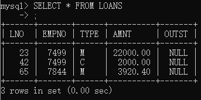


### NO.5
> Add 10% interest to all M type loans

```mysql
UPDATE LOANS
SET AMNT = AMNT*1.1
WHERE TYPE='M';
```
> 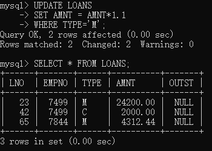

## NO.6-NO.10

### NO.6
> Remove all loans less than £3000.00

```mysql
DELETE FROM LOANS
WHERE AMNT<3000;
```
> 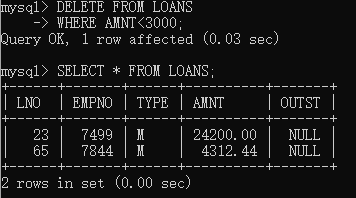

### NO.7
> Change the name of loans table to accounts

```mysql
ALTER TABLE LOANS RENAME TO ACCOUNTS;
```
> 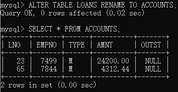

### NO.8
> Change the name of column LNO to LOANNO

```mysql
ALTER TABLE ACCOUNTS
CHANGE COLUMN LNO LOANNO NUMERIC(3);
```
> 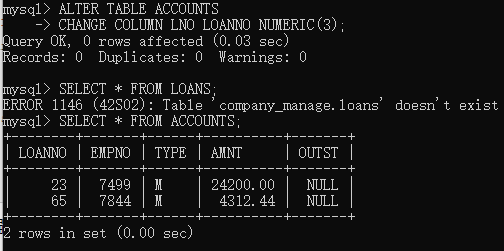

### NO.9
> Create a view for use by personnel in department 30 showing employee name, number, job and hiredate

```mysql
CREATE VIEW EMP_DEPT30 AS
SELECT ENAME,EMPNO,JOB,HIREDATE
FROM EMP2017151019
WHERE DEPTNO=30;
```
> 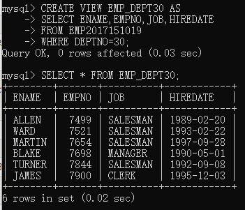

### NO.10
> Use the view to show employees in department 30 having jobs which are not salesman

```mysql
SELECT * FROM EMP_DEPT30
WHERE JOB!='SALESMAN';
```
> 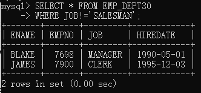


## NO.11-


### NO.11
> Create a view which shows summary information for each department.

```mysql
CREATE VIEW EMP_SUMMARY AS
SELECT DEPTNO,COUNT(EMPNO) EMP_NUM,AVG(SAL) AVG_SAL,AVG(IFNULL(COMM,0)) AVG_COMM
FROM EMP2017151019
GROUP BY DEPTNO;
```
> 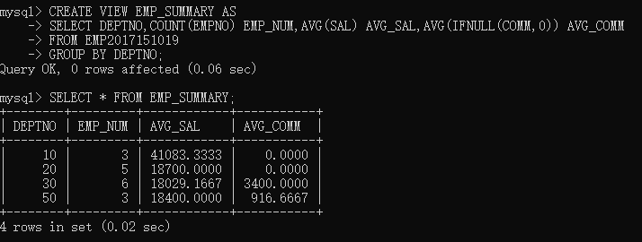
>