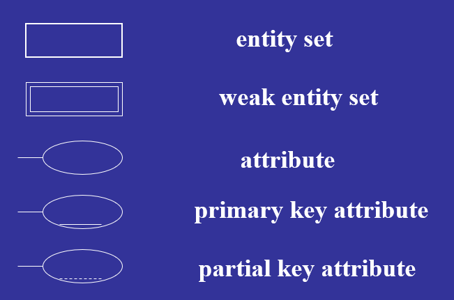
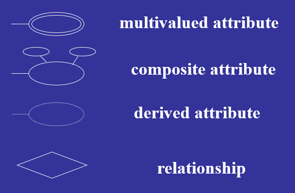
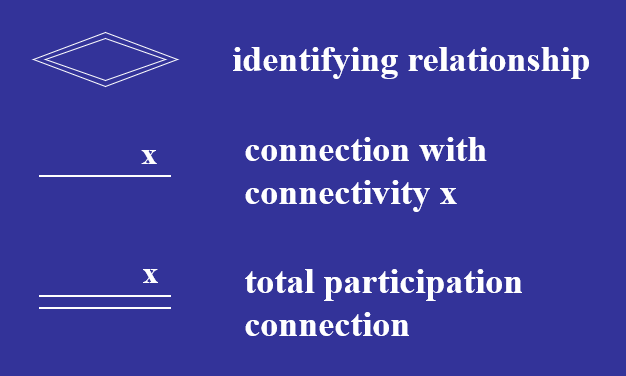
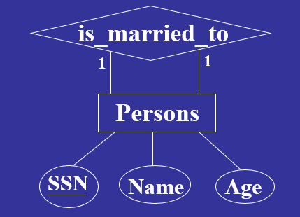
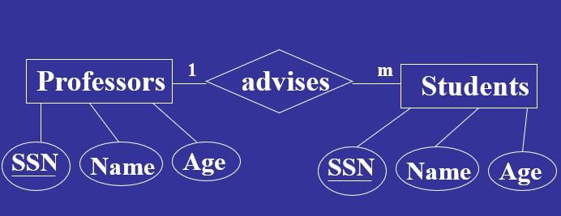
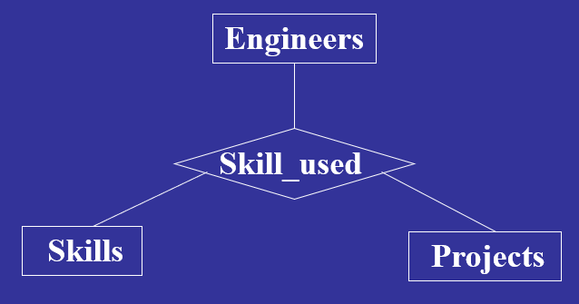

# E-R Modeling

## Entity and Entity Set(实体与实体集)

### Definition

实体满足以下要求

* 存在
* 可分辩的

#### Entity Set

> 某一类实体的集合，例如深圳大学所有的学生，深圳所有的区

### Type

#### Strong entity

> 独立存在

#### Weak entity

> 依赖于其他强实体或实体

### Attribute(属性)

> 组成实体集的属性

例如

**Students**:`SSN, Name, Address, GPA, Status`

**Books**: `Title, ISBN, Authors, Publisher, Year, ...`

 #### Type

##### Simple (or atomic) attributes（简单或原子属性）

> 为每个实体获取单个且不可分割的值

##### Composite attributes（复合属性）

> 取可以进一步划分为子部分的值，例如地址，可划分为省、市、区...

##### Single-valued attributes（单值属性）

> 对应于一个确定的实体，只存在一个值，例如身份证号码

##### Multi-valued attributes （多值属性）

> 对应于一个确定的实体，存在多个值，例如一本书的作者

##### Stored-attributes（存储属性）

> 其值存在于数据库中

##### Derived-attributes（派生属性）

> 其值由其他属性计算而得，例如从出生日期计算的年月

### Relationships

#### Definition（定义）

关系是实体之间的关联

例如：给定一个学生和一门课程，他们之间的关系可能是 学生选择课程

**给定一组实体集的实体之间具有相同含义的所有关系统称为实体集之间的关系集。**

一个关系集

* s1 takes c1
* s1 takes c2
*  s2 takes c1

**定义**：

* 设R为实体集E1、E2、…、En之间的关系集。
* * 如果R中的元组包含e1，则e1中的实体e1参与R。

**在同一组实体集之间可能存在若干关系。**

### **Degree of a Relationship** 

#### Definition

> 关系的程度是参与关系的实体集的数量

#### Type

##### Unary relationship（一元关系）

* 例如在学生实体中，`是否是同学`这一关系只在学生这一实体中存在

##### **Binary relationship** （二元关系）

* 两个实体之间的关系，例如学生和课程之间的选择关系

##### Ternary relationship（多元关系）

* 三个及以上实体之间的关系，例如工程师、技能、工具之间的技能使用关系

### **Connectivity**

> 关系的连接性指定参与关系的实体集之间的映射。

#### Type

##### 一对一

E1与E2之间，对于E1中的每个实体，E2中最多有一个关联实体，反之亦然

* 一元关系的一对一
  * Person之间的婚姻关系
* 二元关系中的一对一
  * 人与身份号的关系：一个人只能有一个身份号，一个身份号只能对应一个人

##### 一对多

* 对于E1的每个实体，有**零个或多个**E2的关联实体
* 对于E2的每个实体，**最多只有一个**E1的关联实体

例子

* 一元关系的一对多
  * 人和母亲的关系：一个人只能有一个母亲，一个人可以是多个人的母亲
* 二元关系的一对多
  * 房间号和楼层的关系：一个楼层可以有多个房间，而一个房间号只能在一个楼层

##### 多对多

* 对于E1的每个实体，有**零个或多个**E2的关联实体，E2对E1也一样

* 一元关系的多对多
  * 机器上的零件：一个零件存在与多个不同机器上，一台机器上存在不同的零件
* 二元关系的多对多
  * 课程和学生：一门课可以被多个学生选择，一个学生可以选择多门课

## E-R 图形

### ER图符号

### Example

#### 一元关系实例

#### 二元关系实例

#### 多元关系实例

### Cardinality Constraint 

`Student -> Courses` 一名学生可以选1-5门课

`Courses -> Students` 一门课可被5-60名学生选

如果min可为0，称为`partial (or optional) participation`部分参与/选择R

如果min>=0，称为` total (or mandatory) participation`全部参与/选择R

